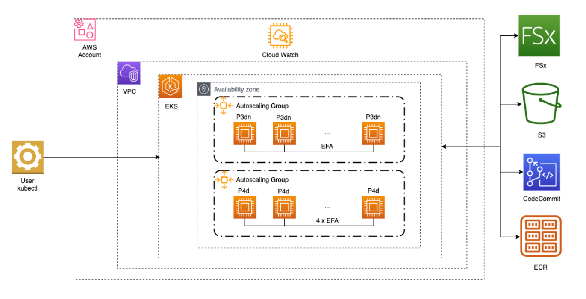
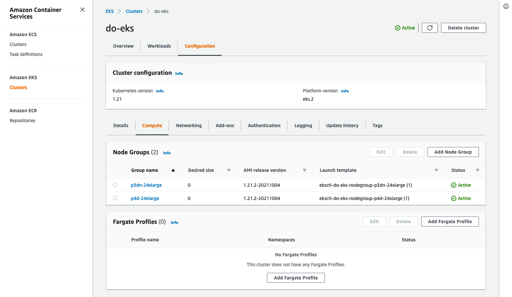
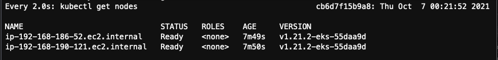
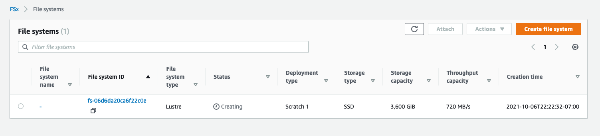
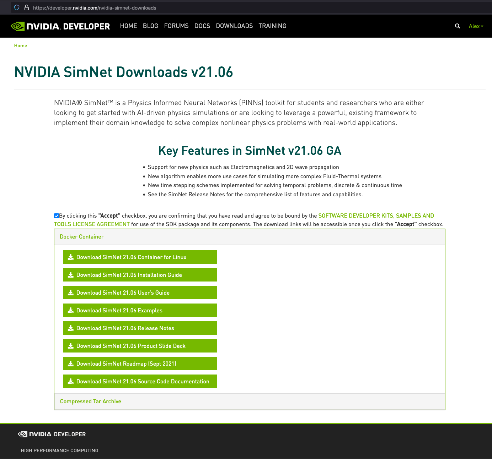
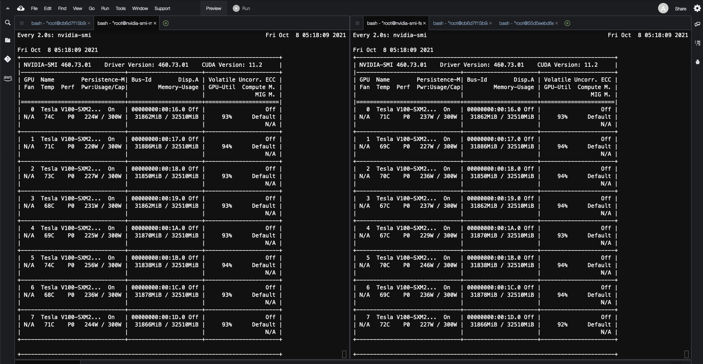
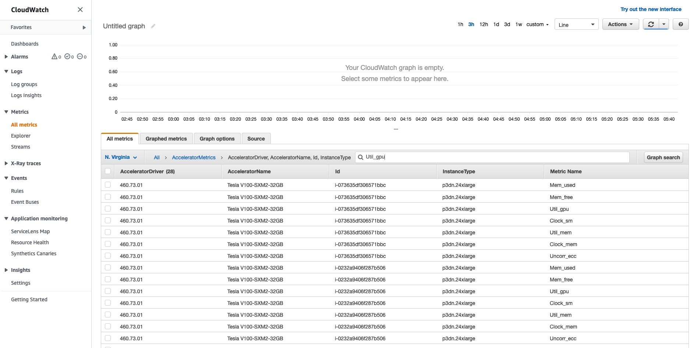
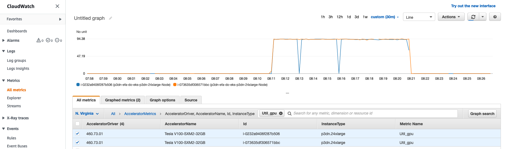

# Run NVIDIA SimNet on AWS EKS (aws-do-simnet)

[NVIDIA SimNet](https://developer.nvidia.com/simnet) is a physics-informed neural network (PINN) toolkit for AI-driven physics simulations and solving of complex nonlinear physics problems.
This project walks through setting up and running examples from the NVIDIA SimNet package on AWS Elastic Kubernetes Service. There is no assumption that any infrastructure already exists at the start.

## Prerequisites
To successfully complete all steps you will need the following:
* Full access to an [AWS account](https://aws.amazon.com/account/)
* [Docker](https://docs.docker.com/get-docker/) (local Docker Desktop or an EC2 instance with Docker) 
* [Git](https://git-scm.com/)

## Conventions
* The sample commands in this document assume that SimNet is being deployed to region `us-east-1`. If you are deploying to a different region, just use the proper region for your case in the provided examples.
* The sample commands use a masked account number `************`. Please replace this mask with your account number prior to executing the code.

## Architecture
The infrastructure needed to run SimNet on EKS is shown in Fig. 1 below.
<br/>
<div align="center">
<br/>
Fig. 1 - SimNet ready EKS cluster
</div>
<br/>

For optimal performance, we will create an EKS cluster that has node groups in a single availability zone and uses FSx as a fast shared volume as well as EFA for fast networking. Follow through the steps below to create the infrastructure and run SimNet.

## 1) Setup Infrastructure 
There are several approaches that can be used to create the necessary infrastructure. One of the options is to use the [aws-do-eks](https://github.com/aws-samples/aws-do-eks) project. The benefit of using this project is that it contains all the tools and packages needed to create and manage an EKS cluster with the architecture described above. It is also a "[Do framework](https://github.com/iankoulski/depend-on-docker)" project which includes all necessary scripts to build and manage the infrastructure using a Docker container.

### 1.1) Provision EKS Cluster

#### 1.1.1) Clone source repositories

##### 1.1.1.1) [aws-do-simnet](https://github.com/aws-samples/aws-do-simnet) 

Please clone [aws-do-simnet](https://github.com/aws-samples/aws-do-simnet) from GitHub into a local directory of your choice. We will use the `aws-do-simnet` directory as the top-level home for the rest of the steps in this document.

```
git clone https://github.com/aws-samples/aws-do-simnet.git
cd aws-do-simnet
```
##### 1.1.1.2) [aws-do-eks](https://github.com/aws-samples/aws-do-eks)

If you already have an EKS cluster or you would like to use alternate means of creating one, you may skip this step. Otherwise please ensure your current directory is `aws-do-simnet` and clone the [aws-do-eks](https://github.com/aws-samples/aws-do-eks) repository. 
```
git clone https://github.com/aws-samples/aws-do-eks.git
cd aws-do-eks
```

#### 1.1.2) Build container image
This step builds a Docker container image named aws-do-eks. This image contains all tools necessary to provision and use your EKS infrastructure. If you would like to rename the image or add a registry URI, please edit the `.env` file in the `aws-do-eks` directory and modify the REGISTRY and IMAGE variables. Execute the build script.
```
./build.sh
```

#### 1.1.3) Run container
This step starts a Docker container from the `aws-do-eks` image and runs an infitite loop in it so the container stays up and you can open a shell in it any time you need. Other [management scripts](https://github.com/iankoulski/depend-on-docker#run) are available for use as needed to manage the state of the container.
```
./run.sh
```

#### 1.1.4) Configure cluster
Files `wd/conf/eks.conf` and `wd/conf/eks.yaml` define the Kubernetes cluster that `aws-do-eks` will create. The project comes with a default configuration which we will overwrite with a configuration that reflects the cluster we need to build for SimNet.
```
cp -f ../eks.conf ../eks.yaml wd/conf
```
Review the values in `eks.conf` and `eks.yaml` in the `wd/conf` directory and adjust if you would like to use any settings that are different than the defaults.

#### 1.1.5) Exec into container
```
./exec.sh
```
You will be dropped into a shell within the aws-do-eks container which includes all necessary tools to create and manage your target EKS cluster.

#### 1.1.6) Configure AWS CLI
The scripts use the AWS CLI and eksctl to create and manage the EKS cluster. Credentials to the AWS account must be configured in order for these tools to be able to perform their work. 
```
aws configure
```
Supply ACCESS_KEY_ID, SECRET_ACCESS_KEY, region: us-east-1, and output: json
The credentials will be stored in the `~/.aws` directory on the host where the `aws-do-eks` container is running. If credentials were already present there, then this step can be skipped. Storing credentials externally of the container is helpful to ensure this configuration is not lost if the container restarts.
#### 1.1.7) Create EKS cluster
To create the cluster, simply execute:
```
./eks-create.sh
```
Please allow about <b>30 minutes</b> for the provisioning process to complete.

<details>
<summary>Click here to expand a log of a complete cluster provisioning process.</summary>


```

root@cb6d7f15b9a8:/eks# ./eks-create.sh 

Creating cluster using eks.yaml ...
eksctl create cluster -f ./eks.yaml
2021-10-06 22:33:18 [ℹ]  eksctl version 0.66.0
2021-10-06 22:33:18 [ℹ]  using region us-east-1
2021-10-06 22:33:18 [ℹ]  subnets for us-east-1a - public:192.168.0.0/19 private:192.168.128.0/19
2021-10-06 22:33:18 [ℹ]  subnets for us-east-1b - public:192.168.32.0/19 private:192.168.160.0/19
2021-10-06 22:33:18 [ℹ]  subnets for us-east-1c - public:192.168.64.0/19 private:192.168.192.0/19
2021-10-06 22:33:18 [ℹ]  subnets for us-east-1d - public:192.168.96.0/19 private:192.168.224.0/19
2021-10-06 22:33:18 [ℹ]  nodegroup "p4d-24xlarge" will use "" [AmazonLinux2/1.21]
2021-10-06 22:33:18 [ℹ]  nodegroup "p3dn-24xlarge" will use "" [AmazonLinux2/1.21]
2021-10-06 22:33:18 [ℹ]  using Kubernetes version 1.21
2021-10-06 22:33:18 [ℹ]  creating EKS cluster "do-eks" in "us-east-1" region with managed nodes
2021-10-06 22:33:18 [ℹ]  2 nodegroups (p3dn-24xlarge, p4d-24xlarge) were included (based on the include/exclude rules)
2021-10-06 22:33:18 [ℹ]  will create a CloudFormation stack for cluster itself and 0 nodegroup stack(s)
2021-10-06 22:33:18 [ℹ]  will create a CloudFormation stack for cluster itself and 2 managed nodegroup stack(s)
2021-10-06 22:33:18 [ℹ]  if you encounter any issues, check CloudFormation console or try 'eksctl utils describe-stacks --region=us-east-1 --cluster=do-eks'
2021-10-06 22:33:18 [ℹ]  CloudWatch logging will not be enabled for cluster "do-eks" in "us-east-1"
2021-10-06 22:33:18 [ℹ]  you can enable it with 'eksctl utils update-cluster-logging --enable-types={SPECIFY-YOUR-LOG-TYPES-HERE (e.g. all)} --region=us-east-1 --cluster=do-eks'
2021-10-06 22:33:18 [ℹ]  Kubernetes API endpoint access will use default of {publicAccess=true, privateAccess=false} for cluster "do-eks" in "us-east-1"
2021-10-06 22:33:18 [ℹ]  2 sequential tasks: { create cluster control plane "do-eks", 3 sequential sub-tasks: { 4 sequential sub-tasks: { wait for control plane to become ready, associate IAM OIDC provider, no tasks, restart daemonset "kube-system/aws-node" }, 1 task: { create addons }, 2 parallel sub-tasks: { create managed nodegroup "p4d-24xlarge", create managed nodegroup "p3dn-24xlarge" } } }
2021-10-06 22:33:18 [ℹ]  building cluster stack "eksctl-do-eks-cluster"
2021-10-06 22:33:19 [ℹ]  deploying stack "eksctl-do-eks-cluster"
2021-10-06 22:33:49 [ℹ]  waiting for CloudFormation stack "eksctl-do-eks-cluster"
2021-10-06 22:34:19 [ℹ]  waiting for CloudFormation stack "eksctl-do-eks-cluster"
2021-10-06 22:35:19 [ℹ]  waiting for CloudFormation stack "eksctl-do-eks-cluster"
2021-10-06 22:36:19 [ℹ]  waiting for CloudFormation stack "eksctl-do-eks-cluster"
2021-10-06 22:37:20 [ℹ]  waiting for CloudFormation stack "eksctl-do-eks-cluster"
2021-10-06 22:38:20 [ℹ]  waiting for CloudFormation stack "eksctl-do-eks-cluster"
2021-10-06 22:39:20 [ℹ]  waiting for CloudFormation stack "eksctl-do-eks-cluster"
2021-10-06 22:40:21 [ℹ]  waiting for CloudFormation stack "eksctl-do-eks-cluster"
2021-10-06 22:41:21 [ℹ]  waiting for CloudFormation stack "eksctl-do-eks-cluster"
2021-10-06 22:42:21 [ℹ]  waiting for CloudFormation stack "eksctl-do-eks-cluster"
2021-10-06 22:43:22 [ℹ]  waiting for CloudFormation stack "eksctl-do-eks-cluster"
2021-10-06 22:44:22 [ℹ]  waiting for CloudFormation stack "eksctl-do-eks-cluster"
2021-10-06 22:45:22 [ℹ]  waiting for CloudFormation stack "eksctl-do-eks-cluster"
2021-10-06 22:46:23 [ℹ]  waiting for CloudFormation stack "eksctl-do-eks-cluster"
2021-10-06 22:47:23 [ℹ]  waiting for CloudFormation stack "eksctl-do-eks-cluster"
2021-10-06 22:51:27 [ℹ]  daemonset "kube-system/aws-node" restarted
2021-10-06 22:53:28 [ℹ]  creating role using recommended policies
2021-10-06 22:53:29 [ℹ]  deploying stack "eksctl-do-eks-addon-vpc-cni"
2021-10-06 22:53:29 [ℹ]  waiting for CloudFormation stack "eksctl-do-eks-addon-vpc-cni"
2021-10-06 22:53:45 [ℹ]  waiting for CloudFormation stack "eksctl-do-eks-addon-vpc-cni"
2021-10-06 22:54:03 [ℹ]  waiting for CloudFormation stack "eksctl-do-eks-addon-vpc-cni"
2021-10-06 22:54:03 [ℹ]  creating addon
2021-10-06 22:56:34 [ℹ]  addon "vpc-cni" active
2021-10-06 22:56:34 [ℹ]  building managed nodegroup stack "eksctl-do-eks-nodegroup-p3dn-24xlarge"
2021-10-06 22:56:34 [ℹ]  building managed nodegroup stack "eksctl-do-eks-nodegroup-p4d-24xlarge"
2021-10-06 22:56:35 [ℹ]  deploying stack "eksctl-do-eks-nodegroup-p3dn-24xlarge"
2021-10-06 22:56:35 [ℹ]  waiting for CloudFormation stack "eksctl-do-eks-nodegroup-p3dn-24xlarge"
2021-10-06 22:56:35 [ℹ]  deploying stack "eksctl-do-eks-nodegroup-p4d-24xlarge"
2021-10-06 22:56:35 [ℹ]  waiting for CloudFormation stack "eksctl-do-eks-nodegroup-p4d-24xlarge"
2021-10-06 22:56:51 [ℹ]  waiting for CloudFormation stack "eksctl-do-eks-nodegroup-p4d-24xlarge"
2021-10-06 22:56:52 [ℹ]  waiting for CloudFormation stack "eksctl-do-eks-nodegroup-p3dn-24xlarge"
2021-10-06 22:57:07 [ℹ]  waiting for CloudFormation stack "eksctl-do-eks-nodegroup-p3dn-24xlarge"
2021-10-06 22:57:07 [ℹ]  waiting for CloudFormation stack "eksctl-do-eks-nodegroup-p4d-24xlarge"
2021-10-06 22:57:23 [ℹ]  waiting for CloudFormation stack "eksctl-do-eks-nodegroup-p3dn-24xlarge"
2021-10-06 22:57:24 [ℹ]  waiting for CloudFormation stack "eksctl-do-eks-nodegroup-p4d-24xlarge"
2021-10-06 22:57:38 [ℹ]  waiting for CloudFormation stack "eksctl-do-eks-nodegroup-p3dn-24xlarge"
2021-10-06 22:57:44 [ℹ]  waiting for CloudFormation stack "eksctl-do-eks-nodegroup-p4d-24xlarge"
2021-10-06 22:57:56 [ℹ]  waiting for CloudFormation stack "eksctl-do-eks-nodegroup-p3dn-24xlarge"
2021-10-06 22:58:01 [ℹ]  waiting for CloudFormation stack "eksctl-do-eks-nodegroup-p4d-24xlarge"
2021-10-06 22:58:13 [ℹ]  waiting for CloudFormation stack "eksctl-do-eks-nodegroup-p3dn-24xlarge"
2021-10-06 22:58:21 [ℹ]  waiting for CloudFormation stack "eksctl-do-eks-nodegroup-p4d-24xlarge"
2021-10-06 22:58:29 [ℹ]  waiting for CloudFormation stack "eksctl-do-eks-nodegroup-p3dn-24xlarge"
2021-10-06 22:58:45 [ℹ]  waiting for CloudFormation stack "eksctl-do-eks-nodegroup-p3dn-24xlarge"
2021-10-06 22:58:45 [ℹ]  waiting for the control plane availability...
2021-10-06 22:58:45 [✔]  saved kubeconfig as "/root/.kube/config"
2021-10-06 22:58:45 [ℹ]  2 parallel tasks: { install Nvidia device plugin, install EFA device plugin }
2021-10-06 22:58:46 [ℹ]  created "kube-system:DaemonSet.apps/aws-efa-k8s-device-plugin-daemonset"
2021-10-06 22:58:46 [ℹ]  created "kube-system:DaemonSet.apps/nvidia-device-plugin-daemonset"
2021-10-06 22:58:46 [ℹ]  as you have enabled EFA, the EFA device plugin was automatically installed.
2021-10-06 22:58:46 [ℹ]  as you are using the EKS-Optimized Accelerated AMI with a GPU-enabled instance type, the Nvidia Kubernetes device plugin was automatically installed.
        to skip installing it, use --install-nvidia-plugin=false.
2021-10-06 22:58:46 [✔]  all EKS cluster resources for "do-eks" have been created
2021-10-06 23:00:49 [ℹ]  kubectl command should work with "/root/.kube/config", try 'kubectl get nodes'
2021-10-06 23:00:49 [✔]  EKS cluster "do-eks" in "us-east-1" region is ready

Done creating cluster using ./eks.yaml

root@cb6d7f15b9a8:/eks# 

```
</details>

<br/>
<div align="center">
 <br/>
Fig. 2 - EKS cluster with two nodegroups scaled to 0
</div>
<br/>

At this time your cluster has been created with two node groups that are scaled down to 0 nodes. This is intentional, to demonstrate that you can have the cluster provisioned, but not incur costs for worker nodes while you are not using them. There is only a [cost](https://aws.amazon.com/eks/pricing/) incurred for the control plane of the cluster itself.

At the end of the provisioning process, your local environment (`~/.kube/config`) is configured with the new kubernetes context to allow your use of `kubectl` with the cluster. This can be confirmed by executing the `kubectx` or `kc` command which shows the current context.

```
root@cb6d7f15b9a8:/eks# kc  
alex@do-eks.us-east-1.eksctl.io
root@cb6d7f15b9a8:/eks# 
```

#### 1.1.8) Scale cluster nodegroups
The project comes pre-configured to scale your cluster to two p3dn.24xlarge nodes and leave the p4d-24xlarge node group scaled down to 0. If you prefer different scaling of your cluster, edit file `eks.conf` and set the sizes of the GPU nodegroups as desired. The first number in the array is the target number of nodes for the p3dn-24xlarge nodegroup and the second one is for the p4d-24xlarge nodegroup. Customize these settings as needed.
```
export GPU_NODEGROUP_SIZES=(2 0)
```
To apply the desired scaling settings, execute the `./eks-scale.sh` script.

<details>
<summary>Click here to expan an ./eks-scale.sh execution log</summary>

```

root@cb6d7f15b9a8:/eks# ./eks-scale.sh 

Thu Oct  7 00:09:36 UTC 2021
Scaling cluster do-eks ...


Scaling node group p3dn-24xlarge in cluster do-eks to 2 ...
asg=eks-p3dn-24xlarge-5abe2be9-cf0b-5db5-4eff-44cab274a17d
max=10
aws autoscaling update-auto-scaling-group --auto-scaling-group-name eks-p3dn-24xlarge-5abe2be9-cf0b-5db5-4eff-44cab274a17d --min-size 0 --max-size 10 --desired-capacity 2 --region us-east-1


Scaling node group p4d-24xlarge in cluster do-eks to 0 ...
asg=eks-p4d-24xlarge-92be2be9-be6f-c3eb-7a22-6f5e7d6136d3
max=10
aws autoscaling update-auto-scaling-group --auto-scaling-group-name eks-p4d-24xlarge-92be2be9-be6f-c3eb-7a22-6f5e7d6136d3 --min-size 0 --max-size 10 --desired-capacity 0 --region us-east-1

Thu Oct  7 00:09:42 UTC 2021
Done scaling cluster do-eks

root@cb6d7f15b9a8:/eks#

```
</details>


#### 1.1.9) Verify cluster readiness
We can proceed with next steps after the cluster has completed scaling and all nodes are in the Ready state. To observe the cluster status until the nodes become ready, execute `ops/watch-nodes.sh`.

<br/>
<div align="center">
<br />
Fig. 3 - EKS cluster nodes in Ready state
</div>
<br/>

When all expected nodes are in the Ready state, press `Ctrl-C` to exit the watch command.

### 1.2) Deploy capabilities to EKS cluster
In this section we will enable the cluster to monitor GPU utilization, execute MPI jobs, and mount a shared FSX volume.

#### 1.2.1) GPU Monitoring
GPU Monitoring can be enabled with one or both of the following

##### 1.2.1.1) NVIDIA SMI Daemonset (Optional)
The nvidia-smi daemonset starts a pod on each node labeled with `processor: gpu`. This pod is idle and consumes minimal resources. The running nvidia-smi pods can be listed by executing `kubectl -n kube-system get pods -o wide | grep nvidia-smi`.  When a shell is opened into the pod via `kubectl -n kube-system exec -it <pod-name>` the `nvidia-smi` command can be used to monitor the GPU utilzation of the node where the pod is running. For continuous monitoring use `watch nvidia-smi`.

```
k apply -f ./deployment/nvidia-device-plugin/nvidia-smi-daemonset.yaml
```

#### 1.2.1.2) GPU Metrics (Optional)
GitHub project [aws-efa-nccl-baseami-pipeline](https://github.com/aws-samples/aws-efa-nccl-baseami-pipeline) describes how to build an AMI with GPU Utilization reporting into CloudWatch. This is the recommended approach for production clusters. 

For development clusters if execution of privileged pods is acceptable, the GPU Utilization reporting capability can be deployed as a daemonset.

```
k apply -f deployment/gpu-efa-metrics/gpu-efa-metrics-daemonset.yaml 
```

#### 1.2.2) Kubeflow MPI Operator
The Kubeflow MPI Operator is used to submit and run tightly coupled distributed jobs in the Kubernetes cluster. To deploy the MPI Operator, execute:

```
cd deployment/kubeflow/mpi-operator
./deploy.sh
cd ../../..
```

#### 1.2.3) FSX CSI driver
The FSX Container Storage Interface (CSI) driver allows Amazon EKS to create and remove FSx volumes. To deploy the FSX CSI driver, you will need to set FSX_SUBNET_ID and EKS_INSTANCE_PROFILE_NAMES in file `fsx.conf` located in directory `deployment/fsx-csi`.

You can get the SUBNET_ID of your EKS instances either from the AWS Console, or through executing the following command and finding the name of one of your EKS nodes.

```
aws ec2 describe-instances --query "Reservations[*].Instances[*].{InstanceId:InstanceId,InstanceType:InstanceType,PrivateIpAddress:PrivateIpAddress,SubnetId:SubnetId,Status:State.Name,Name:Tags[?Key=='Name']|[0].Value}" --output table
```

There is one instance profile name per nodegroup. For one node from each node group, retrieve the instance profile name either through the AWS Console or by executing the following aws cli command:

```
aws ec2 describe-instances --instance-ids <insert-instance-ids-here> --query "Reservations[].Instances[].{InstanceId:InstanceId,InstanceProfileArn:IamInstanceProfile.Arn}" --output table
```

The instance profile name is the part of the InstanceProfileArn that comes after the last forward slash `/`.

After entering the FSX_SUBNET_ID and EKS_INSTANCE_PROFILE_NAMES in `deployment/fsx-csi/fsx.conf` execute the `./deploy.sh` script.

```
cd deployment/fsx-csi
./deploy.sh
```

To verify successful deployment of the CSI driver, check that the fsx storage class is available:

```
root@cb6d7f15b9a8:/eks/deployment/fsx-csi# k get sc
NAME            PROVISIONER             RECLAIMPOLICY   VOLUMEBINDINGMODE      ALLOWVOLUMEEXPANSION   AGE
fsx-sc          fsx.csi.aws.com         Delete          Immediate              false                  97s
gp2 (default)   kubernetes.io/aws-ebs   Delete          WaitForFirstConsumer   false                  6h37m
root@cb6d7f15b9a8:/eks/deployment/fsx-csi# 
```

Since we will need to create an FSx volume and mount it in all SimNet pods we will also create a test pod that we can use to access the content of the FSx volume while SimNet pods are not running. Execute the `./test-deploy.sh` script to accomplish that. 

```
root@cb6d7f15b9a8:/eks/deployment/fsx-csi# ./test-deploy.sh 
persistentvolumeclaim/fsx-claim created
Name:          fsx-claim
Namespace:     default
StorageClass:  fsx-sc
Status:        Pending
Volume:        
Labels:        <none>
Annotations:   volume.beta.kubernetes.io/storage-provisioner: fsx.csi.aws.com
Finalizers:    [kubernetes.io/pvc-protection]
Capacity:      
Access Modes:  
VolumeMode:    Filesystem
Mounted By:    <none>
Events:
  Type    Reason                Age              From                                                                                 Message
  ----    ------                ----             ----                                                                                 -------
  Normal  ExternalProvisioning  1s (x2 over 1s)  persistentvolume-controller                                                          waiting for a volume to be created, either by external provisioner "fsx.csi.aws.com" or manually created by system administrator
  Normal  Provisioning          1s               fsx.csi.aws.com_ip-192-168-186-52.ec2.internal_e0401f7c-67a7-4a4d-8fbc-cd477907e75d  External provisioner is provisioning volume for claim "default/fsx-claim"
pod/test-fsx-pod created
```

A PVC `fsx-claim` is created in the default namespace and a `test-fsx-pod` is launched, mounting the PVC in path /data. If you visit the [AWS Console](https://console.aws.amazon.com/fsx/home?region=us-east-1#file-systems) you will see a new FSx volume being created as shown on Fig. 4 below.

<br/>
<div align="center">
<br/>
Fig. 4 - FSx volume creating triggered through EKS PVC
</div>
<br/>

It will take a few minutes for the FSx volume to finish creating and then the status of the `test-fsx-pod` will change from `Pending` to `Running`.

To verify that the FSx volume has been properly mounted, you can exec into the pod and check the available volumes.

```
root@cb6d7f15b9a8:/# cd /eks
root@cb6d7f15b9a8:/eks# ops/exec-pod.sh test-fsx-pod
[root@test-fsx-pod /]# df -h
Filesystem               Size  Used Avail Use% Mounted on
overlay                  900G   15G  886G   2% /
tmpfs                     64M     0   64M   0% /dev
tmpfs                    374G     0  374G   0% /sys/fs/cgroup
192.168.165.86@tcp:/fsx  3.4T   14M  3.4T   1% /data
/dev/nvme0n1p1           900G   15G  886G   2% /etc/hosts
shm                       64M     0   64M   0% /dev/shm
tmpfs                    374G   12K  374G   1% /run/secrets/kubernetes.io/serviceaccount
tmpfs                    374G     0  374G   0% /proc/acpi
tmpfs                    374G     0  374G   0% /sys/firmware
[root@test-fsx-pod /]# 
```

The FSx volume is mounted successfully as `/data`.

## 2) Download NVIDIA SimNet
Downloading NVIDIA SimNet requires membership to the [NVIDIA Developer Program](https://developer.nvidia.com/developer-program?nvid=nv-int-txtad-18492#cid=dl13_nv-int-txtad_en-us). Visit the [downloads page](https://developer.nvidia.com/nvidia-simnet-downloads) to join,  login, agree to the [license terms](https://developer.download.nvidia.com/assets/simnet/NVIDIA_SimNet_License_25May2021.pdf) and download the Docker container.

<br/>
<div align="center">
<br/>
Fig. 6 - NVIDIA SimNet Download Page 
</div>
<br/>

### 2.1) Required downloads
There are two required downloads from the "Docker Container" section of the page:
* [SimNet Container for Linux](https://developer.nvidia.com/simnet-container-v2106)
* [SimNet Examples](https://developer.nvidia.com/simnet-examples-v2106)

### 2.2) Optional downloads
The rest of the downloads in the section are documents which are not required for running SimNet, but are needed while learning about it and are often referenced during use of the toolkit. It is recommended to download and save a copy of these documents.

## 3) Upload SimNet artifacts to AWS
The two required artifacts need to be uploaded to your AWS account.

### 3.1) Docker Container
The Docker container `simnet_image_v21.06.tar.gz` needs to be pushed to your private container registry ([ECR](https://console.aws.amazon.com/ecr))
To enable that, please create a private registry called `simnet` in your ECR. The base container downloaded from NVIDIA does not have EFA capabilities. To enable EFA we need to build a new version of the simnet container using the NVIDIA version as base. The new container will be capable of running SimNet with or without EFA enabled. Follow the steps below.

#### 3.1.1) load the tar file to create a local Docker image
```
docker load -i ./simnet_image_v21.06.tar.gz
```
This creates a local image `simnet:21.06` which you can see by running `docker images`
 
#### 3.1.2) edit file `simnet-efa/.env` and define your ECR registry by modifying line 13
```
export REGISTRY=************.dkr.ecr.us-east-1.amazonaws.com/
```
#### 3.1.3) ./build the EFA enabled version of the image
```
./build.sh
```
This creates a local image ************.dkr.ecr.us-east-1.amazonaws.com/simnet:21.06

#### 3.1.4) login to the Docker registry
```
./login.sh
```
This authenticates your local Docker daemon with the Docker registry configured in `.env`.

#### 3.1.4) push the EFA-enabled SimNet Docker image to ECR
```
./push.sh
```

### 3.2 Examples
The SimNet examples `SimNet_examples.tar.gz` need to be copied to the FSx volume which we will mount in the SimNet Kubernetes pods in our EKS cluster. This can be accomplished in one of two ways.
#### 3.2.1) use `kubectl cp` to copy the file from a local volume to a pod that has the FSx volume mounted (Preferred)
Copy SimNet_examples.tar.gz to directory `aws-do-simnet/aws-do-eks/wd` in your project, then execute the following command:
```
k cp /aws-do-eks/wd/SimNet_examples.tar.gz test-fsx-pod:/data
```
or
#### 3.2.2) upload the file to s3, then exec into a pod that has the local FSx volume mounted and download from s3 to the FSx volume (Alternative)
Note if you use the test-fsx-pod, you may need to [install the aws cli](https://docs.aws.amazon.com/cli/latest/userguide/install-cliv2-linux.html#cliv2-linux-install) before downloading the examples file from s3 

#### 3.2.3) Extract the SimNet examples in the FSx volume
Lastly, we need to extract the examples archive into the FSx volume.
Exec into the `test-fsx-pod` and use tar to extract the archive.
```
k exec -it test-fsx-pod -- bash
tar zxvf ./SimNet_examples.tar.gz
```

## 4) Run SimNet
We will use the MPIJob manifests [`simnet-efa-ldc.yaml`](simnet-efa-ldc.yaml) to run the SimNet Lid Driven Cavity (LDC) flow example (see page 35 from SimNet_v21.06_Uer_Guide.pdf) on two nodes in our EKS cluster. 

### 4.1) Configure LDC example (Optional)
Running the LDC example on two nodes with its default parameters will take over an hour to complete. If you would like to reduce the runtime, we can reduce the number of points by modifying the `ldc_2d.py` file in the FSx volume. 

Exec into the test-fsx-pod, then edit `/data/examples/ldc/ldc_2d.py` and set decay_steps to 40 and max_steps: 10000.
```
root@cb6d7f15b9a8:/aws-do-eks/wd/simnet# /eks/ops/exec-pod.sh test-fsx-pod
[root@test-fsx-pod /]# vi /data/examples/ldc/ldc_2d.py 
#set decay_steps: 40
#set max_steps: 10000
#save & quit
[root@test-fsx-pod /]# exit
exit
root@cb6d7f15b9a8:/aws-do-eks/wd/simnet# 
```
Note: If you would like to repeat a run, you will need to remove the checkpoint folder which is stored within the current example by any previous runs.

```
rm -rf /data/examples/ldc/network_checkpoint_ldc_2d
```

### 4.2) Copy MPI job manifest to aws-do-eks mounted volume
To make the manifest available within the `aws-do-eks` container, from the `aws-do-simnet` directory please execute:
```
mkdir -p aws-do-eks/wd/simnet
cp -f simnet-efa-ldc.yaml aws-do-eks/wd/simnet
```

<details>
<summary>Expand this section to take a look at one of the MPI job manifests.</summary>

```
apiVersion: kubeflow.org/v1alpha2
kind: MPIJob
metadata:
  name: simnet-mpi
spec:
  slotsPerWorker: 8
  cleanPodPolicy: Running
  mpiReplicaSpecs:
    Launcher:
      replicas: 1
      template:
         spec:
          restartPolicy: OnFailure
          containers:
          - image: ************.dkr.ecr.us-east-1.amazonaws.com/simnet:21.06-efa
            imagePullPolicy: Always
            name: simnet-mpi-launcher
            env:
             - name: NCCL_DEBUG
               value: INFO
            workingDir: /data/examples/ldc
            command:
            - mpirun
            - --allow-run-as-root
            - -np
            - "16"
            - -N
            - "8"
            - -bind-to
            - none
            - -map-by
            - slot
            - -x
            - NCCL_ALGO=Ring
            - -x
            - FI_PROVIDER=efa
            - -x
            - FI_EFA_USE_DEVICE_RDMA=1
            - -x
            - RDMAV_FORK_SAFE=1
            - -x
            - NCCL_DEBUG
            - -mca
            - pml
            - ob1
            - -mca
            - btl
            - ^openlib
            - python
            - ldc_2d.py
    Worker:
      replicas: 2
      template:
        spec:
          nodeSelector:
            beta.kubernetes.io/instance-type: p3dn.24xlarge
            #beta.kubernetes.io/instance-type: p4d.24xlarge
          containers:
          - image: ************.dkr.ecr.us-east-1.amazonaws.com/simnet:21.06-efa
            workingDir: /data/examples/ldc
            imagePullPolicy: Always
            name: simnet-mpi-worker
            resources:
              limits:
                nvidia.com/gpu: 8
                hugepages-2Mi: 5120Mi
                vpc.amazonaws.com/efa: 1
                memory: 80000Mi
              requests:
                nvidia.com/gpu: 8
                hugepages-2Mi: 5120Mi
                vpc.amazonaws.com/efa: 1
                memory: 80000Mi
            volumeMounts:
            - name: persistent-storage
              mountPath: /data
          volumes:
          - name: persistent-storage
            persistentVolumeClaim:
              claimName: fsx-claim
```
</details>

Note: The use of EFA is controlled by the FI_PROVIDER environment variable, defined in the MPI job. If you want to disable EFA, change the value from `efa` to `sockets`. When the value is EFA, accelerated networking will be used when available, and if not available, tcp network sockets will be used as fallback.

The `nodeSelector` section allows control of which instance type in the cluster is used to run the simnet pods.

The Worker `replicas` setting allows us to specify how many nodes to use for the MPI Job. This number multiplied by the number of GPUs per node has to match the `-np` (number of processes) setting in the mpirun options.

The `workingDir` setting needs to point to the directory where the particular SimNet example is located on the FSx shared volume.

The actual command to start the SimNet process is configured on the last two lines of the `simnet-mpi-launcher` container spec (for example: python, and ldc_2d.py). These along with the workingDir setting can be modified to execute other SimNet examples as needed.

### 4.3) Run SimNet LDC Example
Inside the `aws-do-eks` container, execute the following:
```
cd /aws-do-eks/wd/simnet
k apply -f ./simnet-efa-ldc.yaml
```

The launcher pod will be initialized after the two worker pods enter the Running state. Following the logs of the launcher pod, provides real-time feedback about the execution of the job.

```
/eks/ops/pod-logs.sh simnet-mpi-launcher
```

<details>
<summary>simnet-efa-ldc.yaml launcher pod log</summary>

```
root@cb6d7f15b9a8:/aws-do-eks/wd/simnet# /eks/ops/pod-logs.sh simnet-mpi-launcher
+ POD_NAME=simnet-mpi-worker-0
+ '[' s = - ']'
+ shift
+ /opt/kube/kubectl cp /opt/kube/hosts simnet-mpi-worker-0:/etc/hosts_of_nodes
+ POD_NAME=simnet-mpi-worker-1
+ '[' s = - ']'
+ shift
+ /opt/kube/kubectl cp /opt/kube/hosts simnet-mpi-worker-1:/etc/hosts_of_nodes
+ /opt/kube/kubectl exec simnet-mpi-worker-1 -- /bin/sh -c 'cat /etc/hosts_of_nodes >> /etc/hosts &&  orted -mca ess "env" -mca ess_base_jobid "447283200" -mca ess_base_vpid 2 -mca ess_base_num_procs "3" -mca orte_node_regex "simnet-mpi-launcher-rmdct,simnet-mpi-worker-[1:0-1]@0(3)" -mca orte_hnp_uri "447283200.0;tcp://192.168.175.22:54301" -mca pml "ob1" -mca btl "^openlib" -mca plm "rsh" --tree-spawn -mca routed "radix" -mca orte_parent_uri "447283200.0;tcp://192.168.175.22:54301" -mca plm_rsh_agent "/etc/mpi/kubexec.sh" -mca orte_default_hostfile "/etc/mpi/hostfile" -mca rmaps_ppr_n_pernode "8" -mca hwloc_base_binding_policy "none" -mca rmaps_base_mapping_policy "slot" -mca pmix "^s1,s2,cray,isolated"'
+ /opt/kube/kubectl exec simnet-mpi-worker-0 -- /bin/sh -c 'cat /etc/hosts_of_nodes >> /etc/hosts &&  orted -mca ess "env" -mca ess_base_jobid "447283200" -mca ess_base_vpid 1 -mca ess_base_num_procs "3" -mca orte_node_regex "simnet-mpi-launcher-rmdct,simnet-mpi-worker-[1:0-1]@0(3)" -mca orte_hnp_uri "447283200.0;tcp://192.168.175.22:54301" -mca pml "ob1" -mca btl "^openlib" -mca plm "rsh" --tree-spawn -mca routed "radix" -mca orte_parent_uri "447283200.0;tcp://192.168.175.22:54301" -mca plm_rsh_agent "/etc/mpi/kubexec.sh" -mca orte_default_hostfile "/etc/mpi/hostfile" -mca rmaps_ppr_n_pernode "8" -mca hwloc_base_binding_policy "none" -mca rmaps_base_mapping_policy "slot" -mca pmix "^s1,s2,cray,isolated"'
2021-10-08 07:44:00.920310: I tensorflow/stream_executor/platform/default/dso_loader.cc:49] Successfully opened dynamic library libcudart.so.11.0
2021-10-08 07:44:00.920774: I tensorflow/stream_executor/platform/default/dso_loader.cc:49] Successfully opened dynamic library libcudart.so.11.0
2021-10-08 07:44:00.924344: I tensorflow/stream_executor/platform/default/dso_loader.cc:49] Successfully opened dynamic library libcudart.so.11.0
2021-10-08 07:44:00.926347: I tensorflow/stream_executor/platform/default/dso_loader.cc:49] Successfully opened dynamic library libcudart.so.11.0
2021-10-08 07:44:00.930075: I tensorflow/stream_executor/platform/default/dso_loader.cc:49] Successfully opened dynamic library libcudart.so.11.0
2021-10-08 07:44:00.930081: I tensorflow/stream_executor/platform/default/dso_loader.cc:49] Successfully opened dynamic library libcudart.so.11.0
2021-10-08 07:44:00.932099: I tensorflow/stream_executor/platform/default/dso_loader.cc:49] Successfully opened dynamic library libcudart.so.11.0
2021-10-08 07:44:00.932536: I tensorflow/stream_executor/platform/default/dso_loader.cc:49] Successfully opened dynamic library libcudart.so.11.0
2021-10-08 07:44:00.934509: I tensorflow/stream_executor/platform/default/dso_loader.cc:49] Successfully opened dynamic library libcudart.so.11.0
2021-10-08 07:44:00.934508: I tensorflow/stream_executor/platform/default/dso_loader.cc:49] Successfully opened dynamic library libcudart.so.11.0
2021-10-08 07:44:00.942240: I tensorflow/stream_executor/platform/default/dso_loader.cc:49] Successfully opened dynamic library libcudart.so.11.0
2021-10-08 07:44:00.942230: I tensorflow/stream_executor/platform/default/dso_loader.cc:49] Successfully opened dynamic library libcudart.so.11.0
2021-10-08 07:44:00.945442: I tensorflow/stream_executor/platform/default/dso_loader.cc:49] Successfully opened dynamic library libcudart.so.11.0
2021-10-08 07:44:00.948196: I tensorflow/stream_executor/platform/default/dso_loader.cc:49] Successfully opened dynamic library libcudart.so.11.0
WARNING:tensorflow:Deprecation warnings have been disabled. Set TF_ENABLE_DEPRECATION_WARNINGS=1 to re-enable them.
WARNING:tensorflow:Deprecation warnings have been disabled. Set TF_ENABLE_DEPRECATION_WARNINGS=1 to re-enable them.
WARNING:tensorflow:Deprecation warnings have been disabled. Set TF_ENABLE_DEPRECATION_WARNINGS=1 to re-enable them.
WARNING:tensorflow:Deprecation warnings have been disabled. Set TF_ENABLE_DEPRECATION_WARNINGS=1 to re-enable them.
WARNING:tensorflow:Deprecation warnings have been disabled. Set TF_ENABLE_DEPRECATION_WARNINGS=1 to re-enable them.
WARNING:tensorflow:Deprecation warnings have been disabled. Set TF_ENABLE_DEPRECATION_WARNINGS=1 to re-enable them.
2021-10-08 07:44:00.976101: I tensorflow/stream_executor/platform/default/dso_loader.cc:49] Successfully opened dynamic library libcudart.so.11.0
WARNING:tensorflow:Deprecation warnings have been disabled. Set TF_ENABLE_DEPRECATION_WARNINGS=1 to re-enable them.
WARNING:tensorflow:Deprecation warnings have been disabled. Set TF_ENABLE_DEPRECATION_WARNINGS=1 to re-enable them.
WARNING:tensorflow:Deprecation warnings have been disabled. Set TF_ENABLE_DEPRECATION_WARNINGS=1 to re-enable them.
WARNING:tensorflow:Deprecation warnings have been disabled. Set TF_ENABLE_DEPRECATION_WARNINGS=1 to re-enable them.
2021-10-08 07:44:01.011187: I tensorflow/stream_executor/platform/default/dso_loader.cc:49] Successfully opened dynamic library libcudart.so.11.0
WARNING:tensorflow:Deprecation warnings have been disabled. Set TF_ENABLE_DEPRECATION_WARNINGS=1 to re-enable them.
WARNING:tensorflow:Deprecation warnings have been disabled. Set TF_ENABLE_DEPRECATION_WARNINGS=1 to re-enable them.
WARNING:tensorflow:Deprecation warnings have been disabled. Set TF_ENABLE_DEPRECATION_WARNINGS=1 to re-enable them.
WARNING:tensorflow:Deprecation warnings have been disabled. Set TF_ENABLE_DEPRECATION_WARNINGS=1 to re-enable them.
WARNING:tensorflow:Deprecation warnings have been disabled. Set TF_ENABLE_DEPRECATION_WARNINGS=1 to re-enable them.
WARNING:tensorflow:Deprecation warnings have been disabled. Set TF_ENABLE_DEPRECATION_WARNINGS=1 to re-enable them.
WARNING:tensorflow:From /usr/local/lib/python3.8/dist-packages/simnet-21.6-py3.8.egg/simnet/optimizer.py:353: The name tf.train.AdamOptimizer is deprecated. Please use tf.compat.v1.train.AdamOptimizer instead.

WARNING:tensorflow:From /usr/local/lib/python3.8/dist-packages/simnet-21.6-py3.8.egg/simnet/optimizer.py:361: The name tf.train.Optimizer is deprecated. Please use tf.compat.v1.train.Optimizer instead.

WARNING:tensorflow:From /usr/local/lib/python3.8/dist-packages/simnet-21.6-py3.8.egg/simnet/optimizer.py:353: The name tf.train.AdamOptimizer is deprecated. Please use tf.compat.v1.train.AdamOptimizer instead.

WARNING:tensorflow:From /usr/local/lib/python3.8/dist-packages/simnet-21.6-py3.8.egg/simnet/optimizer.py:361: The name tf.train.Optimizer is deprecated. Please use tf.compat.v1.train.Optimizer instead.

WARNING:tensorflow:From /usr/local/lib/python3.8/dist-packages/simnet-21.6-py3.8.egg/simnet/optimizer.py:353: The name tf.train.AdamOptimizer is deprecated. Please use tf.compat.v1.train.AdamOptimizer instead.

WARNING:tensorflow:From /usr/local/lib/python3.8/dist-packages/simnet-21.6-py3.8.egg/simnet/optimizer.py:361: The name tf.train.Optimizer is deprecated. Please use tf.compat.v1.train.Optimizer instead.

WARNING:tensorflow:From /usr/local/lib/python3.8/dist-packages/simnet-21.6-py3.8.egg/simnet/optimizer.py:353: The name tf.train.AdamOptimizer is deprecated. Please use tf.compat.v1.train.AdamOptimizer instead.

WARNING:tensorflow:From /usr/local/lib/python3.8/dist-packages/simnet-21.6-py3.8.egg/simnet/optimizer.py:361: The name tf.train.Optimizer is deprecated. Please use tf.compat.v1.train.Optimizer instead.

WARNING:tensorflow:From /usr/local/lib/python3.8/dist-packages/simnet-21.6-py3.8.egg/simnet/optimizer.py:353: The name tf.train.AdamOptimizer is deprecated. Please use tf.compat.v1.train.AdamOptimizer instead.

WARNING:tensorflow:From /usr/local/lib/python3.8/dist-packages/simnet-21.6-py3.8.egg/simnet/optimizer.py:361: The name tf.train.Optimizer is deprecated. Please use tf.compat.v1.train.Optimizer instead.

WARNING:tensorflow:From /usr/local/lib/python3.8/dist-packages/simnet-21.6-py3.8.egg/simnet/optimizer.py:353: The name tf.train.AdamOptimizer is deprecated. Please use tf.compat.v1.train.AdamOptimizer instead.

WARNING:tensorflow:From /usr/local/lib/python3.8/dist-packages/simnet-21.6-py3.8.egg/simnet/optimizer.py:361: The name tf.train.Optimizer is deprecated. Please use tf.compat.v1.train.Optimizer instead.

WARNING:tensorflow:From /usr/local/lib/python3.8/dist-packages/simnet-21.6-py3.8.egg/simnet/optimizer.py:353: The name tf.train.AdamOptimizer is deprecated. Please use tf.compat.v1.train.AdamOptimizer instead.

WARNING:tensorflow:From /usr/local/lib/python3.8/dist-packages/simnet-21.6-py3.8.egg/simnet/optimizer.py:361: The name tf.train.Optimizer is deprecated. Please use tf.compat.v1.train.Optimizer instead.

WARNING:tensorflow:From /usr/local/lib/python3.8/dist-packages/simnet-21.6-py3.8.egg/simnet/optimizer.py:353: The name tf.train.AdamOptimizer is deprecated. Please use tf.compat.v1.train.AdamOptimizer instead.

WARNING:tensorflow:From /usr/local/lib/python3.8/dist-packages/simnet-21.6-py3.8.egg/simnet/optimizer.py:361: The name tf.train.Optimizer is deprecated. Please use tf.compat.v1.train.Optimizer instead.

WARNING:tensorflow:From /usr/local/lib/python3.8/dist-packages/simnet-21.6-py3.8.egg/simnet/optimizer.py:353: The name tf.train.AdamOptimizer is deprecated. Please use tf.compat.v1.train.AdamOptimizer instead.

WARNING:tensorflow:From /usr/local/lib/python3.8/dist-packages/simnet-21.6-py3.8.egg/simnet/optimizer.py:361: The name tf.train.Optimizer is deprecated. Please use tf.compat.v1.train.Optimizer instead.

WARNING:tensorflow:From /usr/local/lib/python3.8/dist-packages/simnet-21.6-py3.8.egg/simnet/optimizer.py:353: The name tf.train.AdamOptimizer is deprecated. Please use tf.compat.v1.train.AdamOptimizer instead.

WARNING:tensorflow:From /usr/local/lib/python3.8/dist-packages/simnet-21.6-py3.8.egg/simnet/optimizer.py:361: The name tf.train.Optimizer is deprecated. Please use tf.compat.v1.train.Optimizer instead.

WARNING:tensorflow:From /usr/local/lib/python3.8/dist-packages/simnet-21.6-py3.8.egg/simnet/optimizer.py:353: The name tf.train.AdamOptimizer is deprecated. Please use tf.compat.v1.train.AdamOptimizer instead.

WARNING:tensorflow:From /usr/local/lib/python3.8/dist-packages/simnet-21.6-py3.8.egg/simnet/optimizer.py:361: The name tf.train.Optimizer is deprecated. Please use tf.compat.v1.train.Optimizer instead.

WARNING:tensorflow:From /usr/local/lib/python3.8/dist-packages/simnet-21.6-py3.8.egg/simnet/optimizer.py:353: The name tf.train.AdamOptimizer is deprecated. Please use tf.compat.v1.train.AdamOptimizer instead.

WARNING:tensorflow:From /usr/local/lib/python3.8/dist-packages/simnet-21.6-py3.8.egg/simnet/optimizer.py:361: The name tf.train.Optimizer is deprecated. Please use tf.compat.v1.train.Optimizer instead.

WARNING:tensorflow:From /usr/local/lib/python3.8/dist-packages/simnet-21.6-py3.8.egg/simnet/optimizer.py:353: The name tf.train.AdamOptimizer is deprecated. Please use tf.compat.v1.train.AdamOptimizer instead.

WARNING:tensorflow:From /usr/local/lib/python3.8/dist-packages/simnet-21.6-py3.8.egg/simnet/optimizer.py:361: The name tf.train.Optimizer is deprecated. Please use tf.compat.v1.train.Optimizer instead.

WARNING:tensorflow:From /usr/local/lib/python3.8/dist-packages/simnet-21.6-py3.8.egg/simnet/optimizer.py:353: The name tf.train.AdamOptimizer is deprecated. Please use tf.compat.v1.train.AdamOptimizer instead.

WARNING:tensorflow:From /usr/local/lib/python3.8/dist-packages/simnet-21.6-py3.8.egg/simnet/optimizer.py:361: The name tf.train.Optimizer is deprecated. Please use tf.compat.v1.train.Optimizer instead.

WARNING:tensorflow:From /usr/local/lib/python3.8/dist-packages/simnet-21.6-py3.8.egg/simnet/optimizer.py:353: The name tf.train.AdamOptimizer is deprecated. Please use tf.compat.v1.train.AdamOptimizer instead.

WARNING:tensorflow:From /usr/local/lib/python3.8/dist-packages/simnet-21.6-py3.8.egg/simnet/optimizer.py:361: The name tf.train.Optimizer is deprecated. Please use tf.compat.v1.train.Optimizer instead.

WARNING:tensorflow:From /usr/local/lib/python3.8/dist-packages/simnet-21.6-py3.8.egg/simnet/optimizer.py:353: The name tf.train.AdamOptimizer is deprecated. Please use tf.compat.v1.train.AdamOptimizer instead.

WARNING:tensorflow:From /usr/local/lib/python3.8/dist-packages/simnet-21.6-py3.8.egg/simnet/optimizer.py:361: The name tf.train.Optimizer is deprecated. Please use tf.compat.v1.train.Optimizer instead.

CONFIGS: FullyConnectedArch, /usr/local/lib/python3.8/dist-packages/simnet-21.6-py3.8.egg/simnet/architecture/fully_connected.py
  activation_fn: swish
  layer_size: 512
  nr_layers: 6
  skip_connections: False
  weight_norm: True
  adaptive_activations: False
CONFIGS: FullyConnectedArch, /usr/local/lib/python3.8/dist-packages/simnet-21.6-py3.8.egg/simnet/architecture/fully_connected.py
  activation_fn: swish
  layer_size: 512
  nr_layers: 6
  skip_connections: False
  weight_norm: True
  adaptive_activations: False
CONFIGS: ExponentialDecayLR, /usr/local/lib/python3.8/dist-packages/simnet-21.6-py3.8.egg/simnet/learning_rate.py
  start_lr: 0.001
  end_lr: 0.0
  decay_steps: 40
  decay_rate: 0.95
CONFIGS: AdamOptimizer, /usr/local/lib/python3.8/dist-packages/simnet-21.6-py3.8.egg/simnet/optimizer.py
  beta1: 0.9
  beta2: 0.999
  epsilon: 1e-08
  amp: False
CONFIGS: FullyConnectedArch, /usr/local/lib/python3.8/dist-packages/simnet-21.6-py3.8.egg/simnet/architecture/fully_connected.py
  activation_fn: swish
  layer_size: 512
  nr_layers: 6
  skip_connections: False
  weight_norm: True
  adaptive_activations: False
CONFIGS: ExponentialDecayLR, /usr/local/lib/python3.8/dist-packages/simnet-21.6-py3.8.egg/simnet/learning_rate.py
  start_lr: 0.001
  end_lr: 0.0
  decay_steps: 40
  decay_rate: 0.95
CONFIGS: AdamOptimizer, /usr/local/lib/python3.8/dist-packages/simnet-21.6-py3.8.egg/simnet/optimizer.py
  beta1: 0.9
  beta2: 0.999
  epsilon: 1e-08
CONFIGS: ExponentialDecayLR, /usr/local/lib/python3.8/dist-packages/simnet-21.6-py3.8.egg/simnet/learning_rate.py
  start_lr: 0.001
  end_lr: 0.0
  decay_steps: 40
  decay_rate: 0.95
CONFIGS: AdamOptimizer, /usr/local/lib/python3.8/dist-packages/simnet-21.6-py3.8.egg/simnet/optimizer.py
CONFIGS: FullyConnectedArch, /usr/local/lib/python3.8/dist-packages/simnet-21.6-py3.8.egg/simnet/architecture/fully_connected.py
  activation_fn: swish
  layer_size: 512
  nr_layers: 6
  skip_connections: False
  weight_norm: True
  adaptive_activations: False
CONFIGS: ExponentialDecayLR, /usr/local/lib/python3.8/dist-packages/simnet-21.6-py3.8.egg/simnet/learning_rate.py
  start_lr: 0.001
  end_lr: 0.0
  decay_steps: 40
  decay_rate: 0.95
  amp: False
CONFIGS: FullyConnectedArch, /usr/local/lib/python3.8/dist-packages/simnet-21.6-py3.8.egg/simnet/architecture/fully_connected.py
  activation_fn: swish
  layer_size: 512
  nr_layers: 6
  skip_connections: False
  weight_norm: True
  adaptive_activations: False
CONFIGS: ExponentialDecayLR, /usr/local/lib/python3.8/dist-packages/simnet-21.6-py3.8.egg/simnet/learning_rate.py
  start_lr: 0.001
  end_lr: 0.0
  decay_steps: 40
  decay_rate: 0.95
CONFIGS: AdamOptimizer, /usr/local/lib/python3.8/dist-packages/simnet-21.6-py3.8.egg/simnet/optimizer.py
  beta1: 0.9
  beta2: 0.999
  epsilon: 1e-08
  amp: False
CONFIGS: FullyConnectedArch, /usr/local/lib/python3.8/dist-packages/simnet-21.6-py3.8.egg/simnet/architecture/fully_connected.py
  activation_fn: swish
  layer_size: 512
  nr_layers: 6
  skip_connections: False
  weight_norm: True
  adaptive_activations: False
CONFIGS: ExponentialDecayLR, /usr/local/lib/python3.8/dist-packages/simnet-21.6-py3.8.egg/simnet/learning_rate.py
  start_lr: 0.001
  end_lr: 0.0
  decay_steps: 40
  decay_rate: 0.95
CONFIGS: FullyConnectedArch, /usr/local/lib/python3.8/dist-packages/simnet-21.6-py3.8.egg/simnet/architecture/fully_connected.py
  activation_fn: swish
  layer_size: 512
  nr_layers: 6
  skip_connections: False
  weight_norm: True
  adaptive_activations: False
CONFIGS: ExponentialDecayLR, /usr/local/lib/python3.8/dist-packages/simnet-21.6-py3.8.egg/simnet/learning_rate.py
  start_lr: 0.001
  end_lr: 0.0
  decay_steps: 40
  decay_rate: 0.95
CONFIGS: AdamOptimizer, /usr/local/lib/python3.8/dist-packages/simnet-21.6-py3.8.egg/simnet/optimizer.py
  beta1: 0.9
  beta2: 0.999
  epsilon: 1e-08
  amp: False
CONFIGS: AdamOptimizer, /usr/local/lib/python3.8/dist-packages/simnet-21.6-py3.8.egg/simnet/optimizer.py
  beta1: 0.9
  beta2: 0.999
  epsilon: 1e-08
  amp: False
CONFIGS: FullyConnectedArch, /usr/local/lib/python3.8/dist-packages/simnet-21.6-py3.8.egg/simnet/architecture/fully_connected.py
  activation_fn: swish
  layer_size: 512
  nr_layers: 6
  skip_connections: False
  weight_norm: True
  adaptive_activations: False
CONFIGS: ExponentialDecayLR, /usr/local/lib/python3.8/dist-packages/simnet-21.6-py3.8.egg/simnet/learning_rate.py
  start_lr: 0.001
  end_lr: 0.0
  decay_steps: 40
  decay_rate: 0.95
CONFIGS: AdamOptimizer, /usr/local/lib/python3.8/dist-packages/simnet-21.6-py3.8.egg/simnet/optimizer.py
  beta1: 0.9
  beta2: 0.999
  epsilon: 1e-08
  amp: False
  beta1: 0.9
  beta2: 0.999
  epsilon: 1e-08
  amp: False
CONFIGS: FullyConnectedArch, /usr/local/lib/python3.8/dist-packages/simnet-21.6-py3.8.egg/simnet/architecture/fully_connected.py
  activation_fn: swish
  layer_size: 512
  nr_layers: 6
  skip_connections: False
  weight_norm: True
  adaptive_activations: False
CONFIGS: ExponentialDecayLR, /usr/local/lib/python3.8/dist-packages/simnet-21.6-py3.8.egg/simnet/learning_rate.py
  start_lr: 0.001
  end_lr: 0.0
  decay_steps: 40
  decay_rate: 0.95
CONFIGS: AdamOptimizer, /usr/local/lib/python3.8/dist-packages/simnet-21.6-py3.8.egg/simnet/optimizer.py
  beta1: 0.9
  beta2: 0.999
  epsilon: 1e-08
  amp: False
CONFIGS: FullyConnectedArch, /usr/local/lib/python3.8/dist-packages/simnet-21.6-py3.8.egg/simnet/architecture/fully_connected.py
  activation_fn: swish
  layer_size: 512
  nr_layers: 6
  skip_connections: False
  weight_norm: True
  adaptive_activations: False
CONFIGS: ExponentialDecayLR, /usr/local/lib/python3.8/dist-packages/simnet-21.6-py3.8.egg/simnet/learning_rate.py
  start_lr: 0.001
  end_lr: 0.0
  decay_steps: 40
  decay_rate: 0.95
CONFIGS: AdamOptimizer, /usr/local/lib/python3.8/dist-packages/simnet-21.6-py3.8.egg/simnet/optimizer.py
  beta1: 0.9
  beta2: 0.999
  epsilon: 1e-08
  amp: False
CONFIGS: FullyConnectedArch, /usr/local/lib/python3.8/dist-packages/simnet-21.6-py3.8.egg/simnet/architecture/fully_connected.py
  activation_fn: swish
  layer_size: 512
  nr_layers: 6
  skip_connections: False
  weight_norm: True
  adaptive_activations: False
CONFIGS: ExponentialDecayLR, /usr/local/lib/python3.8/dist-packages/simnet-21.6-py3.8.egg/simnet/learning_rate.py
  start_lr: 0.001
  end_lr: 0.0
  decay_steps: 40
  decay_rate: 0.95
CONFIGS: AdamOptimizer, /usr/local/lib/python3.8/dist-packages/simnet-21.6-py3.8.egg/simnet/optimizer.py
  beta1: 0.9
  beta2: 0.999
  epsilon: 1e-08
  amp: False
CONFIGS: AdamOptimizer, /usr/local/lib/python3.8/dist-packages/simnet-21.6-py3.8.egg/simnet/optimizer.py
  beta1: 0.9
  beta2: 0.999
  epsilon: 1e-08
  amp: False
CONFIGS: FullyConnectedArch, /usr/local/lib/python3.8/dist-packages/simnet-21.6-py3.8.egg/simnet/architecture/fully_connected.py
  activation_fn: swish
  layer_size: 512
  nr_layers: 6
  skip_connections: False
  weight_norm: True
  adaptive_activations: False
CONFIGS: FullyConnectedArch, /usr/local/lib/python3.8/dist-packages/simnet-21.6-py3.8.egg/simnet/architecture/fully_connected.py
  activation_fn: swish
  layer_size: 512
  nr_layers: 6
  skip_connections: False
  weight_norm: True
  adaptive_activations: False
CONFIGS: ExponentialDecayLR, /usr/local/lib/python3.8/dist-packages/simnet-21.6-py3.8.egg/simnet/learning_rate.py
CONFIGS: FullyConnectedArch, /usr/local/lib/python3.8/dist-packages/simnet-21.6-py3.8.egg/simnet/architecture/fully_connected.py
  activation_fn: swish
  layer_size: 512
  nr_layers: 6
  skip_connections: False
  weight_norm: True
  adaptive_activations: False
CONFIGS: ExponentialDecayLR, /usr/local/lib/python3.8/dist-packages/simnet-21.6-py3.8.egg/simnet/learning_rate.py
  start_lr: 0.001
  end_lr: 0.0
  decay_steps: 40
  decay_rate: 0.95
CONFIGS: AdamOptimizer, /usr/local/lib/python3.8/dist-packages/simnet-21.6-py3.8.egg/simnet/optimizer.py
  beta1: 0.9
  beta2: 0.999
  epsilon: 1e-08
  amp: False
CONFIGS: ExponentialDecayLR, /usr/local/lib/python3.8/dist-packages/simnet-21.6-py3.8.egg/simnet/learning_rate.py
  start_lr: 0.001
  end_lr: 0.0
  decay_steps: 40
  start_lr: 0.001
  end_lr: 0.0
  decay_steps: 40
  decay_rate: 0.95
CONFIGS: AdamOptimizer, /usr/local/lib/python3.8/dist-packages/simnet-21.6-py3.8.egg/simnet/optimizer.py
  beta1: 0.9
  beta2: 0.999
  epsilon: 1e-08
  decay_rate: 0.95
CONFIGS: AdamOptimizer, /usr/local/lib/python3.8/dist-packages/simnet-21.6-py3.8.egg/simnet/optimizer.py
  beta1: 0.9
  beta2: 0.999
  epsilon: 1e-08
  amp: False
CONFIGS: FullyConnectedArch, /usr/local/lib/python3.8/dist-packages/simnet-21.6-py3.8.egg/simnet/architecture/fully_connected.py
  activation_fn: swish
  layer_size: 512
  nr_layers: 6
  skip_connections: False
  weight_norm: True
  adaptive_activations: False
CONFIGS: ExponentialDecayLR, /usr/local/lib/python3.8/dist-packages/simnet-21.6-py3.8.egg/simnet/learning_rate.py
  start_lr: 0.001
  end_lr: 0.0
  decay_steps: 40
  decay_rate: 0.95
  amp: False
CONFIGS: AdamOptimizer, /usr/local/lib/python3.8/dist-packages/simnet-21.6-py3.8.egg/simnet/optimizer.py
  beta1: 0.9
  beta2: 0.999
  epsilon: 1e-08
  amp: False
CONFIGS: FullyConnectedArch, /usr/local/lib/python3.8/dist-packages/simnet-21.6-py3.8.egg/simnet/architecture/fully_connected.py
  activation_fn: swish
  layer_size: 512
  nr_layers: 6
  skip_connections: False
  weight_norm: True
  adaptive_activations: False
CONFIGS: ExponentialDecayLR, /usr/local/lib/python3.8/dist-packages/simnet-21.6-py3.8.egg/simnet/learning_rate.py
  start_lr: 0.001
  end_lr: 0.0
  decay_steps: 40
  decay_rate: 0.95
CONFIGS: AdamOptimizer, /usr/local/lib/python3.8/dist-packages/simnet-21.6-py3.8.egg/simnet/optimizer.py
  beta1: 0.9
  beta2: 0.999
  epsilon: 1e-08
  amp: False
WARNING:tensorflow:From /usr/local/lib/python3.8/dist-packages/simnet-21.6-py3.8.egg/simnet/arch.py:36: The name tf.make_template is deprecated. Please use tf.compat.v1.make_template instead.

WARNING:tensorflow:From /usr/local/lib/python3.8/dist-packages/simnet-21.6-py3.8.egg/simnet/arch.py:36: The name tf.make_template is deprecated. Please use tf.compat.v1.make_template instead.

WARNING:tensorflow:From /usr/local/lib/python3.8/dist-packages/simnet-21.6-py3.8.egg/simnet/arch.py:36: The name tf.make_template is deprecated. Please use tf.compat.v1.make_template instead.

WARNING:tensorflow:From /usr/local/lib/python3.8/dist-packages/simnet-21.6-py3.8.egg/simnet/arch.py:36: The name tf.make_template is deprecated. Please use tf.compat.v1.make_template instead.

WARNING:tensorflow:From /usr/local/lib/python3.8/dist-packages/simnet-21.6-py3.8.egg/simnet/arch.py:36: The name tf.make_template is deprecated. Please use tf.compat.v1.make_template instead.

WARNING:tensorflow:From /usr/local/lib/python3.8/dist-packages/simnet-21.6-py3.8.egg/simnet/arch.py:36: The name tf.make_template is deprecated. Please use tf.compat.v1.make_template instead.

WARNING:tensorflow:From /usr/local/lib/python3.8/dist-packages/simnet-21.6-py3.8.egg/simnet/arch.py:36: The name tf.make_template is deprecated. Please use tf.compat.v1.make_template instead.

WARNING:tensorflow:From /usr/local/lib/python3.8/dist-packages/simnet-21.6-py3.8.egg/simnet/arch.py:36: The name tf.make_template is deprecated. Please use tf.compat.v1.make_template instead.

WARNING:tensorflow:From /usr/local/lib/python3.8/dist-packages/simnet-21.6-py3.8.egg/simnet/arch.py:36: The name tf.make_template is deprecated. Please use tf.compat.v1.make_template instead.

CONFIGS: LDCSolver, ldc_2d.py
  network_dir: ./network_checkpoint_ldc_2d
  initialize_network_dir: 
  added_config_dir: 
  rec_results: True
  rec_results_cpu: False
  rec_results_freq: 1000
  max_steps: 10000
  save_filetypes: vtk,np
  xla: False
  inner_norm: 2
  outer_norm: 2
  save_network_freq: 1000
  print_stats_freq: 100
  tf_summary_freq: 500
  optimizer_params_index: None
  initialize_network_params: None
CONFIGS: LDCSolver, ldc_2d.py
  network_dir: ./network_checkpoint_ldc_2d
  initialize_network_dir: 
  added_config_dir: 
  rec_results: True
  rec_results_cpu: False
  rec_results_freq: 1000
  max_steps: 10000
  save_filetypes: vtk,np
  xla: False
  inner_norm: 2
  outer_norm: 2
  save_network_freq: 1000
  print_stats_freq: 100
  tf_summary_freq: 500
  optimizer_params_index: None
  initialize_network_params: None
  seq_train_domain: [<class '__main__.LDCTrain'>]
  seq_train_domain: [<class '__main__.LDCTrain'>]
  config: {'config': SimNetConfig(activation_fn='swish', adaptive_activations=False, added_config_dir='', amp=False, beta1=0.9, beta2=0.999, decay_rate=0.95, decay_steps=40, end_lr=0.0, epsilon=1e-08, initialize_network_dir='', inner_norm=2, layer_size=512, max_steps=10000, network_dir='./network_checkpoint_ldc_2d', nr_layers=6, outer_norm=2, rec_results=True, rec_results_cpu=False, rec_results_freq=1000, run_mode='solve', save_filetypes='vtk,np', skip_connections=False, start_lr=0.001, weight_norm=True, xla=False)}
  arch: <simnet.architecture.fully_connected.FullyConnectedArch object at 0x7f81331896d0>
  config: {'config': SimNetConfig(activation_fn='swish', adaptive_activations=False, added_config_dir='', amp=False, beta1=0.9, beta2=0.999, decay_rate=0.95, decay_steps=40, end_lr=0.0, epsilon=1e-08, initialize_network_dir='', inner_norm=2, layer_size=512, max_steps=10000, network_dir='./network_checkpoint_ldc_2d', nr_layers=6, outer_norm=2, rec_results=True, rec_results_cpu=False, rec_results_freq=1000, run_mode='solve', save_filetypes='vtk,np', skip_connections=False, start_lr=0.001, weight_norm=True, xla=False)}
  arch: <simnet.architecture.fully_connected.FullyConnectedArch object at 0x7f4a31bb02b0>
  lr: <simnet.learning_rate.ExponentialDecayLR object at 0x7f4a31bb0400>
  optimizer: <simnet.optimizer.AdamOptimizer object at 0x7f4a31bb04c0>
  equations: [<simnet.node.Node object at 0x7f4a1f7cfe20>, <simnet.node.Node object at 0x7f4a1f8435e0>, <simnet.node.Node object at 0x7f4a31c47490>]
  nets: [<simnet.node.Node object at 0x7f4a1d726fd0>]
  diff_nodes: []
  lr: <simnet.learning_rate.ExponentialDecayLR object at 0x7f8133189820>
  optimizer: <simnet.optimizer.AdamOptimizer object at 0x7f81331898e0>
  equations: [<simnet.node.Node object at 0x7f8062eba0a0>, <simnet.node.Node object at 0x7f81331e5190>, <simnet.node.Node object at 0x7f8062e878e0>]
  nets: [<simnet.node.Node object at 0x7f8062ec6a00>]
  diff_nodes: []
CONFIGS: LDCSolver, ldc_2d.py
  network_dir: ./network_checkpoint_ldc_2d
  initialize_network_dir: 
  added_config_dir: 
  rec_results: True
  rec_results_cpu: False
  rec_results_freq: 1000
  max_steps: 10000
  save_filetypes: vtk,np
  xla: False
  inner_norm: 2
  outer_norm: 2
  save_network_freq: 1000
  print_stats_freq: 100
  tf_summary_freq: 500
  optimizer_params_index: None
  initialize_network_params: None
  seq_train_domain: [<class '__main__.LDCTrain'>]
  config: {'config': SimNetConfig(activation_fn='swish', adaptive_activations=False, added_config_dir='', amp=False, beta1=0.9, beta2=0.999, decay_rate=0.95, decay_steps=40, end_lr=0.0, epsilon=1e-08, initialize_network_dir='', inner_norm=2, layer_size=512, max_steps=10000, network_dir='./network_checkpoint_ldc_2d', nr_layers=6, outer_norm=2, rec_results=True, rec_results_cpu=False, rec_results_freq=1000, run_mode='solve', save_filetypes='vtk,np', skip_connections=False, start_lr=0.001, weight_norm=True, xla=False)}
  arch: <simnet.architecture.fully_connected.FullyConnectedArch object at 0x7f008eb052b0>
  lr: <simnet.learning_rate.ExponentialDecayLR object at 0x7f008eb05430>
  optimizer: <simnet.optimizer.AdamOptimizer object at 0x7f008eb054f0>
  equations: [<simnet.node.Node object at 0x7effac7712e0>, <simnet.node.Node object at 0x7effac702e80>, <simnet.node.Node object at 0x7effac727b50>]
  nets: [<simnet.node.Node object at 0x7effac77d340>]
WARNING:tensorflow:From /usr/local/lib/python3.8/dist-packages/simnet-21.6-py3.8.egg/simnet/solver.py:224: The name tf.ConfigProto is deprecated. Please use tf.compat.v1.ConfigProto instead.

WARNING:tensorflow:From /usr/local/lib/python3.8/dist-packages/simnet-21.6-py3.8.egg/simnet/solver.py:224: The name tf.ConfigProto is deprecated. Please use tf.compat.v1.ConfigProto instead.

WARNING:tensorflow:From /usr/local/lib/python3.8/dist-packages/simnet-21.6-py3.8.egg/simnet/solver.py:224: The name tf.ConfigProto is deprecated. Please use tf.compat.v1.ConfigProto instead.
  diff_nodes: []

CONFIGS: LDCSolver, ldc_2d.py
  network_dir: ./network_checkpoint_ldc_2d
  initialize_network_dir: 
  added_config_dir: 
CONFIGS: LDCSolver, ldc_2d.py
  network_dir: ./network_checkpoint_ldc_2d
  initialize_network_dir: 
  added_config_dir: 
  rec_results: True
  rec_results_cpu: False
  rec_results_freq: 1000
  max_steps: 10000
  save_filetypes: vtk,np
  xla: False
  inner_norm: 2
  outer_norm: 2
  rec_results: True
  rec_results_cpu: False
  rec_results_freq: 1000
  max_steps: 10000
  save_filetypes: vtk,np
  xla: False
  inner_norm: 2
  outer_norm: 2
  save_network_freq: 1000
  print_stats_freq: 100
WARNING:tensorflow:From /usr/local/lib/python3.8/dist-packages/simnet-21.6-py3.8.egg/simnet/arch.py:36: The name tf.make_template is deprecated. Please use tf.compat.v1.make_template instead.

  save_network_freq: 1000
  print_stats_freq: 100
  tf_summary_freq: 500
  optimizer_params_index: None
  initialize_network_params: None
  seq_train_domain: [<class '__main__.LDCTrain'>]
CONFIGS: LDCSolver, ldc_2d.py
  network_dir: ./network_checkpoint_ldc_2d
  initialize_network_dir: 
  added_config_dir: 
  rec_results: True
  rec_results_cpu: False
  rec_results_freq: 1000
  max_steps: 10000
  save_filetypes: vtk,np
  xla: False
  inner_norm: 2
  outer_norm: 2
  save_network_freq: 1000
  print_stats_freq: 100
  tf_summary_freq: 500
  optimizer_params_index: None
  initialize_network_params: None
  tf_summary_freq: 500
  optimizer_params_index: None
  initialize_network_params: None
  seq_train_domain: [<class '__main__.LDCTrain'>]
CONFIGS: LDCSolver, ldc_2d.py
  network_dir: ./network_checkpoint_ldc_2d
  initialize_network_dir: 
  added_config_dir: 
  rec_results: True
  rec_results_cpu: False
  seq_train_domain: [<class '__main__.LDCTrain'>]
  rec_results_freq: 1000
  max_steps: 10000
  save_filetypes: vtk,np
  xla: False
  inner_norm: 2
  outer_norm: 2
  save_network_freq: 1000
  print_stats_freq: 100
  config: {'config': SimNetConfig(activation_fn='swish', adaptive_activations=False, added_config_dir='', amp=False, beta1=0.9, beta2=0.999, decay_rate=0.95, decay_steps=40, end_lr=0.0, epsilon=1e-08, initialize_network_dir='', inner_norm=2, layer_size=512, max_steps=10000, network_dir='./network_checkpoint_ldc_2d', nr_layers=6, outer_norm=2, rec_results=True, rec_results_cpu=False, rec_results_freq=1000, run_mode='solve', save_filetypes='vtk,np', skip_connections=False, start_lr=0.001, weight_norm=True, xla=False)}
  arch: <simnet.architecture.fully_connected.FullyConnectedArch object at 0x7f820d57f370>
  lr: <simnet.learning_rate.ExponentialDecayLR object at 0x7f820d57f4f0>
  optimizer: <simnet.optimizer.AdamOptimizer object at 0x7f820d57f5b0>
  equations: [<simnet.node.Node object at 0x7f813925bf70>, <simnet.node.Node object at 0x7f8139208940>, <simnet.node.Node object at 0x7f81391f0e80>]
  nets: [<simnet.node.Node object at 0x7f820d5d7df0>]
  diff_nodes: []
  tf_summary_freq: 500
  optimizer_params_index: None
  initialize_network_params: None
  seq_train_domain: [<class '__main__.LDCTrain'>]
CONFIGS: LDCSolver, ldc_2d.py
  network_dir: ./network_checkpoint_ldc_2d
  initialize_network_dir: 
  added_config_dir: 
  rec_results: True
  rec_results_cpu: False
  rec_results_freq: 1000
  max_steps: 10000
  save_filetypes: vtk,np
  xla: False
  inner_norm: 2
  outer_norm: 2
  save_network_freq: 1000
  print_stats_freq: 100
  tf_summary_freq: 500
  optimizer_params_index: None
  initialize_network_params: None
  seq_train_domain: [<class '__main__.LDCTrain'>]
  config: {'config': SimNetConfig(activation_fn='swish', adaptive_activations=False, added_config_dir='', amp=False, beta1=0.9, beta2=0.999, decay_rate=0.95, decay_steps=40, end_lr=0.0, epsilon=1e-08, initialize_network_dir='', inner_norm=2, layer_size=512, max_steps=10000, network_dir='./network_checkpoint_ldc_2d', nr_layers=6, outer_norm=2, rec_results=True, rec_results_cpu=False, rec_results_freq=1000, run_mode='solve', save_filetypes='vtk,np', skip_connections=False, start_lr=0.001, weight_norm=True, xla=False)}
  arch: <simnet.architecture.fully_connected.FullyConnectedArch object at 0x7f8e2569c340>
  lr: <simnet.learning_rate.ExponentialDecayLR object at 0x7f8e2569c490>
  optimizer: <simnet.optimizer.AdamOptimizer object at 0x7f8e2569c550>
  config: {'config': SimNetConfig(activation_fn='swish', adaptive_activations=False, added_config_dir='', amp=False, beta1=0.9, beta2=0.999, decay_rate=0.95, decay_steps=40, end_lr=0.0, epsilon=1e-08, initialize_network_dir='', inner_norm=2, layer_size=512, max_steps=10000, network_dir='./network_checkpoint_ldc_2d', nr_layers=6, outer_norm=2, rec_results=True, rec_results_cpu=False, rec_results_freq=1000, run_mode='solve', save_filetypes='vtk,np', skip_connections=False, start_lr=0.001, weight_norm=True, xla=False)}
WARNING:tensorflow:From /usr/local/lib/python3.8/dist-packages/simnet-21.6-py3.8.egg/simnet/solver.py:224: The name tf.ConfigProto is deprecated. Please use tf.compat.v1.ConfigProto instead.
  arch: <simnet.architecture.fully_connected.FullyConnectedArch object at 0x7f4b47c023a0>
  lr: <simnet.learning_rate.ExponentialDecayLR object at 0x7f4b47c02250>
  optimizer: <simnet.optimizer.AdamOptimizer object at 0x7f4b47c02310>
  config: {'config': SimNetConfig(activation_fn='swish', adaptive_activations=False, added_config_dir='', amp=False, beta1=0.9, beta2=0.999, decay_rate=0.95, decay_steps=40, end_lr=0.0, epsilon=1e-08, initialize_network_dir='', inner_norm=2, layer_size=512, max_steps=10000, network_dir='./network_checkpoint_ldc_2d', nr_layers=6, outer_norm=2, rec_results=True, rec_results_cpu=False, rec_results_freq=1000, run_mode='solve', save_filetypes='vtk,np', skip_connections=False, start_lr=0.001, weight_norm=True, xla=False)}
  arch: <simnet.architecture.fully_connected.FullyConnectedArch object at 0x7f46f4a012e0>
  lr: <simnet.learning_rate.ExponentialDecayLR object at 0x7f46f4a01430>
  optimizer: <simnet.optimizer.AdamOptimizer object at 0x7f46f4a014f0>
  equations: [<simnet.node.Node object at 0x7f461ddc9310>, <simnet.node.Node object at 0x7f461dd5ac10>, <simnet.node.Node object at 0x7f46f4a99790>]
  nets: [<simnet.node.Node object at 0x7f461ddd8610>]
  diff_nodes: []
  config: {'config': SimNetConfig(activation_fn='swish', adaptive_activations=False, added_config_dir='', amp=False, beta1=0.9, beta2=0.999, decay_rate=0.95, decay_steps=40, end_lr=0.0, epsilon=1e-08, initialize_network_dir='', inner_norm=2, layer_size=512, max_steps=10000, network_dir='./network_checkpoint_ldc_2d', nr_layers=6, outer_norm=2, rec_results=True, rec_results_cpu=False, rec_results_freq=1000, run_mode='solve', save_filetypes='vtk,np', skip_connections=False, start_lr=0.001, weight_norm=True, xla=False)}
  arch: <simnet.architecture.fully_connected.FullyConnectedArch object at 0x7f1e6972f1f0>
  lr: <simnet.learning_rate.ExponentialDecayLR object at 0x7f1e6972f340>
  optimizer: <simnet.optimizer.AdamOptimizer object at 0x7f1e6972f400>

  equations: [<simnet.node.Node object at 0x7f1d9956b8b0>, <simnet.node.Node object at 0x7f1d9955afd0>, <simnet.node.Node object at 0x7f1e6eae8310>]
  nets: [<simnet.node.Node object at 0x7f1e6eae54f0>]
  diff_nodes: []
  equations: [<simnet.node.Node object at 0x7f8e233be400>, <simnet.node.Node object at 0x7f8e23363d30>, <simnet.node.Node object at 0x7f8e2569ce80>]
  nets: [<simnet.node.Node object at 0x7f8e2333f4c0>]
  diff_nodes: []
  equations: [<simnet.node.Node object at 0x7f4a74fdae80>, <simnet.node.Node object at 0x7f4b42d27ee0>, <simnet.node.Node object at 0x7f4a74ff7220>]
  nets: [<simnet.node.Node object at 0x7f4a74fa8a90>]
  diff_nodes: []
CONFIGS: LDCSolver, ldc_2d.py
  network_dir: ./network_checkpoint_ldc_2d
  initialize_network_dir: 
  added_config_dir: 
  rec_results: True
  rec_results_cpu: False
  rec_results_freq: 1000
  max_steps: 10000
  save_filetypes: vtk,np
  xla: False
  inner_norm: 2
  outer_norm: 2
  save_network_freq: 1000
  print_stats_freq: 100
  tf_summary_freq: 500
  optimizer_params_index: None
  initialize_network_params: None
  seq_train_domain: [<class '__main__.LDCTrain'>]
WARNING:tensorflow:From /usr/local/lib/python3.8/dist-packages/simnet-21.6-py3.8.egg/simnet/solver.py:224: The name tf.ConfigProto is deprecated. Please use tf.compat.v1.ConfigProto instead.

WARNING:tensorflow:From /usr/local/lib/python3.8/dist-packages/simnet-21.6-py3.8.egg/simnet/solver.py:224: The name tf.ConfigProto is deprecated. Please use tf.compat.v1.ConfigProto instead.

WARNING:tensorflow:From /usr/local/lib/python3.8/dist-packages/simnet-21.6-py3.8.egg/simnet/solver.py:224: The name tf.ConfigProto is deprecated. Please use tf.compat.v1.ConfigProto instead.

WARNING:tensorflow:From /usr/local/lib/python3.8/dist-packages/simnet-21.6-py3.8.egg/simnet/solver.py:224: The name tf.ConfigProto is deprecated. Please use tf.compat.v1.ConfigProto instead.

WARNING:tensorflow:From /usr/local/lib/python3.8/dist-packages/simnet-21.6-py3.8.egg/simnet/solver.py:224: The name tf.ConfigProto is deprecated. Please use tf.compat.v1.ConfigProto instead.

  config: {'config': SimNetConfig(activation_fn='swish', adaptive_activations=False, added_config_dir='', amp=False, beta1=0.9, beta2=0.999, decay_rate=0.95, decay_steps=40, end_lr=0.0, epsilon=1e-08, initialize_network_dir='', inner_norm=2, layer_size=512, max_steps=10000, network_dir='./network_checkpoint_ldc_2d', nr_layers=6, outer_norm=2, rec_results=True, rec_results_cpu=False, rec_results_freq=1000, run_mode='solve', save_filetypes='vtk,np', skip_connections=False, start_lr=0.001, weight_norm=True, xla=False)}
  arch: <simnet.architecture.fully_connected.FullyConnectedArch object at 0x7f77a3ff1250>
  lr: <simnet.learning_rate.ExponentialDecayLR object at 0x7f77a3ff13a0>
  optimizer: <simnet.optimizer.AdamOptimizer object at 0x7f77a3ff1460>
  equations: [<simnet.node.Node object at 0x7f76d6fd0fd0>, <simnet.node.Node object at 0x7f76d6f5d3a0>, <simnet.node.Node object at 0x7f77a3ff1d00>]
  nets: [<simnet.node.Node object at 0x7f76d6fd9bb0>]
  diff_nodes: []
CONFIGS: LDCSolver, ldc_2d.py
  network_dir: ./network_checkpoint_ldc_2d
  initialize_network_dir: 
  added_config_dir: 
  rec_results: True
  rec_results_cpu: False
  rec_results_freq: 1000
  max_steps: 10000
  save_filetypes: vtk,np
  xla: False
  inner_norm: 2
  outer_norm: 2
  save_network_freq: 1000
  print_stats_freq: 100
WARNING:tensorflow:From /usr/local/lib/python3.8/dist-packages/simnet-21.6-py3.8.egg/simnet/arch.py:36: The name tf.make_template is deprecated. Please use tf.compat.v1.make_template instead.

  tf_summary_freq: 500
  optimizer_params_index: None
  initialize_network_params: None
  seq_train_domain: [<class '__main__.LDCTrain'>]
  config: {'config': SimNetConfig(activation_fn='swish', adaptive_activations=False, added_config_dir='', amp=False, beta1=0.9, beta2=0.999, decay_rate=0.95, decay_steps=40, end_lr=0.0, epsilon=1e-08, initialize_network_dir='', inner_norm=2, layer_size=512, max_steps=10000, network_dir='./network_checkpoint_ldc_2d', nr_layers=6, outer_norm=2, rec_results=True, rec_results_cpu=False, rec_results_freq=1000, run_mode='solve', save_filetypes='vtk,np', skip_connections=False, start_lr=0.001, weight_norm=True, xla=False)}
  arch: <simnet.architecture.fully_connected.FullyConnectedArch object at 0x7fdfd907d700>
  lr: <simnet.learning_rate.ExponentialDecayLR object at 0x7fdfd907d850>
  optimizer: <simnet.optimizer.AdamOptimizer object at 0x7fdfd907d910>
  equations: [<simnet.node.Node object at 0x7fdefe47a2e0>, <simnet.node.Node object at 0x7fdfd90d8ee0>, <simnet.node.Node object at 0x7fdefe41a730>]
  nets: [<simnet.node.Node object at 0x7fdefe485af0>]
  diff_nodes: []
WARNING:tensorflow:From /usr/local/lib/python3.8/dist-packages/simnet-21.6-py3.8.egg/simnet/solver.py:224: The name tf.ConfigProto is deprecated. Please use tf.compat.v1.ConfigProto instead.

WARNING:tensorflow:From /usr/local/lib/python3.8/dist-packages/simnet-21.6-py3.8.egg/simnet/arch.py:36: The name tf.make_template is deprecated. Please use tf.compat.v1.make_template instead.

WARNING:tensorflow:From /usr/local/lib/python3.8/dist-packages/simnet-21.6-py3.8.egg/simnet/arch.py:36: The name tf.make_template is deprecated. Please use tf.compat.v1.make_template instead.

WARNING:tensorflow:From /usr/local/lib/python3.8/dist-packages/simnet-21.6-py3.8.egg/simnet/arch.py:36: The name tf.make_template is deprecated. Please use tf.compat.v1.make_template instead.

CONFIGS: LDCSolver, ldc_2d.py
  network_dir: ./network_checkpoint_ldc_2d
  initialize_network_dir: 
  added_config_dir: 
  rec_results: True
  rec_results_cpu: False
  rec_results_freq: 1000
  max_steps: 10000
  save_filetypes: vtk,np
  xla: False
  inner_norm: 2
  outer_norm: 2
  save_network_freq: 1000
  print_stats_freq: 100
  tf_summary_freq: 500
  optimizer_params_index: None
  initialize_network_params: None
  seq_train_domain: [<class '__main__.LDCTrain'>]
  config: {'config': SimNetConfig(activation_fn='swish', adaptive_activations=False, added_config_dir='', amp=False, beta1=0.9, beta2=0.999, decay_rate=0.95, decay_steps=40, end_lr=0.0, epsilon=1e-08, initialize_network_dir='', inner_norm=2, layer_size=512, max_steps=10000, network_dir='./network_checkpoint_ldc_2d', nr_layers=6, outer_norm=2, rec_results=True, rec_results_cpu=False, rec_results_freq=1000, run_mode='solve', save_filetypes='vtk,np', skip_connections=False, start_lr=0.001, weight_norm=True, xla=False)}
  arch: <simnet.architecture.fully_connected.FullyConnectedArch object at 0x7f2837d86250>
  lr: <simnet.learning_rate.ExponentialDecayLR object at 0x7f2837d863a0>
  optimizer: <simnet.optimizer.AdamOptimizer object at 0x7f2837d86460>
  equations: [<simnet.node.Node object at 0x7f2835aa1fa0>, <simnet.node.Node object at 0x7f2835a58670>, <simnet.node.Node object at 0x7f2837e1e9d0>]
  nets: [<simnet.node.Node object at 0x7f2835ab3b20>]
  diff_nodes: []
WARNING:tensorflow:From /usr/local/lib/python3.8/dist-packages/simnet-21.6-py3.8.egg/simnet/solver.py:224: The name tf.ConfigProto is deprecated. Please use tf.compat.v1.ConfigProto instead.

CONFIGS: LDCSolver, ldc_2d.py
  network_dir: ./network_checkpoint_ldc_2d
  initialize_network_dir: 
  added_config_dir: 
  rec_results: True
  rec_results_cpu: False
  rec_results_freq: 1000
  max_steps: 10000
  save_filetypes: vtk,np
  xla: False
  inner_norm: 2
  outer_norm: 2
  save_network_freq: 1000
  print_stats_freq: 100
  tf_summary_freq: 500
  optimizer_params_index: None
  initialize_network_params: None
  seq_train_domain: [<class '__main__.LDCTrain'>]
  config: {'config': SimNetConfig(activation_fn='swish', adaptive_activations=False, added_config_dir='', amp=False, beta1=0.9, beta2=0.999, decay_rate=0.95, decay_steps=40, end_lr=0.0, epsilon=1e-08, initialize_network_dir='', inner_norm=2, layer_size=512, max_steps=10000, network_dir='./network_checkpoint_ldc_2d', nr_layers=6, outer_norm=2, rec_results=True, rec_results_cpu=False, rec_results_freq=1000, run_mode='solve', save_filetypes='vtk,np', skip_connections=False, start_lr=0.001, weight_norm=True, xla=False)}
  arch: <simnet.architecture.fully_connected.FullyConnectedArch object at 0x7fda73698340>
  lr: <simnet.learning_rate.ExponentialDecayLR object at 0x7fda73698490>
  optimizer: <simnet.optimizer.AdamOptimizer object at 0x7fda73698550>
  equations: [<simnet.node.Node object at 0x7fda6b3b0460>, <simnet.node.Node object at 0x7fda6b343e80>, <simnet.node.Node object at 0x7fda705d46a0>]
  nets: [<simnet.node.Node object at 0x7fda6b3bc6a0>]
  diff_nodes: []
WARNING:tensorflow:From /usr/local/lib/python3.8/dist-packages/simnet-21.6-py3.8.egg/simnet/solver.py:224: The name tf.ConfigProto is deprecated. Please use tf.compat.v1.ConfigProto instead.

CONFIGS: LDCSolver, ldc_2d.py
  network_dir: ./network_checkpoint_ldc_2d
  initialize_network_dir: 
  added_config_dir: 
  rec_results: True
  rec_results_cpu: False
  rec_results_freq: 1000
  max_steps: 10000
  save_filetypes: vtk,np
  xla: False
  inner_norm: 2
  outer_norm: 2
  save_network_freq: 1000
  print_stats_freq: 100
  tf_summary_freq: 500
  optimizer_params_index: None
  initialize_network_params: None
  seq_train_domain: [<class '__main__.LDCTrain'>]
  config: {'config': SimNetConfig(activation_fn='swish', adaptive_activations=False, added_config_dir='', amp=False, beta1=0.9, beta2=0.999, decay_rate=0.95, decay_steps=40, end_lr=0.0, epsilon=1e-08, initialize_network_dir='', inner_norm=2, layer_size=512, max_steps=10000, network_dir='./network_checkpoint_ldc_2d', nr_layers=6, outer_norm=2, rec_results=True, rec_results_cpu=False, rec_results_freq=1000, run_mode='solve', save_filetypes='vtk,np', skip_connections=False, start_lr=0.001, weight_norm=True, xla=False)}
  arch: <simnet.architecture.fully_connected.FullyConnectedArch object at 0x7f49acc7a2e0>
  lr: <simnet.learning_rate.ExponentialDecayLR object at 0x7f49acc7a430>
  optimizer: <simnet.optimizer.AdamOptimizer object at 0x7f49acc7a4f0>
  equations: [<simnet.node.Node object at 0x7f49aa997eb0>, <simnet.node.Node object at 0x7f49aa94edf0>, <simnet.node.Node object at 0x7f49acc7ae80>]
  nets: [<simnet.node.Node object at 0x7f49aa9a6400>]
  diff_nodes: []
WARNING:tensorflow:From /usr/local/lib/python3.8/dist-packages/simnet-21.6-py3.8.egg/simnet/solver.py:224: The name tf.ConfigProto is deprecated. Please use tf.compat.v1.ConfigProto instead.

CONFIGS: LDCSolver, ldc_2d.py
  network_dir: ./network_checkpoint_ldc_2d
  initialize_network_dir: 
  added_config_dir: 
  rec_results: True
  rec_results_cpu: False
  rec_results_freq: 1000
  max_steps: 10000
  save_filetypes: vtk,np
  xla: False
  inner_norm: 2
  outer_norm: 2
  save_network_freq: 1000
  print_stats_freq: 100
  tf_summary_freq: 500
  optimizer_params_index: None
  initialize_network_params: None
  seq_train_domain: [<class '__main__.LDCTrain'>]
  config: {'config': SimNetConfig(activation_fn='swish', adaptive_activations=False, added_config_dir='', amp=False, beta1=0.9, beta2=0.999, decay_rate=0.95, decay_steps=40, end_lr=0.0, epsilon=1e-08, initialize_network_dir='', inner_norm=2, layer_size=512, max_steps=10000, network_dir='./network_checkpoint_ldc_2d', nr_layers=6, outer_norm=2, rec_results=True, rec_results_cpu=False, rec_results_freq=1000, run_mode='solve', save_filetypes='vtk,np', skip_connections=False, start_lr=0.001, weight_norm=True, xla=False)}
  arch: <simnet.architecture.fully_connected.FullyConnectedArch object at 0x7f8ee7de6220>
  lr: <simnet.learning_rate.ExponentialDecayLR object at 0x7f8ee7de6370>
  optimizer: <simnet.optimizer.AdamOptimizer object at 0x7f8ee7de6430>
  equations: [<simnet.node.Node object at 0x7f8e1a551eb0>, <simnet.node.Node object at 0x7f8e1a4fda60>, <simnet.node.Node object at 0x7f8eeb1e2310>]
  nets: [<simnet.node.Node object at 0x7f8e1a560880>]
  diff_nodes: []
WARNING:tensorflow:From /usr/local/lib/python3.8/dist-packages/simnet-21.6-py3.8.egg/simnet/solver.py:224: The name tf.ConfigProto is deprecated. Please use tf.compat.v1.ConfigProto instead.

WARNING:tensorflow:From /usr/local/lib/python3.8/dist-packages/simnet-21.6-py3.8.egg/simnet/arch.py:36: The name tf.make_template is deprecated. Please use tf.compat.v1.make_template instead.

CONFIGS: LDCSolver, ldc_2d.py
  network_dir: ./network_checkpoint_ldc_2d
  initialize_network_dir: 
  added_config_dir: 
  rec_results: True
  rec_results_cpu: False
  rec_results_freq: 1000
  max_steps: 10000
  save_filetypes: vtk,np
  xla: False
  inner_norm: 2
  outer_norm: 2
  save_network_freq: 1000
  print_stats_freq: 100
  tf_summary_freq: 500
  optimizer_params_index: None
  initialize_network_params: None
  seq_train_domain: [<class '__main__.LDCTrain'>]
  config: {'config': SimNetConfig(activation_fn='swish', adaptive_activations=False, added_config_dir='', amp=False, beta1=0.9, beta2=0.999, decay_rate=0.95, decay_steps=40, end_lr=0.0, epsilon=1e-08, initialize_network_dir='', inner_norm=2, layer_size=512, max_steps=10000, network_dir='./network_checkpoint_ldc_2d', nr_layers=6, outer_norm=2, rec_results=True, rec_results_cpu=False, rec_results_freq=1000, run_mode='solve', save_filetypes='vtk,np', skip_connections=False, start_lr=0.001, weight_norm=True, xla=False)}
  arch: <simnet.architecture.fully_connected.FullyConnectedArch object at 0x7f609d449340>
  lr: <simnet.learning_rate.ExponentialDecayLR object at 0x7f609d449490>
  optimizer: <simnet.optimizer.AdamOptimizer object at 0x7f609d449550>
  equations: [<simnet.node.Node object at 0x7f609b16a2b0>, <simnet.node.Node object at 0x7f609b0f7970>, <simnet.node.Node object at 0x7f609d449700>]
  nets: [<simnet.node.Node object at 0x7f609d4e0970>]
  diff_nodes: []
WARNING:tensorflow:From /usr/local/lib/python3.8/dist-packages/simnet-21.6-py3.8.egg/simnet/solver.py:224: The name tf.ConfigProto is deprecated. Please use tf.compat.v1.ConfigProto instead.

WARNING:tensorflow:From /usr/local/lib/python3.8/dist-packages/simnet-21.6-py3.8.egg/simnet/arch.py:36: The name tf.make_template is deprecated. Please use tf.compat.v1.make_template instead.

CONFIGS: LDCSolver, ldc_2d.py
  network_dir: ./network_checkpoint_ldc_2d
  initialize_network_dir: 
  added_config_dir: 
  rec_results: True
  rec_results_cpu: False
  rec_results_freq: 1000
  max_steps: 10000
  save_filetypes: vtk,np
  xla: False
  inner_norm: 2
  outer_norm: 2
  save_network_freq: 1000
  print_stats_freq: 100
  tf_summary_freq: 500
  optimizer_params_index: None
  initialize_network_params: None
  seq_train_domain: [<class '__main__.LDCTrain'>]
  config: {'config': SimNetConfig(activation_fn='swish', adaptive_activations=False, added_config_dir='', amp=False, beta1=0.9, beta2=0.999, decay_rate=0.95, decay_steps=40, end_lr=0.0, epsilon=1e-08, initialize_network_dir='', inner_norm=2, layer_size=512, max_steps=10000, network_dir='./network_checkpoint_ldc_2d', nr_layers=6, outer_norm=2, rec_results=True, rec_results_cpu=False, rec_results_freq=1000, run_mode='solve', save_filetypes='vtk,np', skip_connections=False, start_lr=0.001, weight_norm=True, xla=False)}
  arch: <simnet.architecture.fully_connected.FullyConnectedArch object at 0x7f645a632280>
  lr: <simnet.learning_rate.ExponentialDecayLR object at 0x7f645a6323d0>
  optimizer: <simnet.optimizer.AdamOptimizer object at 0x7f645a632490>
  equations: [<simnet.node.Node object at 0x7f6387607df0>, <simnet.node.Node object at 0x7f63875b4be0>, <simnet.node.Node object at 0x7f63876173a0>]
  nets: [<simnet.node.Node object at 0x7f6387598b20>]
  diff_nodes: []
WARNING:tensorflow:From /usr/local/lib/python3.8/dist-packages/simnet-21.6-py3.8.egg/simnet/solver.py:224: The name tf.ConfigProto is deprecated. Please use tf.compat.v1.ConfigProto instead.

WARNING:tensorflow:From /usr/local/lib/python3.8/dist-packages/simnet-21.6-py3.8.egg/simnet/solver.py:236: The name tf.Session is deprecated. Please use tf.compat.v1.Session instead.

WARNING:tensorflow:From /usr/local/lib/python3.8/dist-packages/simnet-21.6-py3.8.egg/simnet/solver.py:236: The name tf.Session is deprecated. Please use tf.compat.v1.Session instead.

WARNING:tensorflow:From /usr/local/lib/python3.8/dist-packages/simnet-21.6-py3.8.egg/simnet/solver.py:236: The name tf.Session is deprecated. Please use tf.compat.v1.Session instead.

WARNING:tensorflow:From /usr/local/lib/python3.8/dist-packages/simnet-21.6-py3.8.egg/simnet/solver.py:236: The name tf.Session is deprecated. Please use tf.compat.v1.Session instead.

WARNING:tensorflow:From /usr/local/lib/python3.8/dist-packages/simnet-21.6-py3.8.egg/simnet/solver.py:236: The name tf.Session is deprecated. Please use tf.compat.v1.Session instead.

WARNING:tensorflow:From /usr/local/lib/python3.8/dist-packages/simnet-21.6-py3.8.egg/simnet/solver.py:236: The name tf.Session is deprecated. Please use tf.compat.v1.Session instead.

WARNING:tensorflow:From /usr/local/lib/python3.8/dist-packages/simnet-21.6-py3.8.egg/simnet/solver.py:236: The name tf.Session is deprecated. Please use tf.compat.v1.Session instead.

2021-10-08 07:44:05.125126: I tensorflow/core/platform/profile_utils/cpu_utils.cc:94] CPU Frequency: 2500000000 Hz
2021-10-08 07:44:05.125127: I tensorflow/core/platform/profile_utils/cpu_utils.cc:94] CPU Frequency: 2500000000 Hz
2021-10-08 07:44:05.125126: I tensorflow/core/platform/profile_utils/cpu_utils.cc:94] CPU Frequency: 2500000000 Hz
2021-10-08 07:44:05.125126: I tensorflow/core/platform/profile_utils/cpu_utils.cc:94] CPU Frequency: 2500000000 Hz
2021-10-08 07:44:05.125160: I tensorflow/core/platform/profile_utils/cpu_utils.cc:94] CPU Frequency: 2500000000 Hz
2021-10-08 07:44:05.125736: I tensorflow/core/platform/profile_utils/cpu_utils.cc:94] CPU Frequency: 2500000000 Hz
2021-10-08 07:44:05.130449: I tensorflow/compiler/xla/service/service.cc:168] XLA service 0x54dabf0 initialized for platform Host (this does not guarantee that XLA will be used). Devices:
2021-10-08 07:44:05.130476: I tensorflow/compiler/xla/service/service.cc:176]   StreamExecutor device (0): Host, Default Version
2021-10-08 07:44:05.130570: I tensorflow/compiler/xla/service/service.cc:168] XLA service 0x63fcd00 initialized for platform Host (this does not guarantee that XLA will be used). Devices:
2021-10-08 07:44:05.130591: I tensorflow/compiler/xla/service/service.cc:176]   StreamExecutor device (0): Host, Default Version
2021-10-08 07:44:05.130624: I tensorflow/compiler/xla/service/service.cc:168] XLA service 0x6308100 initialized for platform Host (this does not guarantee that XLA will be used). Devices:
2021-10-08 07:44:05.130631: I tensorflow/compiler/xla/service/service.cc:168] XLA service 0x307ac10 initialized for platform Host (this does not guarantee that XLA will be used). Devices:
2021-10-08 07:44:05.130653: I tensorflow/compiler/xla/service/service.cc:176]   StreamExecutor device (0): Host, Default Version
2021-10-08 07:44:05.130654: I tensorflow/compiler/xla/service/service.cc:176]   StreamExecutor device (0): Host, Default Version
2021-10-08 07:44:05.130644: I tensorflow/compiler/xla/service/service.cc:168] XLA service 0x5d6c420 initialized for platform Host (this does not guarantee that XLA will be used). Devices:
2021-10-08 07:44:05.130665: I tensorflow/compiler/xla/service/service.cc:176]   StreamExecutor device (0): Host, Default Version
2021-10-08 07:44:05.130958: I tensorflow/compiler/xla/service/service.cc:168] XLA service 0x5844c40 initialized for platform Host (this does not guarantee that XLA will be used). Devices:
2021-10-08 07:44:05.130984: I tensorflow/compiler/xla/service/service.cc:176]   StreamExecutor device (0): Host, Default Version
2021-10-08 07:44:05.132009: I tensorflow/stream_executor/platform/default/dso_loader.cc:49] Successfully opened dynamic library libcuda.so.1
2021-10-08 07:44:05.132074: I tensorflow/stream_executor/platform/default/dso_loader.cc:49] Successfully opened dynamic library libcuda.so.1
2021-10-08 07:44:05.132113: I tensorflow/stream_executor/platform/default/dso_loader.cc:49] Successfully opened dynamic library libcuda.so.1
2021-10-08 07:44:05.132177: I tensorflow/stream_executor/platform/default/dso_loader.cc:49] Successfully opened dynamic library libcuda.so.1
2021-10-08 07:44:05.132493: I tensorflow/stream_executor/platform/default/dso_loader.cc:49] Successfully opened dynamic library libcuda.so.1
2021-10-08 07:44:05.132521: I tensorflow/stream_executor/platform/default/dso_loader.cc:49] Successfully opened dynamic library libcuda.so.1
WARNING:tensorflow:From /usr/local/lib/python3.8/dist-packages/simnet-21.6-py3.8.egg/simnet/solver.py:236: The name tf.Session is deprecated. Please use tf.compat.v1.Session instead.

WARNING:tensorflow:From /usr/local/lib/python3.8/dist-packages/simnet-21.6-py3.8.egg/simnet/solver.py:236: The name tf.Session is deprecated. Please use tf.compat.v1.Session instead.

WARNING:tensorflow:From /usr/local/lib/python3.8/dist-packages/simnet-21.6-py3.8.egg/simnet/solver.py:236: The name tf.Session is deprecated. Please use tf.compat.v1.Session instead.

WARNING:tensorflow:From /usr/local/lib/python3.8/dist-packages/simnet-21.6-py3.8.egg/simnet/solver.py:236: The name tf.Session is deprecated. Please use tf.compat.v1.Session instead.

WARNING:tensorflow:From /usr/local/lib/python3.8/dist-packages/simnet-21.6-py3.8.egg/simnet/solver.py:236: The name tf.Session is deprecated. Please use tf.compat.v1.Session instead.

WARNING:tensorflow:From /usr/local/lib/python3.8/dist-packages/simnet-21.6-py3.8.egg/simnet/solver.py:236: The name tf.Session is deprecated. Please use tf.compat.v1.Session instead.

WARNING:tensorflow:From /usr/local/lib/python3.8/dist-packages/simnet-21.6-py3.8.egg/simnet/solver.py:236: The name tf.Session is deprecated. Please use tf.compat.v1.Session instead.

WARNING:tensorflow:From /usr/local/lib/python3.8/dist-packages/simnet-21.6-py3.8.egg/simnet/solver.py:236: The name tf.Session is deprecated. Please use tf.compat.v1.Session instead.

2021-10-08 07:44:05.136771: I tensorflow/core/platform/profile_utils/cpu_utils.cc:94] CPU Frequency: 2500000000 Hz
2021-10-08 07:44:05.140941: I tensorflow/compiler/xla/service/service.cc:168] XLA service 0x527c390 initialized for platform Host (this does not guarantee that XLA will be used). Devices:
2021-10-08 07:44:05.140964: I tensorflow/compiler/xla/service/service.cc:176]   StreamExecutor device (0): Host, Default Version
2021-10-08 07:44:05.142392: I tensorflow/stream_executor/platform/default/dso_loader.cc:49] Successfully opened dynamic library libcuda.so.1
2021-10-08 07:44:05.149860: I tensorflow/core/platform/profile_utils/cpu_utils.cc:94] CPU Frequency: 2500000000 Hz
2021-10-08 07:44:05.149870: I tensorflow/core/platform/profile_utils/cpu_utils.cc:94] CPU Frequency: 2500000000 Hz
2021-10-08 07:44:05.149880: I tensorflow/core/platform/profile_utils/cpu_utils.cc:94] CPU Frequency: 2500000000 Hz
2021-10-08 07:44:05.149863: I tensorflow/core/platform/profile_utils/cpu_utils.cc:94] CPU Frequency: 2500000000 Hz
2021-10-08 07:44:05.149861: I tensorflow/core/platform/profile_utils/cpu_utils.cc:94] CPU Frequency: 2500000000 Hz
2021-10-08 07:44:05.149861: I tensorflow/core/platform/profile_utils/cpu_utils.cc:94] CPU Frequency: 2500000000 Hz
2021-10-08 07:44:05.149860: I tensorflow/core/platform/profile_utils/cpu_utils.cc:94] CPU Frequency: 2500000000 Hz
2021-10-08 07:44:05.149861: I tensorflow/core/platform/profile_utils/cpu_utils.cc:94] CPU Frequency: 2500000000 Hz
2021-10-08 07:44:05.155694: I tensorflow/compiler/xla/service/service.cc:168] XLA service 0x6a46c90 initialized for platform Host (this does not guarantee that XLA will be used). Devices:
2021-10-08 07:44:05.155718: I tensorflow/compiler/xla/service/service.cc:176]   StreamExecutor device (0): Host, Default Version
2021-10-08 07:44:05.155728: I tensorflow/compiler/xla/service/service.cc:168] XLA service 0x5b062b0 initialized for platform Host (this does not guarantee that XLA will be used). Devices:
2021-10-08 07:44:05.155749: I tensorflow/compiler/xla/service/service.cc:176]   StreamExecutor device (0): Host, Default Version
2021-10-08 07:44:05.155828: I tensorflow/compiler/xla/service/service.cc:168] XLA service 0x510d190 initialized for platform Host (this does not guarantee that XLA will be used). Devices:
2021-10-08 07:44:05.155853: I tensorflow/compiler/xla/service/service.cc:176]   StreamExecutor device (0): Host, Default Version
2021-10-08 07:44:05.155916: I tensorflow/compiler/xla/service/service.cc:168] XLA service 0x67349d0 initialized for platform Host (this does not guarantee that XLA will be used). Devices:
2021-10-08 07:44:05.155964: I tensorflow/compiler/xla/service/service.cc:176]   StreamExecutor device (0): Host, Default Version
2021-10-08 07:44:05.155984: I tensorflow/compiler/xla/service/service.cc:168] XLA service 0x54fb050 initialized for platform Host (this does not guarantee that XLA will be used). Devices:
2021-10-08 07:44:05.156017: I tensorflow/compiler/xla/service/service.cc:176]   StreamExecutor device (0): Host, Default Version
2021-10-08 07:44:05.155937: I tensorflow/compiler/xla/service/service.cc:168] XLA service 0x53b25a0 initialized for platform Host (this does not guarantee that XLA will be used). Devices:
2021-10-08 07:44:05.155978: I tensorflow/compiler/xla/service/service.cc:176]   StreamExecutor device (0): Host, Default Version
2021-10-08 07:44:05.155998: I tensorflow/compiler/xla/service/service.cc:168] XLA service 0x6692610 initialized for platform Host (this does not guarantee that XLA will be used). Devices:
2021-10-08 07:44:05.156024: I tensorflow/compiler/xla/service/service.cc:176]   StreamExecutor device (0): Host, Default Version
2021-10-08 07:44:05.155991: I tensorflow/compiler/xla/service/service.cc:168] XLA service 0x3138c10 initialized for platform Host (this does not guarantee that XLA will be used). Devices:
2021-10-08 07:44:05.156012: I tensorflow/compiler/xla/service/service.cc:176]   StreamExecutor device (0): Host, Default Version
2021-10-08 07:44:05.157226: I tensorflow/stream_executor/platform/default/dso_loader.cc:49] Successfully opened dynamic library libcuda.so.1
2021-10-08 07:44:05.157345: I tensorflow/stream_executor/platform/default/dso_loader.cc:49] Successfully opened dynamic library libcuda.so.1
2021-10-08 07:44:05.157391: I tensorflow/stream_executor/platform/default/dso_loader.cc:49] Successfully opened dynamic library libcuda.so.1
2021-10-08 07:44:05.157513: I tensorflow/stream_executor/platform/default/dso_loader.cc:49] Successfully opened dynamic library libcuda.so.1
2021-10-08 07:44:05.157533: I tensorflow/stream_executor/platform/default/dso_loader.cc:49] Successfully opened dynamic library libcuda.so.1
2021-10-08 07:44:05.157550: I tensorflow/stream_executor/platform/default/dso_loader.cc:49] Successfully opened dynamic library libcuda.so.1
2021-10-08 07:44:05.157552: I tensorflow/stream_executor/platform/default/dso_loader.cc:49] Successfully opened dynamic library libcuda.so.1
2021-10-08 07:44:05.157572: I tensorflow/stream_executor/platform/default/dso_loader.cc:49] Successfully opened dynamic library libcuda.so.1
WARNING:tensorflow:From /usr/local/lib/python3.8/dist-packages/simnet-21.6-py3.8.egg/simnet/solver.py:236: The name tf.Session is deprecated. Please use tf.compat.v1.Session instead.

2021-10-08 07:44:05.220687: I tensorflow/core/platform/profile_utils/cpu_utils.cc:94] CPU Frequency: 2500000000 Hz
2021-10-08 07:44:05.224767: I tensorflow/compiler/xla/service/service.cc:168] XLA service 0x5194930 initialized for platform Host (this does not guarantee that XLA will be used). Devices:
2021-10-08 07:44:05.224791: I tensorflow/compiler/xla/service/service.cc:176]   StreamExecutor device (0): Host, Default Version
2021-10-08 07:44:05.226188: I tensorflow/stream_executor/platform/default/dso_loader.cc:49] Successfully opened dynamic library libcuda.so.1
2021-10-08 07:44:05.948597: I tensorflow/stream_executor/cuda/cuda_gpu_executor.cc:1082] successful NUMA node read from SysFS had negative value (-1), but there must be at least one NUMA node, so returning NUMA node zero
2021-10-08 07:44:05.953958: I tensorflow/compiler/xla/service/service.cc:168] XLA service 0x61d6f30 initialized for platform CUDA (this does not guarantee that XLA will be used). Devices:
2021-10-08 07:44:05.953988: I tensorflow/compiler/xla/service/service.cc:176]   StreamExecutor device (0): Tesla V100-SXM2-32GB, Compute Capability 7.0
2021-10-08 07:44:05.954876: I tensorflow/stream_executor/cuda/cuda_gpu_executor.cc:1082] successful NUMA node read from SysFS had negative value (-1), but there must be at least one NUMA node, so returning NUMA node zero
2021-10-08 07:44:05.955041: I tensorflow/stream_executor/cuda/cuda_gpu_executor.cc:1082] successful NUMA node read from SysFS had negative value (-1), but there must be at least one NUMA node, so returning NUMA node zero
2021-10-08 07:44:05.955255: I tensorflow/stream_executor/cuda/cuda_gpu_executor.cc:1082] successful NUMA node read from SysFS had negative value (-1), but there must be at least one NUMA node, so returning NUMA node zero
2021-10-08 07:44:05.961006: I tensorflow/stream_executor/cuda/cuda_gpu_executor.cc:1082] successful NUMA node read from SysFS had negative value (-1), but there must be at least one NUMA node, so returning NUMA node zero
2021-10-08 07:44:05.961033: I tensorflow/stream_executor/cuda/cuda_gpu_executor.cc:1082] successful NUMA node read from SysFS had negative value (-1), but there must be at least one NUMA node, so returning NUMA node zero
2021-10-08 07:44:05.961913: I tensorflow/stream_executor/cuda/cuda_gpu_executor.cc:1082] successful NUMA node read from SysFS had negative value (-1), but there must be at least one NUMA node, so returning NUMA node zero
2021-10-08 07:44:05.964255: I tensorflow/core/common_runtime/gpu/gpu_device.cc:1666] Found device 0 with properties: 
name: Tesla V100-SXM2-32GB major: 7 minor: 0 memoryClockRate(GHz): 1.53
pciBusID: 0000:00:1a.0
2021-10-08 07:44:05.964291: I tensorflow/stream_executor/platform/default/dso_loader.cc:49] Successfully opened dynamic library libcudart.so.11.0
2021-10-08 07:44:05.965060: I tensorflow/compiler/xla/service/service.cc:168] XLA service 0x4871b00 initialized for platform CUDA (this does not guarantee that XLA will be used). Devices:
2021-10-08 07:44:05.965089: I tensorflow/compiler/xla/service/service.cc:176]   StreamExecutor device (0): Tesla V100-SXM2-32GB, Compute Capability 7.0
2021-10-08 07:44:05.965334: I tensorflow/compiler/xla/service/service.cc:168] XLA service 0x3ef50c0 initialized for platform CUDA (this does not guarantee that XLA will be used). Devices:
2021-10-08 07:44:05.965360: I tensorflow/compiler/xla/service/service.cc:176]   StreamExecutor device (0): Tesla V100-SXM2-32GB, Compute Capability 7.0
2021-10-08 07:44:05.969077: I tensorflow/stream_executor/cuda/cuda_gpu_executor.cc:1082] successful NUMA node read from SysFS had negative value (-1), but there must be at least one NUMA node, so returning NUMA node zero
2021-10-08 07:44:05.969126: I tensorflow/stream_executor/cuda/cuda_gpu_executor.cc:1082] successful NUMA node read from SysFS had negative value (-1), but there must be at least one NUMA node, so returning NUMA node zero
2021-10-08 07:44:05.969702: I tensorflow/stream_executor/platform/default/dso_loader.cc:49] Successfully opened dynamic library libcublas.so.11
2021-10-08 07:44:05.970773: I tensorflow/compiler/xla/service/service.cc:168] XLA service 0x54f7470 initialized for platform CUDA (this does not guarantee that XLA will be used). Devices:
2021-10-08 07:44:05.970807: I tensorflow/compiler/xla/service/service.cc:176]   StreamExecutor device (0): Tesla V100-SXM2-32GB, Compute Capability 7.0
2021-10-08 07:44:05.970822: I tensorflow/stream_executor/platform/default/dso_loader.cc:49] Successfully opened dynamic library libcufft.so.10
2021-10-08 07:44:05.970842: I tensorflow/compiler/xla/service/service.cc:168] XLA service 0x50bdaf0 initialized for platform CUDA (this does not guarantee that XLA will be used). Devices:
2021-10-08 07:44:05.970864: I tensorflow/compiler/xla/service/service.cc:176]   StreamExecutor device (0): Tesla V100-SXM2-32GB, Compute Capability 7.0
2021-10-08 07:44:05.971053: I tensorflow/compiler/xla/service/service.cc:168] XLA service 0x5685d60 initialized for platform CUDA (this does not guarantee that XLA will be used). Devices:
2021-10-08 07:44:05.971076: I tensorflow/compiler/xla/service/service.cc:176]   StreamExecutor device (0): Tesla V100-SXM2-32GB, Compute Capability 7.0
2021-10-08 07:44:05.971133: I tensorflow/stream_executor/platform/default/dso_loader.cc:49] Successfully opened dynamic library libcurand.so.10
2021-10-08 07:44:05.971813: I tensorflow/stream_executor/platform/default/dso_loader.cc:49] Successfully opened dynamic library libcusolver.so.11
2021-10-08 07:44:05.972829: I tensorflow/stream_executor/platform/default/dso_loader.cc:49] Successfully opened dynamic library libcusparse.so.11
2021-10-08 07:44:05.973021: I tensorflow/stream_executor/cuda/cuda_gpu_executor.cc:1082] successful NUMA node read from SysFS had negative value (-1), but there must be at least one NUMA node, so returning NUMA node zero
2021-10-08 07:44:05.973011: I tensorflow/stream_executor/cuda/cuda_gpu_executor.cc:1082] successful NUMA node read from SysFS had negative value (-1), but there must be at least one NUMA node, so returning NUMA node zero
2021-10-08 07:44:05.973037: I tensorflow/stream_executor/platform/default/dso_loader.cc:49] Successfully opened dynamic library libcudnn.so.8
2021-10-08 07:44:05.973138: I tensorflow/stream_executor/cuda/cuda_gpu_executor.cc:1082] successful NUMA node read from SysFS had negative value (-1), but there must be at least one NUMA node, so returning NUMA node zero
2021-10-08 07:44:05.974210: I tensorflow/stream_executor/cuda/cuda_gpu_executor.cc:1082] successful NUMA node read from SysFS had negative value (-1), but there must be at least one NUMA node, so returning NUMA node zero
2021-10-08 07:44:05.978051: I tensorflow/stream_executor/cuda/cuda_gpu_executor.cc:1082] successful NUMA node read from SysFS had negative value (-1), but there must be at least one NUMA node, so returning NUMA node zero
2021-10-08 07:44:05.978774: I tensorflow/core/common_runtime/gpu/gpu_device.cc:1666] Found device 0 with properties: 
name: Tesla V100-SXM2-32GB major: 7 minor: 0 memoryClockRate(GHz): 1.53
pciBusID: 0000:00:16.0
2021-10-08 07:44:05.978795: I tensorflow/stream_executor/cuda/cuda_gpu_executor.cc:1082] successful NUMA node read from SysFS had negative value (-1), but there must be at least one NUMA node, so returning NUMA node zero
2021-10-08 07:44:05.978809: I tensorflow/stream_executor/platform/default/dso_loader.cc:49] Successfully opened dynamic library libcudart.so.11.0
2021-10-08 07:44:05.978883: I tensorflow/core/common_runtime/gpu/gpu_device.cc:1666] Found device 0 with properties: 
name: Tesla V100-SXM2-32GB major: 7 minor: 0 memoryClockRate(GHz): 1.53
pciBusID: 0000:00:19.0
2021-10-08 07:44:05.978937: I tensorflow/stream_executor/platform/default/dso_loader.cc:49] Successfully opened dynamic library libcudart.so.11.0
2021-10-08 07:44:05.983357: I tensorflow/stream_executor/platform/default/dso_loader.cc:49] Successfully opened dynamic library libcublas.so.11
2021-10-08 07:44:05.984427: I tensorflow/stream_executor/platform/default/dso_loader.cc:49] Successfully opened dynamic library libcufft.so.10
2021-10-08 07:44:05.984658: I tensorflow/stream_executor/platform/default/dso_loader.cc:49] Successfully opened dynamic library libcublas.so.11
2021-10-08 07:44:05.984729: I tensorflow/stream_executor/platform/default/dso_loader.cc:49] Successfully opened dynamic library libcurand.so.10
2021-10-08 07:44:05.985015: I tensorflow/core/common_runtime/gpu/gpu_device.cc:1666] Found device 0 with properties: 
name: Tesla V100-SXM2-32GB major: 7 minor: 0 memoryClockRate(GHz): 1.53
pciBusID: 0000:00:1d.0
2021-10-08 07:44:05.985054: I tensorflow/stream_executor/platform/default/dso_loader.cc:49] Successfully opened dynamic library libcudart.so.11.0
2021-10-08 07:44:05.985325: I tensorflow/core/common_runtime/gpu/gpu_device.cc:1666] Found device 0 with properties: 
name: Tesla V100-SXM2-32GB major: 7 minor: 0 memoryClockRate(GHz): 1.53
pciBusID: 0000:00:18.0
2021-10-08 07:44:05.985364: I tensorflow/stream_executor/platform/default/dso_loader.cc:49] Successfully opened dynamic library libcudart.so.11.0
2021-10-08 07:44:05.985421: I tensorflow/stream_executor/platform/default/dso_loader.cc:49] Successfully opened dynamic library libcusolver.so.11
2021-10-08 07:44:05.985477: I tensorflow/stream_executor/cuda/cuda_gpu_executor.cc:1082] successful NUMA node read from SysFS had negative value (-1), but there must be at least one NUMA node, so returning NUMA node zero
2021-10-08 07:44:05.985495: I tensorflow/core/common_runtime/gpu/gpu_device.cc:1666] Found device 0 with properties: 
name: Tesla V100-SXM2-32GB major: 7 minor: 0 memoryClockRate(GHz): 1.53
pciBusID: 0000:00:1c.0
2021-10-08 07:44:05.985537: I tensorflow/stream_executor/platform/default/dso_loader.cc:49] Successfully opened dynamic library libcudart.so.11.0
2021-10-08 07:44:05.986051: I tensorflow/stream_executor/platform/default/dso_loader.cc:49] Successfully opened dynamic library libcufft.so.10
2021-10-08 07:44:05.986411: I tensorflow/stream_executor/platform/default/dso_loader.cc:49] Successfully opened dynamic library libcusparse.so.11
2021-10-08 07:44:05.986462: I tensorflow/stream_executor/platform/default/dso_loader.cc:49] Successfully opened dynamic library libcurand.so.10
2021-10-08 07:44:05.986600: I tensorflow/stream_executor/platform/default/dso_loader.cc:49] Successfully opened dynamic library libcudnn.so.8
2021-10-08 07:44:05.986682: I tensorflow/stream_executor/cuda/cuda_gpu_executor.cc:1082] successful NUMA node read from SysFS had negative value (-1), but there must be at least one NUMA node, so returning NUMA node zero
2021-10-08 07:44:05.987414: I tensorflow/stream_executor/platform/default/dso_loader.cc:49] Successfully opened dynamic library libcusolver.so.11
2021-10-08 07:44:05.988553: I tensorflow/compiler/xla/service/service.cc:168] XLA service 0x3260390 initialized for platform CUDA (this does not guarantee that XLA will be used). Devices:
2021-10-08 07:44:05.988580: I tensorflow/compiler/xla/service/service.cc:176]   StreamExecutor device (0): Tesla V100-SXM2-32GB, Compute Capability 7.0
2021-10-08 07:44:05.988740: I tensorflow/stream_executor/platform/default/dso_loader.cc:49] Successfully opened dynamic library libcusparse.so.11
2021-10-08 07:44:05.988970: I tensorflow/stream_executor/platform/default/dso_loader.cc:49] Successfully opened dynamic library libcudnn.so.8
2021-10-08 07:44:05.988993: I tensorflow/compiler/xla/service/service.cc:168] XLA service 0x66aead0 initialized for platform CUDA (this does not guarantee that XLA will be used). Devices:
2021-10-08 07:44:05.989020: I tensorflow/compiler/xla/service/service.cc:176]   StreamExecutor device (0): Tesla V100-SXM2-32GB, Compute Capability 7.0
2021-10-08 07:44:05.989073: I tensorflow/stream_executor/cuda/cuda_gpu_executor.cc:1082] successful NUMA node read from SysFS had negative value (-1), but there must be at least one NUMA node, so returning NUMA node zero
2021-10-08 07:44:05.989486: I tensorflow/stream_executor/platform/default/dso_loader.cc:49] Successfully opened dynamic library libcublas.so.11
2021-10-08 07:44:05.989579: I tensorflow/stream_executor/platform/default/dso_loader.cc:49] Successfully opened dynamic library libcublas.so.11
2021-10-08 07:44:05.990208: I tensorflow/stream_executor/platform/default/dso_loader.cc:49] Successfully opened dynamic library libcublas.so.11
2021-10-08 07:44:05.990556: I tensorflow/stream_executor/platform/default/dso_loader.cc:49] Successfully opened dynamic library libcufft.so.10
2021-10-08 07:44:05.990626: I tensorflow/stream_executor/platform/default/dso_loader.cc:49] Successfully opened dynamic library libcufft.so.10
2021-10-08 07:44:05.990844: I tensorflow/stream_executor/platform/default/dso_loader.cc:49] Successfully opened dynamic library libcurand.so.10
2021-10-08 07:44:05.990923: I tensorflow/stream_executor/platform/default/dso_loader.cc:49] Successfully opened dynamic library libcurand.so.10
2021-10-08 07:44:05.991065: I tensorflow/stream_executor/cuda/cuda_gpu_executor.cc:1082] successful NUMA node read from SysFS had negative value (-1), but there must be at least one NUMA node, so returning NUMA node zero
2021-10-08 07:44:05.991191: I tensorflow/stream_executor/cuda/cuda_gpu_executor.cc:1082] successful NUMA node read from SysFS had negative value (-1), but there must be at least one NUMA node, so returning NUMA node zero
2021-10-08 07:44:05.991222: I tensorflow/stream_executor/platform/default/dso_loader.cc:49] Successfully opened dynamic library libcufft.so.10
2021-10-08 07:44:05.991465: I tensorflow/stream_executor/platform/default/dso_loader.cc:49] Successfully opened dynamic library libcusolver.so.11
2021-10-08 07:44:05.991500: I tensorflow/stream_executor/platform/default/dso_loader.cc:49] Successfully opened dynamic library libcurand.so.10
2021-10-08 07:44:05.991528: I tensorflow/stream_executor/platform/default/dso_loader.cc:49] Successfully opened dynamic library libcusolver.so.11
2021-10-08 07:44:05.992129: I tensorflow/stream_executor/platform/default/dso_loader.cc:49] Successfully opened dynamic library libcusolver.so.11
2021-10-08 07:44:05.992252: I tensorflow/core/common_runtime/gpu/gpu_device.cc:1794] Adding visible gpu devices: 4
2021-10-08 07:44:05.992312: I tensorflow/stream_executor/platform/default/dso_loader.cc:49] Successfully opened dynamic library libcudart.so.11.0
2021-10-08 07:44:05.992440: I tensorflow/stream_executor/platform/default/dso_loader.cc:49] Successfully opened dynamic library libcusparse.so.11
2021-10-08 07:44:05.992446: I tensorflow/stream_executor/platform/default/dso_loader.cc:49] Successfully opened dynamic library libcusparse.so.11
2021-10-08 07:44:05.992627: I tensorflow/stream_executor/platform/default/dso_loader.cc:49] Successfully opened dynamic library libcudnn.so.8
2021-10-08 07:44:05.992624: I tensorflow/stream_executor/platform/default/dso_loader.cc:49] Successfully opened dynamic library libcudnn.so.8
2021-10-08 07:44:05.992733: I tensorflow/stream_executor/cuda/cuda_gpu_executor.cc:1082] successful NUMA node read from SysFS had negative value (-1), but there must be at least one NUMA node, so returning NUMA node zero
2021-10-08 07:44:05.992733: I tensorflow/stream_executor/cuda/cuda_gpu_executor.cc:1082] successful NUMA node read from SysFS had negative value (-1), but there must be at least one NUMA node, so returning NUMA node zero
2021-10-08 07:44:05.992736: I tensorflow/stream_executor/cuda/cuda_gpu_executor.cc:1082] successful NUMA node read from SysFS had negative value (-1), but there must be at least one NUMA node, so returning NUMA node zero
2021-10-08 07:44:05.993084: I tensorflow/stream_executor/platform/default/dso_loader.cc:49] Successfully opened dynamic library libcusparse.so.11
2021-10-08 07:44:05.993259: I tensorflow/stream_executor/platform/default/dso_loader.cc:49] Successfully opened dynamic library libcudnn.so.8
2021-10-08 07:44:05.993346: I tensorflow/stream_executor/cuda/cuda_gpu_executor.cc:1082] successful NUMA node read from SysFS had negative value (-1), but there must be at least one NUMA node, so returning NUMA node zero
2021-10-08 07:44:05.994132: I tensorflow/stream_executor/cuda/cuda_gpu_executor.cc:1082] successful NUMA node read from SysFS had negative value (-1), but there must be at least one NUMA node, so returning NUMA node zero
2021-10-08 07:44:05.996975: I tensorflow/compiler/xla/service/service.cc:168] XLA service 0x4b38840 initialized for platform CUDA (this does not guarantee that XLA will be used). Devices:
2021-10-08 07:44:05.997004: I tensorflow/compiler/xla/service/service.cc:176]   StreamExecutor device (0): Tesla V100-SXM2-32GB, Compute Capability 7.0
2021-10-08 07:44:05.997340: I tensorflow/stream_executor/cuda/cuda_gpu_executor.cc:1082] successful NUMA node read from SysFS had negative value (-1), but there must be at least one NUMA node, so returning NUMA node zero
2021-10-08 07:44:05.997473: I tensorflow/stream_executor/cuda/cuda_gpu_executor.cc:1082] successful NUMA node read from SysFS had negative value (-1), but there must be at least one NUMA node, so returning NUMA node zero
2021-10-08 07:44:05.997899: I tensorflow/stream_executor/cuda/cuda_gpu_executor.cc:1082] successful NUMA node read from SysFS had negative value (-1), but there must be at least one NUMA node, so returning NUMA node zero
2021-10-08 07:44:06.000601: I tensorflow/core/common_runtime/gpu/gpu_device.cc:1666] Found device 0 with properties: 
name: Tesla V100-SXM2-32GB major: 7 minor: 0 memoryClockRate(GHz): 1.53
pciBusID: 0000:00:17.0
2021-10-08 07:44:06.000638: I tensorflow/stream_executor/platform/default/dso_loader.cc:49] Successfully opened dynamic library libcudart.so.11.0
2021-10-08 07:44:06.000891: I tensorflow/compiler/xla/service/service.cc:168] XLA service 0x3eaf440 initialized for platform CUDA (this does not guarantee that XLA will be used). Devices:
2021-10-08 07:44:06.000918: I tensorflow/compiler/xla/service/service.cc:176]   StreamExecutor device (0): Tesla V100-SXM2-32GB, Compute Capability 7.0
2021-10-08 07:44:06.001722: I tensorflow/stream_executor/cuda/cuda_gpu_executor.cc:1082] successful NUMA node read from SysFS had negative value (-1), but there must be at least one NUMA node, so returning NUMA node zero
2021-10-08 07:44:06.001796: I tensorflow/core/common_runtime/gpu/gpu_device.cc:1666] Found device 0 with properties: 
name: Tesla V100-SXM2-32GB major: 7 minor: 0 memoryClockRate(GHz): 1.53
pciBusID: 0000:00:17.0
2021-10-08 07:44:06.001835: I tensorflow/stream_executor/platform/default/dso_loader.cc:49] Successfully opened dynamic library libcudart.so.11.0
2021-10-08 07:44:06.001955: I tensorflow/core/common_runtime/gpu/gpu_device.cc:1666] Found device 0 with properties: 
name: Tesla V100-SXM2-32GB major: 7 minor: 0 memoryClockRate(GHz): 1.53
pciBusID: 0000:00:1b.0
2021-10-08 07:44:06.001996: I tensorflow/stream_executor/platform/default/dso_loader.cc:49] Successfully opened dynamic library libcudart.so.11.0
2021-10-08 07:44:06.003826: I tensorflow/stream_executor/cuda/cuda_gpu_executor.cc:1082] successful NUMA node read from SysFS had negative value (-1), but there must be at least one NUMA node, so returning NUMA node zero
2021-10-08 07:44:06.003918: I tensorflow/core/common_runtime/gpu/gpu_device.cc:1794] Adding visible gpu devices: 0
2021-10-08 07:44:06.003912: I tensorflow/stream_executor/cuda/cuda_gpu_executor.cc:1082] successful NUMA node read from SysFS had negative value (-1), but there must be at least one NUMA node, so returning NUMA node zero
2021-10-08 07:44:06.003973: I tensorflow/stream_executor/platform/default/dso_loader.cc:49] Successfully opened dynamic library libcudart.so.11.0
2021-10-08 07:44:06.004065: I tensorflow/stream_executor/cuda/cuda_gpu_executor.cc:1082] successful NUMA node read from SysFS had negative value (-1), but there must be at least one NUMA node, so returning NUMA node zero
2021-10-08 07:44:06.004661: I tensorflow/core/common_runtime/gpu/gpu_device.cc:1666] Found device 0 with properties: 
name: Tesla V100-SXM2-32GB major: 7 minor: 0 memoryClockRate(GHz): 1.53
pciBusID: 0000:00:1d.0
2021-10-08 07:44:06.004698: I tensorflow/stream_executor/platform/default/dso_loader.cc:49] Successfully opened dynamic library libcudart.so.11.0
2021-10-08 07:44:06.005535: I tensorflow/stream_executor/platform/default/dso_loader.cc:49] Successfully opened dynamic library libcublas.so.11
2021-10-08 07:44:06.006426: I tensorflow/stream_executor/cuda/cuda_gpu_executor.cc:1082] successful NUMA node read from SysFS had negative value (-1), but there must be at least one NUMA node, so returning NUMA node zero
2021-10-08 07:44:06.006397: I tensorflow/stream_executor/platform/default/dso_loader.cc:49] Successfully opened dynamic library libcublas.so.11
2021-10-08 07:44:06.006448: I tensorflow/stream_executor/platform/default/dso_loader.cc:49] Successfully opened dynamic library libcublas.so.11
2021-10-08 07:44:06.006687: I tensorflow/stream_executor/platform/default/dso_loader.cc:49] Successfully opened dynamic library libcufft.so.10
2021-10-08 07:44:06.007018: I tensorflow/stream_executor/platform/default/dso_loader.cc:49] Successfully opened dynamic library libcurand.so.10
2021-10-08 07:44:06.007296: I tensorflow/core/common_runtime/gpu/gpu_device.cc:1794] Adding visible gpu devices: 3
2021-10-08 07:44:06.007363: I tensorflow/stream_executor/platform/default/dso_loader.cc:49] Successfully opened dynamic library libcudart.so.11.0
2021-10-08 07:44:06.007467: I tensorflow/stream_executor/platform/default/dso_loader.cc:49] Successfully opened dynamic library libcufft.so.10
2021-10-08 07:44:06.007551: I tensorflow/stream_executor/platform/default/dso_loader.cc:49] Successfully opened dynamic library libcufft.so.10
2021-10-08 07:44:06.007696: I tensorflow/stream_executor/platform/default/dso_loader.cc:49] Successfully opened dynamic library libcusolver.so.11
2021-10-08 07:44:06.007787: I tensorflow/stream_executor/platform/default/dso_loader.cc:49] Successfully opened dynamic library libcurand.so.10
2021-10-08 07:44:06.007851: I tensorflow/stream_executor/platform/default/dso_loader.cc:49] Successfully opened dynamic library libcurand.so.10
2021-10-08 07:44:06.008066: I tensorflow/stream_executor/cuda/cuda_gpu_executor.cc:1082] successful NUMA node read from SysFS had negative value (-1), but there must be at least one NUMA node, so returning NUMA node zero
2021-10-08 07:44:06.008428: I tensorflow/stream_executor/platform/default/dso_loader.cc:49] Successfully opened dynamic library libcusolver.so.11
2021-10-08 07:44:06.008496: I tensorflow/stream_executor/platform/default/dso_loader.cc:49] Successfully opened dynamic library libcusolver.so.11
2021-10-08 07:44:06.008685: I tensorflow/stream_executor/platform/default/dso_loader.cc:49] Successfully opened dynamic library libcusparse.so.11
2021-10-08 07:44:06.008898: I tensorflow/stream_executor/platform/default/dso_loader.cc:49] Successfully opened dynamic library libcudnn.so.8
2021-10-08 07:44:06.008999: I tensorflow/stream_executor/cuda/cuda_gpu_executor.cc:1082] successful NUMA node read from SysFS had negative value (-1), but there must be at least one NUMA node, so returning NUMA node zero
2021-10-08 07:44:06.009143: I tensorflow/stream_executor/platform/default/dso_loader.cc:49] Successfully opened dynamic library libcublas.so.11
2021-10-08 07:44:06.009383: I tensorflow/stream_executor/platform/default/dso_loader.cc:49] Successfully opened dynamic library libcusparse.so.11
2021-10-08 07:44:06.009442: I tensorflow/stream_executor/platform/default/dso_loader.cc:49] Successfully opened dynamic library libcusparse.so.11
2021-10-08 07:44:06.009569: I tensorflow/stream_executor/platform/default/dso_loader.cc:49] Successfully opened dynamic library libcudnn.so.8
2021-10-08 07:44:06.009617: I tensorflow/stream_executor/platform/default/dso_loader.cc:49] Successfully opened dynamic library libcudnn.so.8
2021-10-08 07:44:06.009665: I tensorflow/stream_executor/cuda/cuda_gpu_executor.cc:1082] successful NUMA node read from SysFS had negative value (-1), but there must be at least one NUMA node, so returning NUMA node zero
2021-10-08 07:44:06.009741: I tensorflow/stream_executor/cuda/cuda_gpu_executor.cc:1082] successful NUMA node read from SysFS had negative value (-1), but there must be at least one NUMA node, so returning NUMA node zero
2021-10-08 07:44:06.010140: I tensorflow/stream_executor/platform/default/dso_loader.cc:49] Successfully opened dynamic library libcufft.so.10
2021-10-08 07:44:06.010395: I tensorflow/stream_executor/platform/default/dso_loader.cc:49] Successfully opened dynamic library libcurand.so.10
2021-10-08 07:44:06.010956: I tensorflow/stream_executor/platform/default/dso_loader.cc:49] Successfully opened dynamic library libcusolver.so.11
2021-10-08 07:44:06.011263: I tensorflow/core/common_runtime/gpu/gpu_device.cc:1794] Adding visible gpu devices: 2
2021-10-08 07:44:06.011307: I tensorflow/stream_executor/platform/default/dso_loader.cc:49] Successfully opened dynamic library libcudart.so.11.0
2021-10-08 07:44:06.011427: I tensorflow/core/common_runtime/gpu/gpu_device.cc:1794] Adding visible gpu devices: 7
2021-10-08 07:44:06.011472: I tensorflow/stream_executor/platform/default/dso_loader.cc:49] Successfully opened dynamic library libcudart.so.11.0
2021-10-08 07:44:06.011498: I tensorflow/core/common_runtime/gpu/gpu_device.cc:1794] Adding visible gpu devices: 6
2021-10-08 07:44:06.011539: I tensorflow/stream_executor/platform/default/dso_loader.cc:49] Successfully opened dynamic library libcudart.so.11.0
2021-10-08 07:44:06.011780: I tensorflow/stream_executor/platform/default/dso_loader.cc:49] Successfully opened dynamic library libcusparse.so.11
2021-10-08 07:44:06.011935: I tensorflow/stream_executor/platform/default/dso_loader.cc:49] Successfully opened dynamic library libcudnn.so.8
2021-10-08 07:44:06.012019: I tensorflow/stream_executor/cuda/cuda_gpu_executor.cc:1082] successful NUMA node read from SysFS had negative value (-1), but there must be at least one NUMA node, so returning NUMA node zero
2021-10-08 07:44:06.014839: I tensorflow/stream_executor/cuda/cuda_gpu_executor.cc:1082] successful NUMA node read from SysFS had negative value (-1), but there must be at least one NUMA node, so returning NUMA node zero
2021-10-08 07:44:06.015907: I tensorflow/stream_executor/cuda/cuda_gpu_executor.cc:1082] successful NUMA node read from SysFS had negative value (-1), but there must be at least one NUMA node, so returning NUMA node zero
2021-10-08 07:44:06.016115: I tensorflow/stream_executor/cuda/cuda_gpu_executor.cc:1082] successful NUMA node read from SysFS had negative value (-1), but there must be at least one NUMA node, so returning NUMA node zero
2021-10-08 07:44:06.016017: I tensorflow/compiler/xla/service/service.cc:168] XLA service 0x59224f0 initialized for platform CUDA (this does not guarantee that XLA will be used). Devices:
2021-10-08 07:44:06.016062: I tensorflow/compiler/xla/service/service.cc:176]   StreamExecutor device (0): Tesla V100-SXM2-32GB, Compute Capability 7.0
2021-10-08 07:44:06.018887: I tensorflow/stream_executor/cuda/cuda_gpu_executor.cc:1082] successful NUMA node read from SysFS had negative value (-1), but there must be at least one NUMA node, so returning NUMA node zero
2021-10-08 07:44:06.019775: I tensorflow/stream_executor/cuda/cuda_gpu_executor.cc:1082] successful NUMA node read from SysFS had negative value (-1), but there must be at least one NUMA node, so returning NUMA node zero
2021-10-08 07:44:06.020787: I tensorflow/core/common_runtime/gpu/gpu_device.cc:1794] Adding visible gpu devices: 5
2021-10-08 07:44:06.020832: I tensorflow/stream_executor/platform/default/dso_loader.cc:49] Successfully opened dynamic library libcudart.so.11.0
2021-10-08 07:44:06.020859: I tensorflow/core/common_runtime/gpu/gpu_device.cc:1794] Adding visible gpu devices: 1
2021-10-08 07:44:06.020934: I tensorflow/stream_executor/platform/default/dso_loader.cc:49] Successfully opened dynamic library libcudart.so.11.0
2021-10-08 07:44:06.021919: I tensorflow/stream_executor/cuda/cuda_gpu_executor.cc:1082] successful NUMA node read from SysFS had negative value (-1), but there must be at least one NUMA node, so returning NUMA node zero
2021-10-08 07:44:06.022058: I tensorflow/compiler/xla/service/service.cc:168] XLA service 0x61d76b0 initialized for platform CUDA (this does not guarantee that XLA will be used). Devices:
2021-10-08 07:44:06.022079: I tensorflow/compiler/xla/service/service.cc:176]   StreamExecutor device (0): Tesla V100-SXM2-32GB, Compute Capability 7.0
2021-10-08 07:44:06.022279: I tensorflow/stream_executor/cuda/cuda_gpu_executor.cc:1082] successful NUMA node read from SysFS had negative value (-1), but there must be at least one NUMA node, so returning NUMA node zero
2021-10-08 07:44:06.023722: I tensorflow/stream_executor/cuda/cuda_gpu_executor.cc:1082] successful NUMA node read from SysFS had negative value (-1), but there must be at least one NUMA node, so returning NUMA node zero
2021-10-08 07:44:06.025395: I tensorflow/compiler/xla/service/service.cc:168] XLA service 0x4ddef80 initialized for platform CUDA (this does not guarantee that XLA will be used). Devices:
2021-10-08 07:44:06.025466: I tensorflow/compiler/xla/service/service.cc:176]   StreamExecutor device (0): Tesla V100-SXM2-32GB, Compute Capability 7.0
2021-10-08 07:44:06.027798: I tensorflow/stream_executor/cuda/cuda_gpu_executor.cc:1082] successful NUMA node read from SysFS had negative value (-1), but there must be at least one NUMA node, so returning NUMA node zero
2021-10-08 07:44:06.030693: I tensorflow/compiler/xla/service/service.cc:168] XLA service 0x5a9a670 initialized for platform CUDA (this does not guarantee that XLA will be used). Devices:
2021-10-08 07:44:06.030729: I tensorflow/compiler/xla/service/service.cc:176]   StreamExecutor device (0): Tesla V100-SXM2-32GB, Compute Capability 7.0
2021-10-08 07:44:06.030864: I tensorflow/core/common_runtime/gpu/gpu_device.cc:1666] Found device 0 with properties: 
name: Tesla V100-SXM2-32GB major: 7 minor: 0 memoryClockRate(GHz): 1.53
pciBusID: 0000:00:1a.0
2021-10-08 07:44:06.030898: I tensorflow/stream_executor/platform/default/dso_loader.cc:49] Successfully opened dynamic library libcudart.so.11.0
2021-10-08 07:44:06.033236: I tensorflow/stream_executor/cuda/cuda_gpu_executor.cc:1082] successful NUMA node read from SysFS had negative value (-1), but there must be at least one NUMA node, so returning NUMA node zero
2021-10-08 07:44:06.033288: I tensorflow/core/common_runtime/gpu/gpu_device.cc:1794] Adding visible gpu devices: 1
2021-10-08 07:44:06.033345: I tensorflow/stream_executor/platform/default/dso_loader.cc:49] Successfully opened dynamic library libcudart.so.11.0
2021-10-08 07:44:06.033361: I tensorflow/core/common_runtime/gpu/gpu_device.cc:1794] Adding visible gpu devices: 7
2021-10-08 07:44:06.033402: I tensorflow/stream_executor/platform/default/dso_loader.cc:49] Successfully opened dynamic library libcudart.so.11.0
2021-10-08 07:44:06.033472: I tensorflow/stream_executor/cuda/cuda_gpu_executor.cc:1082] successful NUMA node read from SysFS had negative value (-1), but there must be at least one NUMA node, so returning NUMA node zero
2021-10-08 07:44:06.035786: I tensorflow/stream_executor/platform/default/dso_loader.cc:49] Successfully opened dynamic library libcublas.so.11
2021-10-08 07:44:06.036013: I tensorflow/core/common_runtime/gpu/gpu_device.cc:1666] Found device 0 with properties: 
name: Tesla V100-SXM2-32GB major: 7 minor: 0 memoryClockRate(GHz): 1.53
pciBusID: 0000:00:18.0
2021-10-08 07:44:06.036048: I tensorflow/stream_executor/platform/default/dso_loader.cc:49] Successfully opened dynamic library libcudart.so.11.0
2021-10-08 07:44:06.036945: I tensorflow/stream_executor/platform/default/dso_loader.cc:49] Successfully opened dynamic library libcufft.so.10
2021-10-08 07:44:06.037272: I tensorflow/stream_executor/platform/default/dso_loader.cc:49] Successfully opened dynamic library libcurand.so.10
2021-10-08 07:44:06.037514: I tensorflow/core/common_runtime/gpu/gpu_device.cc:1666] Found device 0 with properties: 
name: Tesla V100-SXM2-32GB major: 7 minor: 0 memoryClockRate(GHz): 1.53
pciBusID: 0000:00:1c.0
2021-10-08 07:44:06.037556: I tensorflow/stream_executor/platform/default/dso_loader.cc:49] Successfully opened dynamic library libcudart.so.11.0
2021-10-08 07:44:06.037999: I tensorflow/stream_executor/platform/default/dso_loader.cc:49] Successfully opened dynamic library libcusolver.so.11
2021-10-08 07:44:06.039033: I tensorflow/stream_executor/platform/default/dso_loader.cc:49] Successfully opened dynamic library libcusparse.so.11
2021-10-08 07:44:06.039227: I tensorflow/stream_executor/platform/default/dso_loader.cc:49] Successfully opened dynamic library libcudnn.so.8
2021-10-08 07:44:06.039315: I tensorflow/stream_executor/cuda/cuda_gpu_executor.cc:1082] successful NUMA node read from SysFS had negative value (-1), but there must be at least one NUMA node, so returning NUMA node zero
2021-10-08 07:44:06.039576: I tensorflow/stream_executor/cuda/cuda_gpu_executor.cc:1082] successful NUMA node read from SysFS had negative value (-1), but there must be at least one NUMA node, so returning NUMA node zero
2021-10-08 07:44:06.040455: I tensorflow/stream_executor/platform/default/dso_loader.cc:49] Successfully opened dynamic library libcublas.so.11
2021-10-08 07:44:06.041202: I tensorflow/core/common_runtime/gpu/gpu_device.cc:1666] Found device 0 with properties: 
name: Tesla V100-SXM2-32GB major: 7 minor: 0 memoryClockRate(GHz): 1.53
pciBusID: 0000:00:16.0
2021-10-08 07:44:06.041256: I tensorflow/stream_executor/platform/default/dso_loader.cc:49] Successfully opened dynamic library libcudart.so.11.0
2021-10-08 07:44:06.041555: I tensorflow/stream_executor/platform/default/dso_loader.cc:49] Successfully opened dynamic library libcufft.so.10
2021-10-08 07:44:06.041740: I tensorflow/compiler/xla/service/service.cc:168] XLA service 0x48f9680 initialized for platform CUDA (this does not guarantee that XLA will be used). Devices:
2021-10-08 07:44:06.041781: I tensorflow/compiler/xla/service/service.cc:176]   StreamExecutor device (0): Tesla V100-SXM2-32GB, Compute Capability 7.0
2021-10-08 07:44:06.041886: I tensorflow/stream_executor/platform/default/dso_loader.cc:49] Successfully opened dynamic library libcurand.so.10
2021-10-08 07:44:06.042275: I tensorflow/stream_executor/platform/default/dso_loader.cc:49] Successfully opened dynamic library libcublas.so.11
2021-10-08 07:44:06.042566: I tensorflow/stream_executor/platform/default/dso_loader.cc:49] Successfully opened dynamic library libcusolver.so.11
2021-10-08 07:44:06.043459: I tensorflow/stream_executor/platform/default/dso_loader.cc:49] Successfully opened dynamic library libcufft.so.10
2021-10-08 07:44:06.043535: I tensorflow/stream_executor/platform/default/dso_loader.cc:49] Successfully opened dynamic library libcusparse.so.11
2021-10-08 07:44:06.043749: I tensorflow/stream_executor/platform/default/dso_loader.cc:49] Successfully opened dynamic library libcudnn.so.8
2021-10-08 07:44:06.043799: I tensorflow/stream_executor/platform/default/dso_loader.cc:49] Successfully opened dynamic library libcurand.so.10
2021-10-08 07:44:06.043827: I tensorflow/stream_executor/cuda/cuda_gpu_executor.cc:1082] successful NUMA node read from SysFS had negative value (-1), but there must be at least one NUMA node, so returning NUMA node zero
2021-10-08 07:44:06.043992: I tensorflow/stream_executor/cuda/cuda_gpu_executor.cc:1082] successful NUMA node read from SysFS had negative value (-1), but there must be at least one NUMA node, so returning NUMA node zero
2021-10-08 07:44:06.044515: I tensorflow/stream_executor/platform/default/dso_loader.cc:49] Successfully opened dynamic library libcusolver.so.11
2021-10-08 07:44:06.045087: I tensorflow/stream_executor/cuda/cuda_gpu_executor.cc:1082] successful NUMA node read from SysFS had negative value (-1), but there must be at least one NUMA node, so returning NUMA node zero
2021-10-08 07:44:06.045536: I tensorflow/stream_executor/platform/default/dso_loader.cc:49] Successfully opened dynamic library libcusparse.so.11
2021-10-08 07:44:06.045572: I tensorflow/compiler/xla/service/service.cc:168] XLA service 0x4fa9010 initialized for platform CUDA (this does not guarantee that XLA will be used). Devices:
2021-10-08 07:44:06.045593: I tensorflow/compiler/xla/service/service.cc:176]   StreamExecutor device (0): Tesla V100-SXM2-32GB, Compute Capability 7.0
2021-10-08 07:44:06.045726: I tensorflow/stream_executor/platform/default/dso_loader.cc:49] Successfully opened dynamic library libcudnn.so.8
2021-10-08 07:44:06.045816: I tensorflow/stream_executor/cuda/cuda_gpu_executor.cc:1082] successful NUMA node read from SysFS had negative value (-1), but there must be at least one NUMA node, so returning NUMA node zero
2021-10-08 07:44:06.045989: I tensorflow/stream_executor/platform/default/dso_loader.cc:49] Successfully opened dynamic library libcublas.so.11
2021-10-08 07:44:06.046965: I tensorflow/stream_executor/cuda/cuda_gpu_executor.cc:1082] successful NUMA node read from SysFS had negative value (-1), but there must be at least one NUMA node, so returning NUMA node zero
2021-10-08 07:44:06.047086: I tensorflow/stream_executor/platform/default/dso_loader.cc:49] Successfully opened dynamic library libcufft.so.10
2021-10-08 07:44:06.047423: I tensorflow/stream_executor/platform/default/dso_loader.cc:49] Successfully opened dynamic library libcurand.so.10
2021-10-08 07:44:06.048112: I tensorflow/stream_executor/platform/default/dso_loader.cc:49] Successfully opened dynamic library libcusolver.so.11
2021-10-08 07:44:06.049143: I tensorflow/stream_executor/platform/default/dso_loader.cc:49] Successfully opened dynamic library libcusparse.so.11
2021-10-08 07:44:06.049353: I tensorflow/stream_executor/platform/default/dso_loader.cc:49] Successfully opened dynamic library libcudnn.so.8
2021-10-08 07:44:06.049469: I tensorflow/stream_executor/cuda/cuda_gpu_executor.cc:1082] successful NUMA node read from SysFS had negative value (-1), but there must be at least one NUMA node, so returning NUMA node zero
2021-10-08 07:44:06.053354: I tensorflow/stream_executor/cuda/cuda_gpu_executor.cc:1082] successful NUMA node read from SysFS had negative value (-1), but there must be at least one NUMA node, so returning NUMA node zero
2021-10-08 07:44:06.053515: I tensorflow/core/common_runtime/gpu/gpu_device.cc:1666] Found device 0 with properties: 
name: Tesla V100-SXM2-32GB major: 7 minor: 0 memoryClockRate(GHz): 1.53
pciBusID: 0000:00:1b.0
2021-10-08 07:44:06.053572: I tensorflow/stream_executor/platform/default/dso_loader.cc:49] Successfully opened dynamic library libcudart.so.11.0
2021-10-08 07:44:06.056029: I tensorflow/core/common_runtime/gpu/gpu_device.cc:1794] Adding visible gpu devices: 4
2021-10-08 07:44:06.056112: I tensorflow/stream_executor/platform/default/dso_loader.cc:49] Successfully opened dynamic library libcudart.so.11.0
2021-10-08 07:44:06.056789: I tensorflow/stream_executor/cuda/cuda_gpu_executor.cc:1082] successful NUMA node read from SysFS had negative value (-1), but there must be at least one NUMA node, so returning NUMA node zero
2021-10-08 07:44:06.057558: I tensorflow/core/common_runtime/gpu/gpu_device.cc:1666] Found device 0 with properties: 
name: Tesla V100-SXM2-32GB major: 7 minor: 0 memoryClockRate(GHz): 1.53
pciBusID: 0000:00:19.0
2021-10-08 07:44:06.057589: I tensorflow/stream_executor/platform/default/dso_loader.cc:49] Successfully opened dynamic library libcudart.so.11.0
2021-10-08 07:44:06.058755: I tensorflow/stream_executor/cuda/cuda_gpu_executor.cc:1082] successful NUMA node read from SysFS had negative value (-1), but there must be at least one NUMA node, so returning NUMA node zero
2021-10-08 07:44:06.060706: I tensorflow/core/common_runtime/gpu/gpu_device.cc:1794] Adding visible gpu devices: 2
2021-10-08 07:44:06.060756: I tensorflow/stream_executor/platform/default/dso_loader.cc:49] Successfully opened dynamic library libcudart.so.11.0
2021-10-08 07:44:06.061786: I tensorflow/stream_executor/platform/default/dso_loader.cc:49] Successfully opened dynamic library libcublas.so.11
2021-10-08 07:44:06.062356: I tensorflow/core/common_runtime/gpu/gpu_device.cc:1794] Adding visible gpu devices: 6
2021-10-08 07:44:06.062383: I tensorflow/stream_executor/platform/default/dso_loader.cc:49] Successfully opened dynamic library libcublas.so.11
2021-10-08 07:44:06.062405: I tensorflow/stream_executor/platform/default/dso_loader.cc:49] Successfully opened dynamic library libcudart.so.11.0
2021-10-08 07:44:06.063653: I tensorflow/stream_executor/platform/default/dso_loader.cc:49] Successfully opened dynamic library libcufft.so.10
2021-10-08 07:44:06.063833: I tensorflow/core/common_runtime/gpu/gpu_device.cc:1794] Adding visible gpu devices: 0
2021-10-08 07:44:06.063909: I tensorflow/stream_executor/platform/default/dso_loader.cc:49] Successfully opened dynamic library libcudart.so.11.0
2021-10-08 07:44:06.063893: I tensorflow/stream_executor/platform/default/dso_loader.cc:49] Successfully opened dynamic library libcufft.so.10
2021-10-08 07:44:06.064003: I tensorflow/stream_executor/platform/default/dso_loader.cc:49] Successfully opened dynamic library libcurand.so.10
2021-10-08 07:44:06.064459: I tensorflow/stream_executor/platform/default/dso_loader.cc:49] Successfully opened dynamic library libcurand.so.10
2021-10-08 07:44:06.064762: I tensorflow/stream_executor/platform/default/dso_loader.cc:49] Successfully opened dynamic library libcusolver.so.11
2021-10-08 07:44:06.065291: I tensorflow/stream_executor/platform/default/dso_loader.cc:49] Successfully opened dynamic library libcusolver.so.11
2021-10-08 07:44:06.065845: I tensorflow/stream_executor/platform/default/dso_loader.cc:49] Successfully opened dynamic library libcusparse.so.11
2021-10-08 07:44:06.066044: I tensorflow/stream_executor/platform/default/dso_loader.cc:49] Successfully opened dynamic library libcudnn.so.8
2021-10-08 07:44:06.066140: I tensorflow/stream_executor/cuda/cuda_gpu_executor.cc:1082] successful NUMA node read from SysFS had negative value (-1), but there must be at least one NUMA node, so returning NUMA node zero
2021-10-08 07:44:06.066369: I tensorflow/stream_executor/platform/default/dso_loader.cc:49] Successfully opened dynamic library libcusparse.so.11
2021-10-08 07:44:06.066564: I tensorflow/stream_executor/platform/default/dso_loader.cc:49] Successfully opened dynamic library libcudnn.so.8
2021-10-08 07:44:06.066659: I tensorflow/stream_executor/cuda/cuda_gpu_executor.cc:1082] successful NUMA node read from SysFS had negative value (-1), but there must be at least one NUMA node, so returning NUMA node zero
2021-10-08 07:44:06.070568: I tensorflow/stream_executor/cuda/cuda_gpu_executor.cc:1082] successful NUMA node read from SysFS had negative value (-1), but there must be at least one NUMA node, so returning NUMA node zero
2021-10-08 07:44:06.071199: I tensorflow/stream_executor/cuda/cuda_gpu_executor.cc:1082] successful NUMA node read from SysFS had negative value (-1), but there must be at least one NUMA node, so returning NUMA node zero
2021-10-08 07:44:06.074589: I tensorflow/core/common_runtime/gpu/gpu_device.cc:1794] Adding visible gpu devices: 3
2021-10-08 07:44:06.074638: I tensorflow/stream_executor/platform/default/dso_loader.cc:49] Successfully opened dynamic library libcudart.so.11.0
2021-10-08 07:44:06.075856: I tensorflow/core/common_runtime/gpu/gpu_device.cc:1794] Adding visible gpu devices: 5
2021-10-08 07:44:06.075907: I tensorflow/stream_executor/platform/default/dso_loader.cc:49] Successfully opened dynamic library libcudart.so.11.0
2021-10-08 07:44:06.384680: I tensorflow/core/common_runtime/gpu/gpu_device.cc:1206] Device interconnect StreamExecutor with strength 1 edge matrix:
2021-10-08 07:44:06.384726: I tensorflow/core/common_runtime/gpu/gpu_device.cc:1212]      0 
2021-10-08 07:44:06.384734: I tensorflow/core/common_runtime/gpu/gpu_device.cc:1225] 0:   N 
2021-10-08 07:44:06.385270: I tensorflow/stream_executor/cuda/cuda_gpu_executor.cc:1082] successful NUMA node read from SysFS had negative value (-1), but there must be at least one NUMA node, so returning NUMA node zero
2021-10-08 07:44:06.389386: I tensorflow/stream_executor/cuda/cuda_gpu_executor.cc:1082] successful NUMA node read from SysFS had negative value (-1), but there must be at least one NUMA node, so returning NUMA node zero
2021-10-08 07:44:06.391680: I tensorflow/core/common_runtime/gpu/gpu_device.cc:1206] Device interconnect StreamExecutor with strength 1 edge matrix:
2021-10-08 07:44:06.391711: I tensorflow/core/common_runtime/gpu/gpu_device.cc:1212]      4 
2021-10-08 07:44:06.391718: I tensorflow/core/common_runtime/gpu/gpu_device.cc:1225] 4:   N 
2021-10-08 07:44:06.392138: I tensorflow/stream_executor/cuda/cuda_gpu_executor.cc:1082] successful NUMA node read from SysFS had negative value (-1), but there must be at least one NUMA node, so returning NUMA node zero
2021-10-08 07:44:06.392963: I tensorflow/core/common_runtime/gpu/gpu_device.cc:1351] Created TensorFlow device (/job:localhost/replica:0/task:0/device:GPU:0 with 31017 MB memory) -> physical GPU (device: 0, name: Tesla V100-SXM2-32GB, pci bus id: 0000:00:16.0, compute capability: 7.0)
2021-10-08 07:44:06.394721: I tensorflow/core/common_runtime/gpu/gpu_device.cc:1206] Device interconnect StreamExecutor with strength 1 edge matrix:
2021-10-08 07:44:06.394764: I tensorflow/core/common_runtime/gpu/gpu_device.cc:1212]      7 
2021-10-08 07:44:06.394771: I tensorflow/core/common_runtime/gpu/gpu_device.cc:1225] 7:   N 
2021-10-08 07:44:06.395258: I tensorflow/stream_executor/cuda/cuda_gpu_executor.cc:1082] successful NUMA node read from SysFS had negative value (-1), but there must be at least one NUMA node, so returning NUMA node zero
2021-10-08 07:44:06.397460: I tensorflow/stream_executor/cuda/cuda_gpu_executor.cc:1082] successful NUMA node read from SysFS had negative value (-1), but there must be at least one NUMA node, so returning NUMA node zero
WARNING:tensorflow:
The TensorFlow contrib module will not be included in TensorFlow 2.0.
For more information, please see:
  * https://github.com/tensorflow/community/blob/master/rfcs/20180907-contrib-sunset.md
  * https://github.com/tensorflow/addons
  * https://github.com/tensorflow/io (for I/O related ops)
If you depend on functionality not listed there, please file an issue.

2021-10-08 07:44:06.401194: I tensorflow/stream_executor/cuda/cuda_gpu_executor.cc:1082] successful NUMA node read from SysFS had negative value (-1), but there must be at least one NUMA node, so returning NUMA node zero
2021-10-08 07:44:06.402445: I tensorflow/core/common_runtime/gpu/gpu_device.cc:1351] Created TensorFlow device (/job:localhost/replica:0/task:0/device:GPU:0 with 31017 MB memory) -> physical GPU (device: 4, name: Tesla V100-SXM2-32GB, pci bus id: 0000:00:1a.0, compute capability: 7.0)
2021-10-08 07:44:06.404128: I tensorflow/core/common_runtime/gpu/gpu_device.cc:1206] Device interconnect StreamExecutor with strength 1 edge matrix:
2021-10-08 07:44:06.404165: I tensorflow/core/common_runtime/gpu/gpu_device.cc:1212]      5 
2021-10-08 07:44:06.404172: I tensorflow/core/common_runtime/gpu/gpu_device.cc:1225] 5:   N 
2021-10-08 07:44:06.404576: I tensorflow/stream_executor/cuda/cuda_gpu_executor.cc:1082] successful NUMA node read from SysFS had negative value (-1), but there must be at least one NUMA node, so returning NUMA node zero
2021-10-08 07:44:06.404697: I tensorflow/core/common_runtime/gpu/gpu_device.cc:1351] Created TensorFlow device (/job:localhost/replica:0/task:0/device:GPU:0 with 31017 MB memory) -> physical GPU (device: 7, name: Tesla V100-SXM2-32GB, pci bus id: 0000:00:1d.0, compute capability: 7.0)
WARNING:tensorflow:
The TensorFlow contrib module will not be included in TensorFlow 2.0.
For more information, please see:
  * https://github.com/tensorflow/community/blob/master/rfcs/20180907-contrib-sunset.md
  * https://github.com/tensorflow/addons
  * https://github.com/tensorflow/io (for I/O related ops)
If you depend on functionality not listed there, please file an issue.

2021-10-08 07:44:06.408168: I tensorflow/core/common_runtime/gpu/gpu_device.cc:1206] Device interconnect StreamExecutor with strength 1 edge matrix:
2021-10-08 07:44:06.408199: I tensorflow/core/common_runtime/gpu/gpu_device.cc:1212]      6 
2021-10-08 07:44:06.408206: I tensorflow/core/common_runtime/gpu/gpu_device.cc:1225] 6:   N 
2021-10-08 07:44:06.408641: I tensorflow/stream_executor/cuda/cuda_gpu_executor.cc:1082] successful NUMA node read from SysFS had negative value (-1), but there must be at least one NUMA node, so returning NUMA node zero
2021-10-08 07:44:06.408737: I tensorflow/stream_executor/cuda/cuda_gpu_executor.cc:1082] successful NUMA node read from SysFS had negative value (-1), but there must be at least one NUMA node, so returning NUMA node zero
2021-10-08 07:44:06.408770: I tensorflow/core/common_runtime/gpu/gpu_device.cc:1206] Device interconnect StreamExecutor with strength 1 edge matrix:
2021-10-08 07:44:06.408799: I tensorflow/core/common_runtime/gpu/gpu_device.cc:1212]      2 
2021-10-08 07:44:06.408805: I tensorflow/core/common_runtime/gpu/gpu_device.cc:1225] 2:   N 
WARNING:tensorflow:
The TensorFlow contrib module will not be included in TensorFlow 2.0.
For more information, please see:
  * https://github.com/tensorflow/community/blob/master/rfcs/20180907-contrib-sunset.md
  * https://github.com/tensorflow/addons
  * https://github.com/tensorflow/io (for I/O related ops)
If you depend on functionality not listed there, please file an issue.

2021-10-08 07:44:06.409234: I tensorflow/stream_executor/cuda/cuda_gpu_executor.cc:1082] successful NUMA node read from SysFS had negative value (-1), but there must be at least one NUMA node, so returning NUMA node zero
2021-10-08 07:44:06.410043: I tensorflow/core/common_runtime/gpu/gpu_device.cc:1206] Device interconnect StreamExecutor with strength 1 edge matrix:
2021-10-08 07:44:06.410082: I tensorflow/core/common_runtime/gpu/gpu_device.cc:1212]      1 
2021-10-08 07:44:06.410089: I tensorflow/core/common_runtime/gpu/gpu_device.cc:1225] 1:   N 
2021-10-08 07:44:06.410449: I tensorflow/stream_executor/cuda/cuda_gpu_executor.cc:1082] successful NUMA node read from SysFS had negative value (-1), but there must be at least one NUMA node, so returning NUMA node zero
2021-10-08 07:44:06.413308: I tensorflow/core/common_runtime/gpu/gpu_device.cc:1206] Device interconnect StreamExecutor with strength 1 edge matrix:
2021-10-08 07:44:06.413342: I tensorflow/core/common_runtime/gpu/gpu_device.cc:1212]      3 
2021-10-08 07:44:06.413349: I tensorflow/core/common_runtime/gpu/gpu_device.cc:1225] 3:   N 
2021-10-08 07:44:06.414020: I tensorflow/stream_executor/cuda/cuda_gpu_executor.cc:1082] successful NUMA node read from SysFS had negative value (-1), but there must be at least one NUMA node, so returning NUMA node zero
2021-10-08 07:44:06.414722: I tensorflow/core/common_runtime/gpu/gpu_device.cc:1351] Created TensorFlow device (/job:localhost/replica:0/task:0/device:GPU:0 with 31017 MB memory) -> physical GPU (device: 5, name: Tesla V100-SXM2-32GB, pci bus id: 0000:00:1b.0, compute capability: 7.0)
2021-10-08 07:44:06.414991: I tensorflow/stream_executor/cuda/cuda_gpu_executor.cc:1082] successful NUMA node read from SysFS had negative value (-1), but there must be at least one NUMA node, so returning NUMA node zero
2021-10-08 07:44:06.415447: I tensorflow/core/common_runtime/gpu/gpu_device.cc:1206] Device interconnect StreamExecutor with strength 1 edge matrix:
2021-10-08 07:44:06.415504: I tensorflow/core/common_runtime/gpu/gpu_device.cc:1212]      7 
2021-10-08 07:44:06.415511: I tensorflow/core/common_runtime/gpu/gpu_device.cc:1225] 7:   N 
2021-10-08 07:44:06.415786: I tensorflow/stream_executor/cuda/cuda_gpu_executor.cc:1082] successful NUMA node read from SysFS had negative value (-1), but there must be at least one NUMA node, so returning NUMA node zero
2021-10-08 07:44:06.416460: I tensorflow/stream_executor/cuda/cuda_gpu_executor.cc:1082] successful NUMA node read from SysFS had negative value (-1), but there must be at least one NUMA node, so returning NUMA node zero
2021-10-08 07:44:06.418196: I tensorflow/stream_executor/cuda/cuda_gpu_executor.cc:1082] successful NUMA node read from SysFS had negative value (-1), but there must be at least one NUMA node, so returning NUMA node zero
2021-10-08 07:44:06.418872: I tensorflow/stream_executor/cuda/cuda_gpu_executor.cc:1082] successful NUMA node read from SysFS had negative value (-1), but there must be at least one NUMA node, so returning NUMA node zero
WARNING:tensorflow:
The TensorFlow contrib module will not be included in TensorFlow 2.0.
For more information, please see:
  * https://github.com/tensorflow/community/blob/master/rfcs/20180907-contrib-sunset.md
  * https://github.com/tensorflow/addons
  * https://github.com/tensorflow/io (for I/O related ops)
If you depend on functionality not listed there, please file an issue.

2021-10-08 07:44:06.420273: I tensorflow/core/common_runtime/gpu/gpu_device.cc:1351] Created TensorFlow device (/job:localhost/replica:0/task:0/device:GPU:0 with 31017 MB memory) -> physical GPU (device: 7, name: Tesla V100-SXM2-32GB, pci bus id: 0000:00:1d.0, compute capability: 7.0)
2021-10-08 07:44:06.421868: I tensorflow/stream_executor/cuda/cuda_gpu_executor.cc:1082] successful NUMA node read from SysFS had negative value (-1), but there must be at least one NUMA node, so returning NUMA node zero
2021-10-08 07:44:06.422529: I tensorflow/core/common_runtime/gpu/gpu_device.cc:1351] Created TensorFlow device (/job:localhost/replica:0/task:0/device:GPU:0 with 31017 MB memory) -> physical GPU (device: 6, name: Tesla V100-SXM2-32GB, pci bus id: 0000:00:1c.0, compute capability: 7.0)
2021-10-08 07:44:06.423831: I tensorflow/core/common_runtime/gpu/gpu_device.cc:1351] Created TensorFlow device (/job:localhost/replica:0/task:0/device:GPU:0 with 31017 MB memory) -> physical GPU (device: 2, name: Tesla V100-SXM2-32GB, pci bus id: 0000:00:18.0, compute capability: 7.0)
WARNING:tensorflow:
The TensorFlow contrib module will not be included in TensorFlow 2.0.
For more information, please see:
  * https://github.com/tensorflow/community/blob/master/rfcs/20180907-contrib-sunset.md
  * https://github.com/tensorflow/addons
  * https://github.com/tensorflow/io (for I/O related ops)
If you depend on functionality not listed there, please file an issue.

WARNING:tensorflow:
The TensorFlow contrib module will not be included in TensorFlow 2.0.
For more information, please see:
  * https://github.com/tensorflow/community/blob/master/rfcs/20180907-contrib-sunset.md
  * https://github.com/tensorflow/addons
  * https://github.com/tensorflow/io (for I/O related ops)
If you depend on functionality not listed there, please file an issue.

2021-10-08 07:44:06.427529: I tensorflow/core/common_runtime/gpu/gpu_device.cc:1351] Created TensorFlow device (/job:localhost/replica:0/task:0/device:GPU:0 with 31017 MB memory) -> physical GPU (device: 1, name: Tesla V100-SXM2-32GB, pci bus id: 0000:00:17.0, compute capability: 7.0)
WARNING:tensorflow:
The TensorFlow contrib module will not be included in TensorFlow 2.0.
For more information, please see:
  * https://github.com/tensorflow/community/blob/master/rfcs/20180907-contrib-sunset.md
  * https://github.com/tensorflow/addons
  * https://github.com/tensorflow/io (for I/O related ops)
If you depend on functionality not listed there, please file an issue.

2021-10-08 07:44:06.428233: I tensorflow/core/common_runtime/gpu/gpu_device.cc:1351] Created TensorFlow device (/job:localhost/replica:0/task:0/device:GPU:0 with 31017 MB memory) -> physical GPU (device: 3, name: Tesla V100-SXM2-32GB, pci bus id: 0000:00:19.0, compute capability: 7.0)
WARNING:tensorflow:
The TensorFlow contrib module will not be included in TensorFlow 2.0.
For more information, please see:
  * https://github.com/tensorflow/community/blob/master/rfcs/20180907-contrib-sunset.md
  * https://github.com/tensorflow/addons
  * https://github.com/tensorflow/io (for I/O related ops)
If you depend on functionality not listed there, please file an issue.

WARNING:tensorflow:
The TensorFlow contrib module will not be included in TensorFlow 2.0.
For more information, please see:
  * https://github.com/tensorflow/community/blob/master/rfcs/20180907-contrib-sunset.md
  * https://github.com/tensorflow/addons
  * https://github.com/tensorflow/io (for I/O related ops)
If you depend on functionality not listed there, please file an issue.

2021-10-08 07:44:06.435093: I tensorflow/core/common_runtime/gpu/gpu_device.cc:1206] Device interconnect StreamExecutor with strength 1 edge matrix:
2021-10-08 07:44:06.435139: I tensorflow/core/common_runtime/gpu/gpu_device.cc:1212]      1 
2021-10-08 07:44:06.435147: I tensorflow/core/common_runtime/gpu/gpu_device.cc:1225] 1:   N 
2021-10-08 07:44:06.435418: I tensorflow/stream_executor/cuda/cuda_gpu_executor.cc:1082] successful NUMA node read from SysFS had negative value (-1), but there must be at least one NUMA node, so returning NUMA node zero
2021-10-08 07:44:06.437437: I tensorflow/stream_executor/cuda/cuda_gpu_executor.cc:1082] successful NUMA node read from SysFS had negative value (-1), but there must be at least one NUMA node, so returning NUMA node zero
2021-10-08 07:44:06.439966: I tensorflow/core/common_runtime/gpu/gpu_device.cc:1351] Created TensorFlow device (/job:localhost/replica:0/task:0/device:GPU:0 with 31017 MB memory) -> physical GPU (device: 1, name: Tesla V100-SXM2-32GB, pci bus id: 0000:00:17.0, compute capability: 7.0)
WARNING:tensorflow:
The TensorFlow contrib module will not be included in TensorFlow 2.0.
For more information, please see:
  * https://github.com/tensorflow/community/blob/master/rfcs/20180907-contrib-sunset.md
  * https://github.com/tensorflow/addons
  * https://github.com/tensorflow/io (for I/O related ops)
If you depend on functionality not listed there, please file an issue.

2021-10-08 07:44:06.448903: I tensorflow/core/common_runtime/gpu/gpu_device.cc:1206] Device interconnect StreamExecutor with strength 1 edge matrix:
2021-10-08 07:44:06.448945: I tensorflow/core/common_runtime/gpu/gpu_device.cc:1212]      0 
2021-10-08 07:44:06.448953: I tensorflow/core/common_runtime/gpu/gpu_device.cc:1225] 0:   N 
2021-10-08 07:44:06.449238: I tensorflow/stream_executor/cuda/cuda_gpu_executor.cc:1082] successful NUMA node read from SysFS had negative value (-1), but there must be at least one NUMA node, so returning NUMA node zero
2021-10-08 07:44:06.450894: I tensorflow/stream_executor/cuda/cuda_gpu_executor.cc:1082] successful NUMA node read from SysFS had negative value (-1), but there must be at least one NUMA node, so returning NUMA node zero
2021-10-08 07:44:06.452160: I tensorflow/core/common_runtime/gpu/gpu_device.cc:1206] Device interconnect StreamExecutor with strength 1 edge matrix:
2021-10-08 07:44:06.452193: I tensorflow/core/common_runtime/gpu/gpu_device.cc:1212]      4 
2021-10-08 07:44:06.452201: I tensorflow/core/common_runtime/gpu/gpu_device.cc:1225] 4:   N 
2021-10-08 07:44:06.452667: I tensorflow/stream_executor/cuda/cuda_gpu_executor.cc:1082] successful NUMA node read from SysFS had negative value (-1), but there must be at least one NUMA node, so returning NUMA node zero
2021-10-08 07:44:06.452939: I tensorflow/core/common_runtime/gpu/gpu_device.cc:1351] Created TensorFlow device (/job:localhost/replica:0/task:0/device:GPU:0 with 31017 MB memory) -> physical GPU (device: 0, name: Tesla V100-SXM2-32GB, pci bus id: 0000:00:16.0, compute capability: 7.0)
2021-10-08 07:44:06.454739: I tensorflow/stream_executor/cuda/cuda_gpu_executor.cc:1082] successful NUMA node read from SysFS had negative value (-1), but there must be at least one NUMA node, so returning NUMA node zero
2021-10-08 07:44:06.456394: I tensorflow/core/common_runtime/gpu/gpu_device.cc:1206] Device interconnect StreamExecutor with strength 1 edge matrix:
2021-10-08 07:44:06.456423: I tensorflow/core/common_runtime/gpu/gpu_device.cc:1212]      2 
2021-10-08 07:44:06.456430: I tensorflow/core/common_runtime/gpu/gpu_device.cc:1225] 2:   N 
2021-10-08 07:44:06.456752: I tensorflow/stream_executor/cuda/cuda_gpu_executor.cc:1082] successful NUMA node read from SysFS had negative value (-1), but there must be at least one NUMA node, so returning NUMA node zero
2021-10-08 07:44:06.457057: I tensorflow/core/common_runtime/gpu/gpu_device.cc:1351] Created TensorFlow device (/job:localhost/replica:0/task:0/device:GPU:0 with 31017 MB memory) -> physical GPU (device: 4, name: Tesla V100-SXM2-32GB, pci bus id: 0000:00:1a.0, compute capability: 7.0)
WARNING:tensorflow:
The TensorFlow contrib module will not be included in TensorFlow 2.0.
For more information, please see:
  * https://github.com/tensorflow/community/blob/master/rfcs/20180907-contrib-sunset.md
  * https://github.com/tensorflow/addons
  * https://github.com/tensorflow/io (for I/O related ops)
If you depend on functionality not listed there, please file an issue.

2021-10-08 07:44:06.458538: I tensorflow/stream_executor/cuda/cuda_gpu_executor.cc:1082] successful NUMA node read from SysFS had negative value (-1), but there must be at least one NUMA node, so returning NUMA node zero
2021-10-08 07:44:06.460385: I tensorflow/core/common_runtime/gpu/gpu_device.cc:1351] Created TensorFlow device (/job:localhost/replica:0/task:0/device:GPU:0 with 31017 MB memory) -> physical GPU (device: 2, name: Tesla V100-SXM2-32GB, pci bus id: 0000:00:18.0, compute capability: 7.0)
WARNING:tensorflow:
The TensorFlow contrib module will not be included in TensorFlow 2.0.
For more information, please see:
  * https://github.com/tensorflow/community/blob/master/rfcs/20180907-contrib-sunset.md
  * https://github.com/tensorflow/addons
  * https://github.com/tensorflow/io (for I/O related ops)
If you depend on functionality not listed there, please file an issue.

WARNING:tensorflow:
The TensorFlow contrib module will not be included in TensorFlow 2.0.
For more information, please see:
  * https://github.com/tensorflow/community/blob/master/rfcs/20180907-contrib-sunset.md
  * https://github.com/tensorflow/addons
  * https://github.com/tensorflow/io (for I/O related ops)
If you depend on functionality not listed there, please file an issue.

2021-10-08 07:44:06.495820: I tensorflow/core/common_runtime/gpu/gpu_device.cc:1206] Device interconnect StreamExecutor with strength 1 edge matrix:
2021-10-08 07:44:06.495868: I tensorflow/core/common_runtime/gpu/gpu_device.cc:1212]      6 
2021-10-08 07:44:06.495878: I tensorflow/core/common_runtime/gpu/gpu_device.cc:1225] 6:   N 
2021-10-08 07:44:06.496125: I tensorflow/stream_executor/cuda/cuda_gpu_executor.cc:1082] successful NUMA node read from SysFS had negative value (-1), but there must be at least one NUMA node, so returning NUMA node zero
2021-10-08 07:44:06.497975: I tensorflow/stream_executor/cuda/cuda_gpu_executor.cc:1082] successful NUMA node read from SysFS had negative value (-1), but there must be at least one NUMA node, so returning NUMA node zero
2021-10-08 07:44:06.499731: I tensorflow/core/common_runtime/gpu/gpu_device.cc:1351] Created TensorFlow device (/job:localhost/replica:0/task:0/device:GPU:0 with 31017 MB memory) -> physical GPU (device: 6, name: Tesla V100-SXM2-32GB, pci bus id: 0000:00:1c.0, compute capability: 7.0)
2021-10-08 07:44:06.501563: I tensorflow/core/common_runtime/gpu/gpu_device.cc:1206] Device interconnect StreamExecutor with strength 1 edge matrix:
2021-10-08 07:44:06.501594: I tensorflow/core/common_runtime/gpu/gpu_device.cc:1212]      3 
2021-10-08 07:44:06.501601: I tensorflow/core/common_runtime/gpu/gpu_device.cc:1225] 3:   N 
2021-10-08 07:44:06.501838: I tensorflow/stream_executor/cuda/cuda_gpu_executor.cc:1082] successful NUMA node read from SysFS had negative value (-1), but there must be at least one NUMA node, so returning NUMA node zero
2021-10-08 07:44:06.501826: I tensorflow/core/common_runtime/gpu/gpu_device.cc:1206] Device interconnect StreamExecutor with strength 1 edge matrix:
2021-10-08 07:44:06.501863: I tensorflow/core/common_runtime/gpu/gpu_device.cc:1212]      5 
2021-10-08 07:44:06.501872: I tensorflow/core/common_runtime/gpu/gpu_device.cc:1225] 5:   N 
2021-10-08 07:44:06.502186: I tensorflow/stream_executor/cuda/cuda_gpu_executor.cc:1082] successful NUMA node read from SysFS had negative value (-1), but there must be at least one NUMA node, so returning NUMA node zero
WARNING:tensorflow:
The TensorFlow contrib module will not be included in TensorFlow 2.0.
For more information, please see:
  * https://github.com/tensorflow/community/blob/master/rfcs/20180907-contrib-sunset.md
  * https://github.com/tensorflow/addons
  * https://github.com/tensorflow/io (for I/O related ops)
If you depend on functionality not listed there, please file an issue.

2021-10-08 07:44:06.505400: I tensorflow/stream_executor/cuda/cuda_gpu_executor.cc:1082] successful NUMA node read from SysFS had negative value (-1), but there must be at least one NUMA node, so returning NUMA node zero
2021-10-08 07:44:06.505561: I tensorflow/stream_executor/cuda/cuda_gpu_executor.cc:1082] successful NUMA node read from SysFS had negative value (-1), but there must be at least one NUMA node, so returning NUMA node zero
2021-10-08 07:44:06.508467: I tensorflow/core/common_runtime/gpu/gpu_device.cc:1351] Created TensorFlow device (/job:localhost/replica:0/task:0/device:GPU:0 with 31017 MB memory) -> physical GPU (device: 3, name: Tesla V100-SXM2-32GB, pci bus id: 0000:00:19.0, compute capability: 7.0)
2021-10-08 07:44:06.508597: I tensorflow/core/common_runtime/gpu/gpu_device.cc:1351] Created TensorFlow device (/job:localhost/replica:0/task:0/device:GPU:0 with 31017 MB memory) -> physical GPU (device: 5, name: Tesla V100-SXM2-32GB, pci bus id: 0000:00:1b.0, compute capability: 7.0)
WARNING:tensorflow:
The TensorFlow contrib module will not be included in TensorFlow 2.0.
For more information, please see:
  * https://github.com/tensorflow/community/blob/master/rfcs/20180907-contrib-sunset.md
  * https://github.com/tensorflow/addons
  * https://github.com/tensorflow/io (for I/O related ops)
If you depend on functionality not listed there, please file an issue.

WARNING:tensorflow:
The TensorFlow contrib module will not be included in TensorFlow 2.0.
For more information, please see:
  * https://github.com/tensorflow/community/blob/master/rfcs/20180907-contrib-sunset.md
  * https://github.com/tensorflow/addons
  * https://github.com/tensorflow/io (for I/O related ops)
If you depend on functionality not listed there, please file an issue.

WARNING:tensorflow:From /usr/local/lib/python3.8/dist-packages/simnet-21.6-py3.8.egg/simnet/variables.py:241: The name tf.placeholder is deprecated. Please use tf.compat.v1.placeholder instead.

UNROLLING GRAPH: 
    TopWall
WARNING:tensorflow:From /usr/local/lib/python3.8/dist-packages/simnet-21.6-py3.8.egg/simnet/tf_utils/layers.py:34: The name tf.variable_scope is deprecated. Please use tf.compat.v1.variable_scope instead.

WARNING:tensorflow:From /usr/local/lib/python3.8/dist-packages/simnet-21.6-py3.8.egg/simnet/tf_utils/layers.py:34: The name tf.AUTO_REUSE is deprecated. Please use tf.compat.v1.AUTO_REUSE instead.

WARNING:tensorflow:From /usr/local/lib/python3.8/dist-packages/simnet-21.6-py3.8.egg/simnet/tf_utils/layers.py:307: The name tf.get_variable is deprecated. Please use tf.compat.v1.get_variable instead.

WARNING:tensorflow:From /usr/local/lib/python3.8/dist-packages/simnet-21.6-py3.8.egg/simnet/variables.py:241: The name tf.placeholder is deprecated. Please use tf.compat.v1.placeholder instead.

UNROLLING GRAPH: 
    TopWall
WARNING:tensorflow:From /usr/local/lib/python3.8/dist-packages/simnet-21.6-py3.8.egg/simnet/tf_utils/layers.py:34: The name tf.variable_scope is deprecated. Please use tf.compat.v1.variable_scope instead.

WARNING:tensorflow:From /usr/local/lib/python3.8/dist-packages/simnet-21.6-py3.8.egg/simnet/tf_utils/layers.py:34: The name tf.AUTO_REUSE is deprecated. Please use tf.compat.v1.AUTO_REUSE instead.

WARNING:tensorflow:From /usr/local/lib/python3.8/dist-packages/simnet-21.6-py3.8.egg/simnet/tf_utils/layers.py:307: The name tf.get_variable is deprecated. Please use tf.compat.v1.get_variable instead.

    NoSlip
    Interior
    NoSlip
WARNING:tensorflow:From /usr/local/lib/python3.8/dist-packages/simnet-21.6-py3.8.egg/simnet/variables.py:241: The name tf.placeholder is deprecated. Please use tf.compat.v1.placeholder instead.

WARNING:tensorflow:From /usr/local/lib/python3.8/dist-packages/simnet-21.6-py3.8.egg/simnet/variables.py:241: The name tf.placeholder is deprecated. Please use tf.compat.v1.placeholder instead.

    Interior
UNROLLING GRAPH: 
    TopWall
WARNING:tensorflow:From /usr/local/lib/python3.8/dist-packages/simnet-21.6-py3.8.egg/simnet/tf_utils/layers.py:34: The name tf.variable_scope is deprecated. Please use tf.compat.v1.variable_scope instead.

WARNING:tensorflow:From /usr/local/lib/python3.8/dist-packages/simnet-21.6-py3.8.egg/simnet/tf_utils/layers.py:34: The name tf.AUTO_REUSE is deprecated. Please use tf.compat.v1.AUTO_REUSE instead.

WARNING:tensorflow:From /usr/local/lib/python3.8/dist-packages/simnet-21.6-py3.8.egg/simnet/tf_utils/layers.py:307: The name tf.get_variable is deprecated. Please use tf.compat.v1.get_variable instead.

UNROLLING GRAPH: 
    TopWall
WARNING:tensorflow:From /usr/local/lib/python3.8/dist-packages/simnet-21.6-py3.8.egg/simnet/tf_utils/layers.py:34: The name tf.variable_scope is deprecated. Please use tf.compat.v1.variable_scope instead.

WARNING:tensorflow:From /usr/local/lib/python3.8/dist-packages/simnet-21.6-py3.8.egg/simnet/tf_utils/layers.py:34: The name tf.AUTO_REUSE is deprecated. Please use tf.compat.v1.AUTO_REUSE instead.

WARNING:tensorflow:From /usr/local/lib/python3.8/dist-packages/simnet-21.6-py3.8.egg/simnet/tf_utils/layers.py:307: The name tf.get_variable is deprecated. Please use tf.compat.v1.get_variable instead.

WARNING:tensorflow:From /usr/local/lib/python3.8/dist-packages/simnet-21.6-py3.8.egg/simnet/variables.py:241: The name tf.placeholder is deprecated. Please use tf.compat.v1.placeholder instead.

UNROLLING GRAPH: 
    TopWall
WARNING:tensorflow:From /usr/local/lib/python3.8/dist-packages/simnet-21.6-py3.8.egg/simnet/tf_utils/layers.py:34: The name tf.variable_scope is deprecated. Please use tf.compat.v1.variable_scope instead.

WARNING:tensorflow:From /usr/local/lib/python3.8/dist-packages/simnet-21.6-py3.8.egg/simnet/tf_utils/layers.py:34: The name tf.AUTO_REUSE is deprecated. Please use tf.compat.v1.AUTO_REUSE instead.

WARNING:tensorflow:From /usr/local/lib/python3.8/dist-packages/simnet-21.6-py3.8.egg/simnet/tf_utils/layers.py:307: The name tf.get_variable is deprecated. Please use tf.compat.v1.get_variable instead.

WARNING:tensorflow:From /usr/local/lib/python3.8/dist-packages/simnet-21.6-py3.8.egg/simnet/variables.py:241: The name tf.placeholder is deprecated. Please use tf.compat.v1.placeholder instead.

UNROLLING GRAPH: 
    TopWall
WARNING:tensorflow:From /usr/local/lib/python3.8/dist-packages/simnet-21.6-py3.8.egg/simnet/tf_utils/layers.py:34: The name tf.variable_scope is deprecated. Please use tf.compat.v1.variable_scope instead.

WARNING:tensorflow:From /usr/local/lib/python3.8/dist-packages/simnet-21.6-py3.8.egg/simnet/tf_utils/layers.py:34: The name tf.AUTO_REUSE is deprecated. Please use tf.compat.v1.AUTO_REUSE instead.

WARNING:tensorflow:From /usr/local/lib/python3.8/dist-packages/simnet-21.6-py3.8.egg/simnet/tf_utils/layers.py:307: The name tf.get_variable is deprecated. Please use tf.compat.v1.get_variable instead.

    NoSlip
    NoSlip
WARNING:tensorflow:From /usr/local/lib/python3.8/dist-packages/simnet-21.6-py3.8.egg/simnet/variables.py:241: The name tf.placeholder is deprecated. Please use tf.compat.v1.placeholder instead.

WARNING:tensorflow:From /usr/local/lib/python3.8/dist-packages/simnet-21.6-py3.8.egg/simnet/variables.py:241: The name tf.placeholder is deprecated. Please use tf.compat.v1.placeholder instead.

WARNING:tensorflow:From /usr/local/lib/python3.8/dist-packages/simnet-21.6-py3.8.egg/simnet/variables.py:241: The name tf.placeholder is deprecated. Please use tf.compat.v1.placeholder instead.

    NoSlip
    Interior
UNROLLING GRAPH: 
    TopWall
WARNING:tensorflow:From /usr/local/lib/python3.8/dist-packages/simnet-21.6-py3.8.egg/simnet/tf_utils/layers.py:34: The name tf.variable_scope is deprecated. Please use tf.compat.v1.variable_scope instead.

WARNING:tensorflow:From /usr/local/lib/python3.8/dist-packages/simnet-21.6-py3.8.egg/simnet/tf_utils/layers.py:34: The name tf.AUTO_REUSE is deprecated. Please use tf.compat.v1.AUTO_REUSE instead.

WARNING:tensorflow:From /usr/local/lib/python3.8/dist-packages/simnet-21.6-py3.8.egg/simnet/tf_utils/layers.py:307: The name tf.get_variable is deprecated. Please use tf.compat.v1.get_variable instead.

UNROLLING GRAPH: 
    TopWall
    Interior
WARNING:tensorflow:From /usr/local/lib/python3.8/dist-packages/simnet-21.6-py3.8.egg/simnet/tf_utils/layers.py:34: The name tf.variable_scope is deprecated. Please use tf.compat.v1.variable_scope instead.

WARNING:tensorflow:From /usr/local/lib/python3.8/dist-packages/simnet-21.6-py3.8.egg/simnet/tf_utils/layers.py:34: The name tf.AUTO_REUSE is deprecated. Please use tf.compat.v1.AUTO_REUSE instead.

WARNING:tensorflow:From /usr/local/lib/python3.8/dist-packages/simnet-21.6-py3.8.egg/simnet/tf_utils/layers.py:307: The name tf.get_variable is deprecated. Please use tf.compat.v1.get_variable instead.

UNROLLING GRAPH: 
    TopWall
WARNING:tensorflow:From /usr/local/lib/python3.8/dist-packages/simnet-21.6-py3.8.egg/simnet/tf_utils/layers.py:34: The name tf.variable_scope is deprecated. Please use tf.compat.v1.variable_scope instead.

WARNING:tensorflow:From /usr/local/lib/python3.8/dist-packages/simnet-21.6-py3.8.egg/simnet/tf_utils/layers.py:34: The name tf.AUTO_REUSE is deprecated. Please use tf.compat.v1.AUTO_REUSE instead.

WARNING:tensorflow:From /usr/local/lib/python3.8/dist-packages/simnet-21.6-py3.8.egg/simnet/tf_utils/layers.py:307: The name tf.get_variable is deprecated. Please use tf.compat.v1.get_variable instead.

    Interior
    NoSlip
WARNING:tensorflow:From /usr/local/lib/python3.8/dist-packages/simnet-21.6-py3.8.egg/simnet/variables.py:241: The name tf.placeholder is deprecated. Please use tf.compat.v1.placeholder instead.

grad calls: 2
calculated: [p__x, v__x, u__x, p__y, v__y, u__y]
UNROLLING GRAPH: 
    TopWall
WARNING:tensorflow:From /usr/local/lib/python3.8/dist-packages/simnet-21.6-py3.8.egg/simnet/tf_utils/layers.py:34: The name tf.variable_scope is deprecated. Please use tf.compat.v1.variable_scope instead.

WARNING:tensorflow:From /usr/local/lib/python3.8/dist-packages/simnet-21.6-py3.8.egg/simnet/tf_utils/layers.py:34: The name tf.AUTO_REUSE is deprecated. Please use tf.compat.v1.AUTO_REUSE instead.

WARNING:tensorflow:From /usr/local/lib/python3.8/dist-packages/simnet-21.6-py3.8.egg/simnet/tf_utils/layers.py:307: The name tf.get_variable is deprecated. Please use tf.compat.v1.get_variable instead.

WARNING:tensorflow:From /usr/local/lib/python3.8/dist-packages/simnet-21.6-py3.8.egg/simnet/variables.py:241: The name tf.placeholder is deprecated. Please use tf.compat.v1.placeholder instead.

    Interior
UNROLLING GRAPH: 
    TopWall
WARNING:tensorflow:From /usr/local/lib/python3.8/dist-packages/simnet-21.6-py3.8.egg/simnet/tf_utils/layers.py:34: The name tf.variable_scope is deprecated. Please use tf.compat.v1.variable_scope instead.

WARNING:tensorflow:From /usr/local/lib/python3.8/dist-packages/simnet-21.6-py3.8.egg/simnet/tf_utils/layers.py:34: The name tf.AUTO_REUSE is deprecated. Please use tf.compat.v1.AUTO_REUSE instead.

WARNING:tensorflow:From /usr/local/lib/python3.8/dist-packages/simnet-21.6-py3.8.egg/simnet/tf_utils/layers.py:307: The name tf.get_variable is deprecated. Please use tf.compat.v1.get_variable instead.

WARNING:tensorflow:From /usr/local/lib/python3.8/dist-packages/simnet-21.6-py3.8.egg/simnet/variables.py:241: The name tf.placeholder is deprecated. Please use tf.compat.v1.placeholder instead.

    NoSlip
    NoSlip
    NoSlip
UNROLLING GRAPH: 
    TopWall
WARNING:tensorflow:From /usr/local/lib/python3.8/dist-packages/simnet-21.6-py3.8.egg/simnet/tf_utils/layers.py:34: The name tf.variable_scope is deprecated. Please use tf.compat.v1.variable_scope instead.

WARNING:tensorflow:From /usr/local/lib/python3.8/dist-packages/simnet-21.6-py3.8.egg/simnet/tf_utils/layers.py:34: The name tf.AUTO_REUSE is deprecated. Please use tf.compat.v1.AUTO_REUSE instead.

WARNING:tensorflow:From /usr/local/lib/python3.8/dist-packages/simnet-21.6-py3.8.egg/simnet/tf_utils/layers.py:307: The name tf.get_variable is deprecated. Please use tf.compat.v1.get_variable instead.

    Interior
    Interior
    Interior
    NoSlip
grad calls: 2
calculated: [v__x, p__x, u__x, v__y, p__y, u__y]
    NoSlip
    Interior
    NoSlip
    Interior
    Interior
grad calls: 2
calculated: [p__x, v__x, u__x, p__y, v__y, u__y]
grad calls: 2
calculated: [p__x, u__x, v__x, p__y, u__y, v__y]
grad calls: 2
calculated: [v__x, p__x, u__x, v__y, p__y, u__y]
WARNING:tensorflow:From /usr/local/lib/python3.8/dist-packages/simnet-21.6-py3.8.egg/simnet/variables.py:241: The name tf.placeholder is deprecated. Please use tf.compat.v1.placeholder instead.

UNROLLING GRAPH: 
    TopWall
WARNING:tensorflow:From /usr/local/lib/python3.8/dist-packages/simnet-21.6-py3.8.egg/simnet/tf_utils/layers.py:34: The name tf.variable_scope is deprecated. Please use tf.compat.v1.variable_scope instead.

WARNING:tensorflow:From /usr/local/lib/python3.8/dist-packages/simnet-21.6-py3.8.egg/simnet/tf_utils/layers.py:34: The name tf.AUTO_REUSE is deprecated. Please use tf.compat.v1.AUTO_REUSE instead.

WARNING:tensorflow:From /usr/local/lib/python3.8/dist-packages/simnet-21.6-py3.8.egg/simnet/tf_utils/layers.py:307: The name tf.get_variable is deprecated. Please use tf.compat.v1.get_variable instead.

grad calls: 2
calculated: [u__x, p__x, v__x, u__y, p__y, v__y]
WARNING:tensorflow:From /usr/local/lib/python3.8/dist-packages/simnet-21.6-py3.8.egg/simnet/variables.py:241: The name tf.placeholder is deprecated. Please use tf.compat.v1.placeholder instead.

grad calls: 2
calculated: [u__x, v__x, p__x, u__y, v__y, p__y]
grad calls: 2
calculated: [u__x, v__x, p__x, u__y, v__y, p__y]
UNROLLING GRAPH: 
    TopWall
grad calls: 2
calculated: [p__x, u__x, v__x, p__y, u__y, v__y]
WARNING:tensorflow:From /usr/local/lib/python3.8/dist-packages/simnet-21.6-py3.8.egg/simnet/tf_utils/layers.py:34: The name tf.variable_scope is deprecated. Please use tf.compat.v1.variable_scope instead.

WARNING:tensorflow:From /usr/local/lib/python3.8/dist-packages/simnet-21.6-py3.8.egg/simnet/tf_utils/layers.py:34: The name tf.AUTO_REUSE is deprecated. Please use tf.compat.v1.AUTO_REUSE instead.

WARNING:tensorflow:From /usr/local/lib/python3.8/dist-packages/simnet-21.6-py3.8.egg/simnet/tf_utils/layers.py:307: The name tf.get_variable is deprecated. Please use tf.compat.v1.get_variable instead.

grad calls: 2
calculated: [p__x, u__x, v__x, p__y, u__y, v__y]
    NoSlip
grad calls: 2
calculated: [p__x, v__x, u__x, p__y, v__y, u__y]
grad calls: 2
calculated: [u__x, v__x, p__x, u__y, v__y, p__y]
WARNING:tensorflow:From /usr/local/lib/python3.8/dist-packages/simnet-21.6-py3.8.egg/simnet/variables.py:241: The name tf.placeholder is deprecated. Please use tf.compat.v1.placeholder instead.

    Interior
UNROLLING GRAPH: 
    TopWall
    NoSlip
WARNING:tensorflow:From /usr/local/lib/python3.8/dist-packages/simnet-21.6-py3.8.egg/simnet/tf_utils/layers.py:34: The name tf.variable_scope is deprecated. Please use tf.compat.v1.variable_scope instead.

WARNING:tensorflow:From /usr/local/lib/python3.8/dist-packages/simnet-21.6-py3.8.egg/simnet/tf_utils/layers.py:34: The name tf.AUTO_REUSE is deprecated. Please use tf.compat.v1.AUTO_REUSE instead.

WARNING:tensorflow:From /usr/local/lib/python3.8/dist-packages/simnet-21.6-py3.8.egg/simnet/tf_utils/layers.py:307: The name tf.get_variable is deprecated. Please use tf.compat.v1.get_variable instead.

    Interior
WARNING:tensorflow:From /usr/local/lib/python3.8/dist-packages/simnet-21.6-py3.8.egg/simnet/variables.py:241: The name tf.placeholder is deprecated. Please use tf.compat.v1.placeholder instead.

UNROLLING GRAPH: 
    TopWall
WARNING:tensorflow:From /usr/local/lib/python3.8/dist-packages/simnet-21.6-py3.8.egg/simnet/tf_utils/layers.py:34: The name tf.variable_scope is deprecated. Please use tf.compat.v1.variable_scope instead.

WARNING:tensorflow:From /usr/local/lib/python3.8/dist-packages/simnet-21.6-py3.8.egg/simnet/tf_utils/layers.py:34: The name tf.AUTO_REUSE is deprecated. Please use tf.compat.v1.AUTO_REUSE instead.

WARNING:tensorflow:From /usr/local/lib/python3.8/dist-packages/simnet-21.6-py3.8.egg/simnet/tf_utils/layers.py:307: The name tf.get_variable is deprecated. Please use tf.compat.v1.get_variable instead.

    NoSlip
    Interior
    NoSlip
    Interior
grad calls: 2
calculated: [v__x__x, v__x, u__x, u__x__x, u__y__y, v__y, u__y, v__y__y]
grad calls: 2
calculated: [u__x, p__x, v__x, u__y, p__y, v__y]
WARNING:tensorflow:From /usr/local/lib/python3.8/dist-packages/simnet-21.6-py3.8.egg/simnet/variables.py:218: The name tf.summary.scalar is deprecated. Please use tf.compat.v1.summary.scalar instead.

WARNING:tensorflow:From /usr/local/lib/python3.8/dist-packages/simnet-21.6-py3.8.egg/simnet/learning_rate.py:65: The name tf.train.exponential_decay is deprecated. Please use tf.compat.v1.train.exponential_decay instead.

grad calls: 2
calculated: [u__x, v__x, p__x, u__y, v__y, p__y]
grad calls: 2
calculated: [p__x, u__x, v__x, p__y, u__y, v__y]
grad calls: 2
calculated: [v__y, v__y__y, u__y__y, u__y, v__x, u__x, u__x__x, v__x__x]
grad calls: 2
calculated: [u__y__y, v__y, v__y__y, u__y, u__x__x, v__x__x, v__x, u__x]
WARNING:tensorflow:From /usr/local/lib/python3.8/dist-packages/simnet-21.6-py3.8.egg/simnet/variables.py:218: The name tf.summary.scalar is deprecated. Please use tf.compat.v1.summary.scalar instead.

grad calls: 2
calculated: [u__x, v__x__x, v__x, u__x__x, v__y__y, u__y, u__y__y, v__y]
grad calls: 2
calculated: [v__y__y, v__y, u__y__y, u__y, u__x__x, v__x, u__x, v__x__x]
WARNING:tensorflow:From /usr/local/lib/python3.8/dist-packages/simnet-21.6-py3.8.egg/simnet/learning_rate.py:65: The name tf.train.exponential_decay is deprecated. Please use tf.compat.v1.train.exponential_decay instead.

WARNING:tensorflow:From /usr/local/lib/python3.8/dist-packages/simnet-21.6-py3.8.egg/simnet/variables.py:218: The name tf.summary.scalar is deprecated. Please use tf.compat.v1.summary.scalar instead.

WARNING:tensorflow:From /usr/local/lib/python3.8/dist-packages/simnet-21.6-py3.8.egg/simnet/learning_rate.py:65: The name tf.train.exponential_decay is deprecated. Please use tf.compat.v1.train.exponential_decay instead.

WARNING:tensorflow:From /usr/local/lib/python3.8/dist-packages/simnet-21.6-py3.8.egg/simnet/variables.py:218: The name tf.summary.scalar is deprecated. Please use tf.compat.v1.summary.scalar instead.

WARNING:tensorflow:From /usr/local/lib/python3.8/dist-packages/simnet-21.6-py3.8.egg/simnet/variables.py:218: The name tf.summary.scalar is deprecated. Please use tf.compat.v1.summary.scalar instead.

WARNING:tensorflow:From /usr/local/lib/python3.8/dist-packages/simnet-21.6-py3.8.egg/simnet/learning_rate.py:65: The name tf.train.exponential_decay is deprecated. Please use tf.compat.v1.train.exponential_decay instead.

WARNING:tensorflow:From /usr/local/lib/python3.8/dist-packages/simnet-21.6-py3.8.egg/simnet/learning_rate.py:65: The name tf.train.exponential_decay is deprecated. Please use tf.compat.v1.train.exponential_decay instead.

grad calls: 2
calculated: [u__x, p__x, v__x, u__y, p__y, v__y]
grad calls: 2
calculated: [v__y__y, u__y, v__y, u__y__y, u__x__x, u__x, v__x, v__x__x]
grad calls: 2
calculated: [u__y__y, v__y__y, u__y, v__y, v__x__x, u__x__x, u__x, v__x]
grad calls: 2
calculated: [u__y__y, u__y, v__y, v__y__y, u__x, u__x__x, v__x, v__x__x]
WARNING:tensorflow:From /usr/local/lib/python3.8/dist-packages/simnet-21.6-py3.8.egg/simnet/variables.py:218: The name tf.summary.scalar is deprecated. Please use tf.compat.v1.summary.scalar instead.

WARNING:tensorflow:From /usr/local/lib/python3.8/dist-packages/simnet-21.6-py3.8.egg/simnet/learning_rate.py:65: The name tf.train.exponential_decay is deprecated. Please use tf.compat.v1.train.exponential_decay instead.

WARNING:tensorflow:From /usr/local/lib/python3.8/dist-packages/simnet-21.6-py3.8.egg/simnet/variables.py:218: The name tf.summary.scalar is deprecated. Please use tf.compat.v1.summary.scalar instead.

WARNING:tensorflow:From /usr/local/lib/python3.8/dist-packages/simnet-21.6-py3.8.egg/simnet/variables.py:218: The name tf.summary.scalar is deprecated. Please use tf.compat.v1.summary.scalar instead.

WARNING:tensorflow:From /usr/local/lib/python3.8/dist-packages/simnet-21.6-py3.8.egg/simnet/learning_rate.py:65: The name tf.train.exponential_decay is deprecated. Please use tf.compat.v1.train.exponential_decay instead.

WARNING:tensorflow:From /usr/local/lib/python3.8/dist-packages/simnet-21.6-py3.8.egg/simnet/learning_rate.py:65: The name tf.train.exponential_decay is deprecated. Please use tf.compat.v1.train.exponential_decay instead.

grad calls: 2
calculated: [u__y, v__y, u__y__y, v__y__y, u__x, v__x__x, v__x, u__x__x]
WARNING:tensorflow:From /usr/local/lib/python3.8/dist-packages/simnet-21.6-py3.8.egg/simnet/variables.py:218: The name tf.summary.scalar is deprecated. Please use tf.compat.v1.summary.scalar instead.

WARNING:tensorflow:From /usr/local/lib/python3.8/dist-packages/simnet-21.6-py3.8.egg/simnet/learning_rate.py:65: The name tf.train.exponential_decay is deprecated. Please use tf.compat.v1.train.exponential_decay instead.

grad calls: 2
calculated: [v__y__y, u__y__y, u__y, v__y, u__x__x, v__x__x, u__x, v__x]
grad calls: 2
calculated: [v__y__y, u__y__y, v__y, u__y, v__x__x, v__x, u__x, u__x__x]
WARNING:tensorflow:From /usr/local/lib/python3.8/dist-packages/simnet-21.6-py3.8.egg/simnet/variables.py:218: The name tf.summary.scalar is deprecated. Please use tf.compat.v1.summary.scalar instead.

grad calls: 2
calculated: [v__y__y, u__y, v__y, u__y__y, u__x__x, u__x, v__x__x, v__x]
WARNING:tensorflow:From /usr/local/lib/python3.8/dist-packages/simnet-21.6-py3.8.egg/simnet/learning_rate.py:65: The name tf.train.exponential_decay is deprecated. Please use tf.compat.v1.train.exponential_decay instead.

WARNING:tensorflow:From /usr/local/lib/python3.8/dist-packages/simnet-21.6-py3.8.egg/simnet/variables.py:218: The name tf.summary.scalar is deprecated. Please use tf.compat.v1.summary.scalar instead.

WARNING:tensorflow:From /usr/local/lib/python3.8/dist-packages/simnet-21.6-py3.8.egg/simnet/learning_rate.py:65: The name tf.train.exponential_decay is deprecated. Please use tf.compat.v1.train.exponential_decay instead.

WARNING:tensorflow:From /usr/local/lib/python3.8/dist-packages/simnet-21.6-py3.8.egg/simnet/variables.py:218: The name tf.summary.scalar is deprecated. Please use tf.compat.v1.summary.scalar instead.

WARNING:tensorflow:From /usr/local/lib/python3.8/dist-packages/simnet-21.6-py3.8.egg/simnet/learning_rate.py:65: The name tf.train.exponential_decay is deprecated. Please use tf.compat.v1.train.exponential_decay instead.

grad calls: 2
calculated: [v__x__x, u__x__x, u__x, v__x, v__y__y, u__y__y, u__y, v__y]
WARNING:tensorflow:From /usr/local/lib/python3.8/dist-packages/simnet-21.6-py3.8.egg/simnet/variables.py:218: The name tf.summary.scalar is deprecated. Please use tf.compat.v1.summary.scalar instead.

WARNING:tensorflow:From /usr/local/lib/python3.8/dist-packages/simnet-21.6-py3.8.egg/simnet/learning_rate.py:65: The name tf.train.exponential_decay is deprecated. Please use tf.compat.v1.train.exponential_decay instead.

grad calls: 2
calculated: [v__y__y, u__y, v__y, u__y__y, u__x__x, u__x, v__x, v__x__x]
WARNING:tensorflow:From /usr/local/lib/python3.8/dist-packages/simnet-21.6-py3.8.egg/simnet/variables.py:218: The name tf.summary.scalar is deprecated. Please use tf.compat.v1.summary.scalar instead.

WARNING:tensorflow:From /usr/local/lib/python3.8/dist-packages/simnet-21.6-py3.8.egg/simnet/learning_rate.py:65: The name tf.train.exponential_decay is deprecated. Please use tf.compat.v1.train.exponential_decay instead.

grad calls: 2
calculated: [v__x__x, u__x, v__x, u__x__x, u__y, v__y, v__y__y, u__y__y]
WARNING:tensorflow:From /usr/local/lib/python3.8/dist-packages/simnet-21.6-py3.8.egg/simnet/variables.py:218: The name tf.summary.scalar is deprecated. Please use tf.compat.v1.summary.scalar instead.

WARNING:tensorflow:From /usr/local/lib/python3.8/dist-packages/simnet-21.6-py3.8.egg/simnet/learning_rate.py:65: The name tf.train.exponential_decay is deprecated. Please use tf.compat.v1.train.exponential_decay instead.

grad calls: 2
calculated: [u__x, u__x__x, v__x__x, v__x, u__y, v__y__y, u__y__y, v__y]
WARNING:tensorflow:From /usr/local/lib/python3.8/dist-packages/simnet-21.6-py3.8.egg/simnet/variables.py:218: The name tf.summary.scalar is deprecated. Please use tf.compat.v1.summary.scalar instead.

WARNING:tensorflow:From /usr/local/lib/python3.8/dist-packages/simnet-21.6-py3.8.egg/simnet/learning_rate.py:65: The name tf.train.exponential_decay is deprecated. Please use tf.compat.v1.train.exponential_decay instead.

UNROLLING GRAPH: 
    Val
WARNING:tensorflow:From /usr/local/lib/python3.8/dist-packages/simnet-21.6-py3.8.egg/simnet/solver.py:480: The name tf.summary.merge_all is deprecated. Please use tf.compat.v1.summary.merge_all instead.

WARNING:tensorflow:From /usr/local/lib/python3.8/dist-packages/simnet-21.6-py3.8.egg/simnet/solver.py:241: The name tf.global_variables_initializer is deprecated. Please use tf.compat.v1.global_variables_initializer instead.

UNROLLING GRAPH: 
    Val
UNROLLING GRAPH: 
    Val
WARNING:tensorflow:From /usr/local/lib/python3.8/dist-packages/simnet-21.6-py3.8.egg/simnet/solver.py:480: The name tf.summary.merge_all is deprecated. Please use tf.compat.v1.summary.merge_all instead.

WARNING:tensorflow:From /usr/local/lib/python3.8/dist-packages/simnet-21.6-py3.8.egg/simnet/solver.py:241: The name tf.global_variables_initializer is deprecated. Please use tf.compat.v1.global_variables_initializer instead.

UNROLLING GRAPH: 
    Val
WARNING:tensorflow:From /usr/local/lib/python3.8/dist-packages/simnet-21.6-py3.8.egg/simnet/solver.py:480: The name tf.summary.merge_all is deprecated. Please use tf.compat.v1.summary.merge_all instead.

WARNING:tensorflow:From /usr/local/lib/python3.8/dist-packages/simnet-21.6-py3.8.egg/simnet/solver.py:241: The name tf.global_variables_initializer is deprecated. Please use tf.compat.v1.global_variables_initializer instead.

WARNING:tensorflow:From /usr/local/lib/python3.8/dist-packages/simnet-21.6-py3.8.egg/simnet/solver.py:480: The name tf.summary.merge_all is deprecated. Please use tf.compat.v1.summary.merge_all instead.

WARNING:tensorflow:From /usr/local/lib/python3.8/dist-packages/simnet-21.6-py3.8.egg/simnet/solver.py:241: The name tf.global_variables_initializer is deprecated. Please use tf.compat.v1.global_variables_initializer instead.

UNROLLING GRAPH: 
    Val
UNROLLING GRAPH: 
    Val
UNROLLING GRAPH: 
    Val
UNROLLING GRAPH: 
    Val
WARNING:tensorflow:From /usr/local/lib/python3.8/dist-packages/simnet-21.6-py3.8.egg/simnet/solver.py:480: The name tf.summary.merge_all is deprecated. Please use tf.compat.v1.summary.merge_all instead.

WARNING:tensorflow:From /usr/local/lib/python3.8/dist-packages/simnet-21.6-py3.8.egg/simnet/solver.py:241: The name tf.global_variables_initializer is deprecated. Please use tf.compat.v1.global_variables_initializer instead.

WARNING:tensorflow:From /usr/local/lib/python3.8/dist-packages/simnet-21.6-py3.8.egg/simnet/solver.py:480: The name tf.summary.merge_all is deprecated. Please use tf.compat.v1.summary.merge_all instead.

WARNING:tensorflow:From /usr/local/lib/python3.8/dist-packages/simnet-21.6-py3.8.egg/simnet/solver.py:241: The name tf.global_variables_initializer is deprecated. Please use tf.compat.v1.global_variables_initializer instead.

WARNING:tensorflow:From /usr/local/lib/python3.8/dist-packages/simnet-21.6-py3.8.egg/simnet/solver.py:480: The name tf.summary.merge_all is deprecated. Please use tf.compat.v1.summary.merge_all instead.

WARNING:tensorflow:From /usr/local/lib/python3.8/dist-packages/simnet-21.6-py3.8.egg/simnet/solver.py:241: The name tf.global_variables_initializer is deprecated. Please use tf.compat.v1.global_variables_initializer instead.

WARNING:tensorflow:From /usr/local/lib/python3.8/dist-packages/simnet-21.6-py3.8.egg/simnet/solver.py:480: The name tf.summary.merge_all is deprecated. Please use tf.compat.v1.summary.merge_all instead.

WARNING:tensorflow:From /usr/local/lib/python3.8/dist-packages/simnet-21.6-py3.8.egg/simnet/solver.py:241: The name tf.global_variables_initializer is deprecated. Please use tf.compat.v1.global_variables_initializer instead.

UNROLLING GRAPH: 
    Val
WARNING:tensorflow:From /usr/local/lib/python3.8/dist-packages/simnet-21.6-py3.8.egg/simnet/solver.py:480: The name tf.summary.merge_all is deprecated. Please use tf.compat.v1.summary.merge_all instead.

WARNING:tensorflow:From /usr/local/lib/python3.8/dist-packages/simnet-21.6-py3.8.egg/simnet/solver.py:241: The name tf.global_variables_initializer is deprecated. Please use tf.compat.v1.global_variables_initializer instead.

UNROLLING GRAPH: 
    Val
UNROLLING GRAPH: 
    Val
WARNING:tensorflow:From /usr/local/lib/python3.8/dist-packages/simnet-21.6-py3.8.egg/simnet/solver.py:480: The name tf.summary.merge_all is deprecated. Please use tf.compat.v1.summary.merge_all instead.

WARNING:tensorflow:From /usr/local/lib/python3.8/dist-packages/simnet-21.6-py3.8.egg/simnet/solver.py:241: The name tf.global_variables_initializer is deprecated. Please use tf.compat.v1.global_variables_initializer instead.

UNROLLING GRAPH: 
    Val
WARNING:tensorflow:From /usr/local/lib/python3.8/dist-packages/simnet-21.6-py3.8.egg/simnet/solver.py:480: The name tf.summary.merge_all is deprecated. Please use tf.compat.v1.summary.merge_all instead.

WARNING:tensorflow:From /usr/local/lib/python3.8/dist-packages/simnet-21.6-py3.8.egg/simnet/solver.py:241: The name tf.global_variables_initializer is deprecated. Please use tf.compat.v1.global_variables_initializer instead.

WARNING:tensorflow:From /usr/local/lib/python3.8/dist-packages/simnet-21.6-py3.8.egg/simnet/solver.py:480: The name tf.summary.merge_all is deprecated. Please use tf.compat.v1.summary.merge_all instead.

WARNING:tensorflow:From /usr/local/lib/python3.8/dist-packages/simnet-21.6-py3.8.egg/simnet/solver.py:241: The name tf.global_variables_initializer is deprecated. Please use tf.compat.v1.global_variables_initializer instead.

WARNING:tensorflow:From /usr/local/lib/python3.8/dist-packages/simnet-21.6-py3.8.egg/simnet/solver.py:262: The name tf.train.Saver is deprecated. Please use tf.compat.v1.train.Saver instead.

WARNING:tensorflow:From /usr/local/lib/python3.8/dist-packages/simnet-21.6-py3.8.egg/simnet/solver.py:262: The name tf.global_variables is deprecated. Please use tf.compat.v1.global_variables instead.

UNROLLING GRAPH: 
    Val
UNROLLING GRAPH: 
    Val
WARNING:tensorflow:From /usr/local/lib/python3.8/dist-packages/simnet-21.6-py3.8.egg/simnet/solver.py:480: The name tf.summary.merge_all is deprecated. Please use tf.compat.v1.summary.merge_all instead.

WARNING:tensorflow:From /usr/local/lib/python3.8/dist-packages/simnet-21.6-py3.8.egg/simnet/solver.py:241: The name tf.global_variables_initializer is deprecated. Please use tf.compat.v1.global_variables_initializer instead.

WARNING:tensorflow:From /usr/local/lib/python3.8/dist-packages/simnet-21.6-py3.8.egg/simnet/solver.py:480: The name tf.summary.merge_all is deprecated. Please use tf.compat.v1.summary.merge_all instead.

WARNING:tensorflow:From /usr/local/lib/python3.8/dist-packages/simnet-21.6-py3.8.egg/simnet/solver.py:241: The name tf.global_variables_initializer is deprecated. Please use tf.compat.v1.global_variables_initializer instead.

UNROLLING GRAPH: 
    Val
WARNING:tensorflow:From /usr/local/lib/python3.8/dist-packages/simnet-21.6-py3.8.egg/simnet/solver.py:480: The name tf.summary.merge_all is deprecated. Please use tf.compat.v1.summary.merge_all instead.

WARNING:tensorflow:From /usr/local/lib/python3.8/dist-packages/simnet-21.6-py3.8.egg/simnet/solver.py:241: The name tf.global_variables_initializer is deprecated. Please use tf.compat.v1.global_variables_initializer instead.

UNROLLING GRAPH: 
    Val
WARNING:tensorflow:From /usr/local/lib/python3.8/dist-packages/simnet-21.6-py3.8.egg/simnet/solver.py:480: The name tf.summary.merge_all is deprecated. Please use tf.compat.v1.summary.merge_all instead.

WARNING:tensorflow:From /usr/local/lib/python3.8/dist-packages/simnet-21.6-py3.8.egg/simnet/solver.py:241: The name tf.global_variables_initializer is deprecated. Please use tf.compat.v1.global_variables_initializer instead.

simnet-mpi-worker-0:43:1101 [0] NCCL INFO Bootstrap : Using eth0:192.168.163.43<0>
simnet-mpi-worker-0:43:1101 [0] NCCL INFO NET/Plugin: Failed to find ncclCollNetPlugin_v4 symbol.
simnet-mpi-worker-0:43:1101 [0] NCCL INFO NET/OFI Forcing AWS OFI ndev 4
simnet-mpi-worker-0:43:1101 [0] NCCL INFO NET/OFI Selected Provider is efa
simnet-mpi-worker-0:43:1101 [0] NCCL INFO Using network AWS Libfabric
NCCL version 2.10.3+cuda11.3
simnet-mpi-worker-0:48:1086 [5] NCCL INFO Bootstrap : Using eth0:192.168.163.43<0>
simnet-mpi-worker-0:48:1086 [5] NCCL INFO NET/Plugin: Failed to find ncclCollNetPlugin_v4 symbol.
simnet-mpi-worker-0:48:1086 [5] NCCL INFO NET/OFI Forcing AWS OFI ndev 4
simnet-mpi-worker-0:48:1086 [5] NCCL INFO NET/OFI Selected Provider is efa
simnet-mpi-worker-0:48:1086 [5] NCCL INFO Using network AWS Libfabric
simnet-mpi-worker-0:45:1083 [2] NCCL INFO Bootstrap : Using eth0:192.168.163.43<0>
simnet-mpi-worker-0:45:1083 [2] NCCL INFO NET/Plugin: Failed to find ncclCollNetPlugin_v4 symbol.
simnet-mpi-worker-0:45:1083 [2] NCCL INFO NET/OFI Forcing AWS OFI ndev 4
simnet-mpi-worker-0:45:1083 [2] NCCL INFO NET/OFI Selected Provider is efa
simnet-mpi-worker-0:45:1083 [2] NCCL INFO Using network AWS Libfabric
simnet-mpi-worker-0:46:1087 [3] NCCL INFO Bootstrap : Using eth0:192.168.163.43<0>
simnet-mpi-worker-0:46:1087 [3] NCCL INFO NET/Plugin: Failed to find ncclCollNetPlugin_v4 symbol.
simnet-mpi-worker-0:46:1087 [3] NCCL INFO NET/OFI Forcing AWS OFI ndev 4
simnet-mpi-worker-0:46:1087 [3] NCCL INFO NET/OFI Selected Provider is efa
simnet-mpi-worker-0:46:1087 [3] NCCL INFO Using network AWS Libfabric
simnet-mpi-worker-0:50:1088 [7] NCCL INFO Bootstrap : Using eth0:192.168.163.43<0>
simnet-mpi-worker-0:47:1095 [4] NCCL INFO Bootstrap : Using eth0:192.168.163.43<0>
simnet-mpi-worker-0:50:1088 [7] NCCL INFO NET/Plugin: Failed to find ncclCollNetPlugin_v4 symbol.
simnet-mpi-worker-0:50:1088 [7] NCCL INFO NET/OFI Forcing AWS OFI ndev 4
simnet-mpi-worker-0:50:1088 [7] NCCL INFO NET/OFI Selected Provider is efa
simnet-mpi-worker-0:50:1088 [7] NCCL INFO Using network AWS Libfabric
simnet-mpi-worker-0:49:1098 [6] NCCL INFO Bootstrap : Using eth0:192.168.163.43<0>
simnet-mpi-worker-0:47:1095 [4] NCCL INFO NET/Plugin: Failed to find ncclCollNetPlugin_v4 symbol.
simnet-mpi-worker-0:47:1095 [4] NCCL INFO NET/OFI Forcing AWS OFI ndev 4
simnet-mpi-worker-0:47:1095 [4] NCCL INFO NET/OFI Selected Provider is efa
simnet-mpi-worker-0:47:1095 [4] NCCL INFO Using network AWS Libfabric
simnet-mpi-worker-0:49:1098 [6] NCCL INFO NET/Plugin: Failed to find ncclCollNetPlugin_v4 symbol.
simnet-mpi-worker-0:49:1098 [6] NCCL INFO NET/OFI Forcing AWS OFI ndev 4
simnet-mpi-worker-0:49:1098 [6] NCCL INFO NET/OFI Selected Provider is efa
simnet-mpi-worker-0:49:1098 [6] NCCL INFO Using network AWS Libfabric
simnet-mpi-worker-0:44:1103 [1] NCCL INFO Bootstrap : Using eth0:192.168.163.43<0>
simnet-mpi-worker-0:44:1103 [1] NCCL INFO NET/Plugin: Failed to find ncclCollNetPlugin_v4 symbol.
simnet-mpi-worker-0:44:1103 [1] NCCL INFO NET/OFI Forcing AWS OFI ndev 4
simnet-mpi-worker-0:44:1103 [1] NCCL INFO NET/OFI Selected Provider is efa
simnet-mpi-worker-0:44:1103 [1] NCCL INFO Using network AWS Libfabric
simnet-mpi-worker-1:48:1098 [5] NCCL INFO Bootstrap : Using eth0:192.168.179.88<0>
simnet-mpi-worker-1:48:1098 [5] NCCL INFO NET/Plugin: Failed to find ncclCollNetPlugin_v4 symbol.
simnet-mpi-worker-1:48:1098 [5] NCCL INFO NET/OFI Forcing AWS OFI ndev 4
simnet-mpi-worker-1:48:1098 [5] NCCL INFO NET/OFI Selected Provider is efa
simnet-mpi-worker-1:48:1098 [5] NCCL INFO Using network AWS Libfabric
simnet-mpi-worker-1:43:1092 [0] NCCL INFO Bootstrap : Using eth0:192.168.179.88<0>
simnet-mpi-worker-1:46:1095 [3] NCCL INFO Bootstrap : Using eth0:192.168.179.88<0>
simnet-mpi-worker-1:43:1092 [0] NCCL INFO NET/Plugin: Failed to find ncclCollNetPlugin_v4 symbol.
simnet-mpi-worker-1:43:1092 [0] NCCL INFO NET/OFI Forcing AWS OFI ndev 4
simnet-mpi-worker-1:43:1092 [0] NCCL INFO NET/OFI Selected Provider is efa
simnet-mpi-worker-1:43:1092 [0] NCCL INFO Using network AWS Libfabric
simnet-mpi-worker-1:46:1095 [3] NCCL INFO NET/Plugin: Failed to find ncclCollNetPlugin_v4 symbol.
simnet-mpi-worker-1:46:1095 [3] NCCL INFO NET/OFI Forcing AWS OFI ndev 4
simnet-mpi-worker-1:46:1095 [3] NCCL INFO NET/OFI Selected Provider is efa
simnet-mpi-worker-1:46:1095 [3] NCCL INFO Using network AWS Libfabric
simnet-mpi-worker-1:47:1104 [4] NCCL INFO Bootstrap : Using eth0:192.168.179.88<0>
simnet-mpi-worker-1:47:1104 [4] NCCL INFO NET/Plugin: Failed to find ncclCollNetPlugin_v4 symbol.
simnet-mpi-worker-1:47:1104 [4] NCCL INFO NET/OFI Forcing AWS OFI ndev 4
simnet-mpi-worker-1:47:1104 [4] NCCL INFO NET/OFI Selected Provider is efa
simnet-mpi-worker-1:47:1104 [4] NCCL INFO Using network AWS Libfabric
simnet-mpi-worker-1:49:1101 [6] NCCL INFO Bootstrap : Using eth0:192.168.179.88<0>
simnet-mpi-worker-1:49:1101 [6] NCCL INFO NET/Plugin: Failed to find ncclCollNetPlugin_v4 symbol.
simnet-mpi-worker-1:49:1101 [6] NCCL INFO NET/OFI Forcing AWS OFI ndev 4
simnet-mpi-worker-1:49:1101 [6] NCCL INFO NET/OFI Selected Provider is efa
simnet-mpi-worker-1:49:1101 [6] NCCL INFO Using network AWS Libfabric
simnet-mpi-worker-1:44:1083 [1] NCCL INFO Bootstrap : Using eth0:192.168.179.88<0>
simnet-mpi-worker-1:44:1083 [1] NCCL INFO NET/Plugin: Failed to find ncclCollNetPlugin_v4 symbol.
simnet-mpi-worker-1:44:1083 [1] NCCL INFO NET/OFI Forcing AWS OFI ndev 4
simnet-mpi-worker-1:44:1083 [1] NCCL INFO NET/OFI Selected Provider is efa
simnet-mpi-worker-1:44:1083 [1] NCCL INFO Using network AWS Libfabric
simnet-mpi-worker-1:50:1086 [7] NCCL INFO Bootstrap : Using eth0:192.168.179.88<0>
simnet-mpi-worker-1:50:1086 [7] NCCL INFO NET/Plugin: Failed to find ncclCollNetPlugin_v4 symbol.
simnet-mpi-worker-1:50:1086 [7] NCCL INFO NET/OFI Forcing AWS OFI ndev 4
simnet-mpi-worker-1:50:1086 [7] NCCL INFO NET/OFI Selected Provider is efa
simnet-mpi-worker-1:50:1086 [7] NCCL INFO Using network AWS Libfabric
simnet-mpi-worker-1:45:1084 [2] NCCL INFO Bootstrap : Using eth0:192.168.179.88<0>
simnet-mpi-worker-1:45:1084 [2] NCCL INFO NET/Plugin: Failed to find ncclCollNetPlugin_v4 symbol.
simnet-mpi-worker-1:45:1084 [2] NCCL INFO NET/OFI Forcing AWS OFI ndev 4
simnet-mpi-worker-1:45:1084 [2] NCCL INFO NET/OFI Selected Provider is efa
simnet-mpi-worker-1:45:1084 [2] NCCL INFO Using network AWS Libfabric
simnet-mpi-worker-1:50:1086 [7] NCCL INFO NET/OFI [7] getCudaPath dev 0 busId 0000:00:16.0 path /sys/devices/pci0000:00
simnet-mpi-worker-1:50:1086 [7] NCCL INFO NET/OFI [7] getCudaPath dev 1 busId 0000:00:17.0 path /sys/devices/pci0000:00
simnet-mpi-worker-1:50:1086 [7] NCCL INFO NET/OFI [7] getCudaPath dev 2 busId 0000:00:18.0 path /sys/devices/pci0000:00
simnet-mpi-worker-1:50:1086 [7] NCCL INFO NET/OFI [7] getCudaPath dev 3 busId 0000:00:19.0 path /sys/devices/pci0000:00/
simnet-mpi-worker-0:47:1095 [4] NCCL INFO NET/OFI [4] getCudaPath dev 0 busId 0000:00:16.0 path /sys/devices/pci0000:00
simnet-mpi-worker-0:47:1095 [4] NCCL INFO NET/OFI [4] getCudaPath dev 1 busId 0000:00:17.0 path /sys/devices/pci0000:00
simnet-mpi-worker-1:43:1092 [0] NCCL INFO NET/OFI [0] getCudaPath dev 0 busId 0000:00:16.0 path /sys/devices/pci0000:00/
simnet-mpi-worker-1:43:1092 [0] NCCL INFO NET/OFI [0] getCudaPath dev 1 busId 0000:00:17.0 path /sys/devices/pci0000:00
simnet-mpi-worker-0:46:1087 [3] NCCL INFO NET/OFI [3] getCudaPath dev 0 busId 0000:00:16.0 path /sys/devices/pci0000:00
simnet-mpi-worker-0:46:1087 [3] NCCL INFO NET/OFI [3] getCudaPath dev 1 busId 0000:00:17.0 path /sys/devices/pci0000:00/
simnet-mpi-worker-0:45:1083 [2] NCCL INFO NET/OFI [2] getCudaPath dev 0 busId 0000:00:16.0 path /sys/devices/pci0000:00
simnet-mpi-worker-0:45:1083 [2] NCCL INFO NET/OFI [2] getCudaPath dev 1 busId 0000:00:17.0 path /sys/devices/pci0000:00/
simnet-mpi-worker-0:45:1083 [2] NCCL INFO NET/OFI [2] getCudaPath dev 2 busId 0000:00:18.0 path /sys/devices/pci0000:00
simnet-mpi-worker-1:43:1092 [0] NCCL INFO NET/OFI [0] getCudaPath dev 2 busId 0000:00:18.0 path /sys/devices/pci0000:00
simnet-mpi-worker-0:48:1086 [5] NCCL INFO NET/OFI [5] getCudaPath dev 0 busId 0000:00:16.0 path /sys/devices/pci0000:00
simnet-mpi-worker-0:48:1086 [5] NCCL INFO NET/OFI [5] getCudaPath dev 1 busId 0000:00:17.0 path /sys/devices/pci0000:00
simnet-mpi-worker-0:43:1101 [0] NCCL INFO NET/OFI [0] getCudaPath dev 0 busId 0000:00:16.0 path /sys/devices/pci0000:00/
simnet-mpi-worker-0:43:1101 [0] NCCL INFO NET/OFI [0] getCudaPath dev 1 busId 0000:00:17.0 path /sys/devices/pci0000:00
simnet-mpi-worker-0:44:1103 [1] NCCL INFO NET/OFI [1] getCudaPath dev 0 busId 0000:00:16.0 path /sys/devices/pci0000:00/
simnet-mpi-worker-0:44:1103 [1] NCCL INFO NET/OFI [1] getCudaPath dev 1 busId 0000:00:17.0 path /sys/devices/pci0000:00
simnet-mpi-worker-0:44:1103 [1] NCCL INFO NET/OFI [1] getCudaPath dev 2 busId 0000:00:18.0 path /sys/devices/pci0000:00
simnet-mpi-worker-1:44:1083 [1] NCCL INFO NET/OFI [1] getCudaPath dev 0 busId 0000:00:16.0 path /sys/devices/pci0000:00/
simnet-mpi-worker-1:44:1083 [1] NCCL INFO NET/OFI [1] getCudaPath dev 1 busId 0000:00:17.0 path /sys/devices/pci0000:00
simnet-mpi-worker-0:50:1088 [7] NCCL INFO NET/OFI [7] getCudaPath dev 0 busId 0000:00:16.0 path /sys/devices/pci0000:00
simnet-mpi-worker-0:49:1098 [6] NCCL INFO NET/OFI [6] getCudaPath dev 0 busId 0000:00:16.0 path /sys/devices/pci0000:00
simnet-mpi-worker-0:49:1098 [6] NCCL INFO NET/OFI [6] getCudaPath dev 1 busId 0000:00:17.0 path /sys/devices/pci0000:00
simnet-mpi-worker-0:49:1098 [6] NCCL INFO NET/OFI [6] getCudaPath dev 2 busId 0000:00:18.0 path /sys/devices/pci0000:00
simnet-mpi-worker-0:44:1103 [1] NCCL INFO NET/OFI [1] getCudaPath dev 3 busId 0000:00:19.0 path /sys/devices/pci0000:00
simnet-mpi-worker-1:43:1092 [0] NCCL INFO NET/OFI [0] getCudaPath dev 3 busId 0000:00:19.0 path /sys/devices/pci0000:00
simnet-mpi-worker-0:43:1101 [0] NCCL INFO NET/OFI [0] getCudaPath dev 2 busId 0000:00:18.0 path /sys/devices/pci0000:00
simnet-mpi-worker-0:43:1101 [0] NCCL INFO NET/OFI [0] getCudaPath dev 3 busId 0000:00:19.0 path /sys/devices/pci0000:00
simnet-mpi-worker-0:47:1095 [4] NCCL INFO NET/OFI [4] getCudaPath dev 2 busId 0000:00:18.0 path /sys/devices/pci0000:00/
simnet-mpi-worker-0:47:1095 [4] NCCL INFO NET/OFI [4] getCudaPath dev 3 busId 0000:00:19.0 path /sys/devices/pci0000:00
simnet-mpi-worker-0:46:1087 [3] NCCL INFO NET/OFI [3] getCudaPath dev 2 busId 0000:00:18.0 path /sys/devices/pci0000:00
simnet-mpi-worker-0:46:1087 [3] NCCL INFO NET/OFI [3] getCudaPath dev 3 busId 0000:00:19.0 path /sys/devices/pci0000:00
simnet-mpi-worker-1:44:1083 [1] NCCL INFO NET/OFI [1] getCudaPath dev 2 busId 0000:00:18.0 path /sys/devices/pci0000:00
simnet-mpi-worker-1:44:1083 [1] NCCL INFO NET/OFI [1] getCudaPath dev 3 busId 0000:00:19.0 path /sys/devices/pci0000:00
simnet-mpi-worker-0:45:1083 [2] NCCL INFO NET/OFI [2] getCudaPath dev 3 busId 0000:00:19.0 path /sys/devices/pci0000:00
simnet-mpi-worker-0:48:1086 [5] NCCL INFO NET/OFI [5] getCudaPath dev 2 busId 0000:00:18.0 path /sys/devices/pci0000:00/
simnet-mpi-worker-0:48:1086 [5] NCCL INFO NET/OFI [5] getCudaPath dev 3 busId 0000:00:19.0 path /sys/devices/pci0000:00
simnet-mpi-worker-0:49:1098 [6] NCCL INFO NET/OFI [6] getCudaPath dev 3 busId 0000:00:19.0 path /sys/devices/pci0000:00/
simnet-mpi-worker-0:50:1088 [7] NCCL INFO NET/OFI [7] getCudaPath dev 1 busId 0000:00:17.0 path /sys/devices/pci0000:00
simnet-mpi-worker-0:50:1088 [7] NCCL INFO NET/OFI [7] getCudaPath dev 2 busId 0000:00:18.0 path /sys/devices/pci0000:00
simnet-mpi-worker-0:50:1088 [7] NCCL INFO NET/OFI [7] getCudaPath dev 3 busId 0000:00:19.0 path /sys/devices/pci0000:00/
simnet-mpi-worker-1:45:1084 [2] NCCL INFO NET/OFI [2] getCudaPath dev 0 busId 0000:00:16.0 path /sys/devices/pci0000:00
simnet-mpi-worker-1:45:1084 [2] NCCL INFO NET/OFI [2] getCudaPath dev 1 busId 0000:00:17.0 path /sys/devices/pci0000:00/
simnet-mpi-worker-1:45:1084 [2] NCCL INFO NET/OFI [2] getCudaPath dev 2 busId 0000:00:18.0 path /sys/devices/pci0000:00
simnet-mpi-worker-1:45:1084 [2] NCCL INFO NET/OFI [2] getCudaPath dev 3 busId 0000:00:19.0 path /sys/devices/pci0000:00
simnet-mpi-worker-1:46:1095 [3] NCCL INFO NET/OFI [3] getCudaPath dev 0 busId 0000:00:16.0 path /sys/devices/pci0000:00
simnet-mpi-worker-1:46:1095 [3] NCCL INFO NET/OFI [3] getCudaPath dev 1 busId 0000:00:17.0 path /sys/devices/pci0000:00/
simnet-mpi-worker-1:46:1095 [3] NCCL INFO NET/OFI [3] getCudaPath dev 2 busId 0000:00:18.0 path /sys/devices/pci0000:00
simnet-mpi-worker-1:47:1104 [4] NCCL INFO NET/OFI [4] getCudaPath dev 0 busId 0000:00:16.0 path /sys/devices/pci0000:00
simnet-mpi-worker-1:47:1104 [4] NCCL INFO NET/OFI [4] getCudaPath dev 1 busId 0000:00:17.0 path /sys/devices/pci0000:00
simnet-mpi-worker-1:47:1104 [4] NCCL INFO NET/OFI [4] getCudaPath dev 2 busId 0000:00:18.0 path /sys/devices/pci0000:00/
simnet-mpi-worker-1:46:1095 [3] NCCL INFO NET/OFI [3] getCudaPath dev 3 busId 0000:00:19.0 path /sys/devices/pci0000:00
simnet-mpi-worker-1:47:1104 [4] NCCL INFO NET/OFI [4] getCudaPath dev 3 busId 0000:00:19.0 path /sys/devices/pci0000:00
simnet-mpi-worker-1:48:1098 [5] NCCL INFO NET/OFI [5] getCudaPath dev 0 busId 0000:00:16.0 path /sys/devices/pci0000:00
simnet-mpi-worker-1:48:1098 [5] NCCL INFO NET/OFI [5] getCudaPath dev 1 busId 0000:00:17.0 path /sys/devices/pci0000:00
simnet-mpi-worker-1:48:1098 [5] NCCL INFO NET/OFI [5] getCudaPath dev 2 busId 0000:00:18.0 path /sys/devices/pci0000:00/
simnet-mpi-worker-1:49:1101 [6] NCCL INFO NET/OFI [6] getCudaPath dev 0 busId 0000:00:16.0 path /sys/devices/pci0000:00
simnet-mpi-worker-1:48:1098 [5] NCCL INFO NET/OFI [5] getCudaPath dev 3 busId 0000:00:19.0 path /sys/devices/pci0000:00
simnet-mpi-worker-1:49:1101 [6] NCCL INFO NET/OFI [6] getCudaPath dev 1 busId 0000:00:17.0 path /sys/devices/pci0000:00
simnet-mpi-worker-1:49:1101 [6] NCCL INFO NET/OFI [6] getCudaPath dev 2 busId 0000:00:18.0 path /sys/devices/pci0000:00
simnet-mpi-worker-1:49:1101 [6] NCCL INFO NET/OFI [6] getCudaPath dev 3 busId 0000:00:19.0 path /sys/devices/pci0000:00/
simnet-mpi-worker-1:50:1086 [7] NCCL INFO NET/OFI [7] getCudaPath dev 0 busId 0000:00:16.0 path /sys/devices/pci0000:00
simnet-mpi-worker-1:50:1086 [7] NCCL INFO NET/OFI [7] getCudaPath dev 1 busId 0000:00:17.0 path /sys/devices/pci0000:00
simnet-mpi-worker-1:50:1086 [7] NCCL INFO NET/OFI [7] getCudaPath dev 2 busId 0000:00:18.0 path /sys/devices/pci0000:00
simnet-mpi-worker-1:50:1086 [7] NCCL INFO NET/OFI [7] getCudaPath dev 3 busId 0000:00:19.0 path /sys/devices/pci0000:00/
simnet-mpi-worker-1:45:1084 [2] NCCL INFO NET/OFI [2] getCudaPath dev 0 busId 0000:00:16.0 path /sys/devices/pci0000:00
simnet-mpi-worker-1:45:1084 [2] NCCL INFO NET/OFI [2] getCudaPath dev 1 busId 0000:00:17.0 path /sys/devices/pci0000:00/
simnet-mpi-worker-1:45:1084 [2] NCCL INFO NET/OFI [2] getCudaPath dev 2 busId 0000:00:18.0 path /sys/devices/pci0000:00
simnet-mpi-worker-1:45:1084 [2] NCCL INFO NET/OFI [2] getCudaPath dev 3 busId 0000:00:19.0 path /sys/devices/pci0000:00
simnet-mpi-worker-1:44:1083 [1] NCCL INFO NET/OFI [1] getCudaPath dev 0 busId 0000:00:16.0 path /sys/devices/pci0000:00/
simnet-mpi-worker-1:44:1083 [1] NCCL INFO NET/OFI [1] getCudaPath dev 1 busId 0000:00:17.0 path /sys/devices/pci0000:00
simnet-mpi-worker-1:44:1083 [1] NCCL INFO NET/OFI [1] getCudaPath dev 2 busId 0000:00:18.0 path /sys/devices/pci0000:00
simnet-mpi-worker-1:44:1083 [1] NCCL INFO NET/OFI [1] getCudaPath dev 3 busId 0000:00:19.0 path /sys/devices/pci0000:00
simnet-mpi-worker-1:49:1101 [6] NCCL INFO NET/OFI [6] getCudaPath dev 0 busId 0000:00:16.0 path /sys/devices/pci0000:00
simnet-mpi-worker-1:49:1101 [6] NCCL INFO NET/OFI [6] getCudaPath dev 1 busId 0000:00:17.0 path /sys/devices/pci0000:00
simnet-mpi-worker-1:49:1101 [6] NCCL INFO NET/OFI [6] getCudaPath dev 2 busId 0000:00:18.0 path /sys/devices/pci0000:00
simnet-mpi-worker-1:49:1101 [6] NCCL INFO NET/OFI [6] getCudaPath dev 3 busId 0000:00:19.0 path /sys/devices/pci0000:00/
simnet-mpi-worker-0:44:1103 [1] NCCL INFO NET/OFI [1] getCudaPath dev 0 busId 0000:00:16.0 path /sys/devices/pci0000:00/
simnet-mpi-worker-0:44:1103 [1] NCCL INFO NET/OFI [1] getCudaPath dev 1 busId 0000:00:17.0 path /sys/devices/pci0000:00
simnet-mpi-worker-0:44:1103 [1] NCCL INFO NET/OFI [1] getCudaPath dev 2 busId 0000:00:18.0 path /sys/devices/pci0000:00
simnet-mpi-worker-0:44:1103 [1] NCCL INFO NET/OFI [1] getCudaPath dev 3 busId 0000:00:19.0 path /sys/devices/pci0000:00
simnet-mpi-worker-1:48:1098 [5] NCCL INFO NET/OFI [5] getCudaPath dev 0 busId 0000:00:16.0 path /sys/devices/pci0000:00
simnet-mpi-worker-1:48:1098 [5] NCCL INFO NET/OFI [5] getCudaPath dev 1 busId 0000:00:17.0 path /sys/devices/pci0000:00
simnet-mpi-worker-1:48:1098 [5] NCCL INFO NET/OFI [5] getCudaPath dev 2 busId 0000:00:18.0 path /sys/devices/pci0000:00/
simnet-mpi-worker-1:48:1098 [5] NCCL INFO NET/OFI [5] getCudaPath dev 3 busId 0000:00:19.0 path /sys/devices/pci0000:00
simnet-mpi-worker-1:43:1092 [0] NCCL INFO NET/OFI [0] getCudaPath dev 0 busId 0000:00:16.0 path /sys/devices/pci0000:00/
simnet-mpi-worker-1:43:1092 [0] NCCL INFO NET/OFI [0] getCudaPath dev 1 busId 0000:00:17.0 path /sys/devices/pci0000:00
simnet-mpi-worker-1:43:1092 [0] NCCL INFO NET/OFI [0] getCudaPath dev 2 busId 0000:00:18.0 path /sys/devices/pci0000:00
simnet-mpi-worker-1:43:1092 [0] NCCL INFO NET/OFI [0] getCudaPath dev 3 busId 0000:00:19.0 path /sys/devices/pci0000:00
simnet-mpi-worker-1:47:1104 [4] NCCL INFO NET/OFI [4] getCudaPath dev 0 busId 0000:00:16.0 path /sys/devices/pci0000:00
simnet-mpi-worker-1:47:1104 [4] NCCL INFO NET/OFI [4] getCudaPath dev 1 busId 0000:00:17.0 path /sys/devices/pci0000:00
simnet-mpi-worker-1:47:1104 [4] NCCL INFO NET/OFI [4] getCudaPath dev 2 busId 0000:00:18.0 path /sys/devices/pci0000:00/
simnet-mpi-worker-1:47:1104 [4] NCCL INFO NET/OFI [4] getCudaPath dev 3 busId 0000:00:19.0 path /sys/devices/pci0000:00
simnet-mpi-worker-1:46:1095 [3] NCCL INFO NET/OFI [3] getCudaPath dev 0 busId 0000:00:16.0 path /sys/devices/pci0000:00
simnet-mpi-worker-1:46:1095 [3] NCCL INFO NET/OFI [3] getCudaPath dev 1 busId 0000:00:17.0 path /sys/devices/pci0000:00/
simnet-mpi-worker-1:46:1095 [3] NCCL INFO NET/OFI [3] getCudaPath dev 2 busId 0000:00:18.0 path /sys/devices/pci0000:00
simnet-mpi-worker-1:46:1095 [3] NCCL INFO NET/OFI [3] getCudaPath dev 3 busId 0000:00:19.0 path /sys/devices/pci0000:00
simnet-mpi-worker-0:49:1098 [6] NCCL INFO NET/OFI [6] getCudaPath dev 0 busId 0000:00:16.0 path /sys/devices/pci0000:00
simnet-mpi-worker-0:49:1098 [6] NCCL INFO NET/OFI [6] getCudaPath dev 1 busId 0000:00:17.0 path /sys/devices/pci0000:00
simnet-mpi-worker-0:49:1098 [6] NCCL INFO NET/OFI [6] getCudaPath dev 2 busId 0000:00:18.0 path /sys/devices/pci0000:00
simnet-mpi-worker-0:49:1098 [6] NCCL INFO NET/OFI [6] getCudaPath dev 3 busId 0000:00:19.0 path /sys/devices/pci0000:00/
simnet-mpi-worker-0:50:1088 [7] NCCL INFO NET/OFI [7] getCudaPath dev 0 busId 0000:00:16.0 path /sys/devices/pci0000:00
simnet-mpi-worker-0:50:1088 [7] NCCL INFO NET/OFI [7] getCudaPath dev 1 busId 0000:00:17.0 path /sys/devices/pci0000:00
simnet-mpi-worker-0:50:1088 [7] NCCL INFO NET/OFI [7] getCudaPath dev 2 busId 0000:00:18.0 path /sys/devices/pci0000:00
simnet-mpi-worker-0:50:1088 [7] NCCL INFO NET/OFI [7] getCudaPath dev 3 busId 0000:00:19.0 path /sys/devices/pci0000:00/
simnet-mpi-worker-0:47:1095 [4] NCCL INFO NET/OFI [4] getCudaPath dev 0 busId 0000:00:16.0 path /sys/devices/pci0000:00
simnet-mpi-worker-0:47:1095 [4] NCCL INFO NET/OFI [4] getCudaPath dev 1 busId 0000:00:17.0 path /sys/devices/pci0000:00
simnet-mpi-worker-0:47:1095 [4] NCCL INFO NET/OFI [4] getCudaPath dev 2 busId 0000:00:18.0 path /sys/devices/pci0000:00/
simnet-mpi-worker-0:47:1095 [4] NCCL INFO NET/OFI [4] getCudaPath dev 3 busId 0000:00:19.0 path /sys/devices/pci0000:00
simnet-mpi-worker-0:48:1086 [5] NCCL INFO NET/OFI [5] getCudaPath dev 0 busId 0000:00:16.0 path /sys/devices/pci0000:00
simnet-mpi-worker-0:48:1086 [5] NCCL INFO NET/OFI [5] getCudaPath dev 1 busId 0000:00:17.0 path /sys/devices/pci0000:00
simnet-mpi-worker-0:48:1086 [5] NCCL INFO NET/OFI [5] getCudaPath dev 2 busId 0000:00:18.0 path /sys/devices/pci0000:00/
simnet-mpi-worker-0:48:1086 [5] NCCL INFO NET/OFI [5] getCudaPath dev 3 busId 0000:00:19.0 path /sys/devices/pci0000:00
simnet-mpi-worker-0:45:1083 [2] NCCL INFO NET/OFI [2] getCudaPath dev 0 busId 0000:00:16.0 path /sys/devices/pci0000:00
simnet-mpi-worker-0:45:1083 [2] NCCL INFO NET/OFI [2] getCudaPath dev 1 busId 0000:00:17.0 path /sys/devices/pci0000:00/
simnet-mpi-worker-0:45:1083 [2] NCCL INFO NET/OFI [2] getCudaPath dev 2 busId 0000:00:18.0 path /sys/devices/pci0000:00
simnet-mpi-worker-0:45:1083 [2] NCCL INFO NET/OFI [2] getCudaPath dev 3 busId 0000:00:19.0 path /sys/devices/pci0000:00
simnet-mpi-worker-0:43:1101 [0] NCCL INFO NET/OFI [0] getCudaPath dev 0 busId 0000:00:16.0 path /sys/devices/pci0000:00/
simnet-mpi-worker-0:43:1101 [0] NCCL INFO NET/OFI [0] getCudaPath dev 1 busId 0000:00:17.0 path /sys/devices/pci0000:00
simnet-mpi-worker-0:43:1101 [0] NCCL INFO NET/OFI [0] getCudaPath dev 2 busId 0000:00:18.0 path /sys/devices/pci0000:00
simnet-mpi-worker-0:43:1101 [0] NCCL INFO NET/OFI [0] getCudaPath dev 3 busId 0000:00:19.0 path /sys/devices/pci0000:00
simnet-mpi-worker-0:46:1087 [3] NCCL INFO NET/OFI [3] getCudaPath dev 0 busId 0000:00:16.0 path /sys/devices/pci0000:00
simnet-mpi-worker-0:46:1087 [3] NCCL INFO NET/OFI [3] getCudaPath dev 1 busId 0000:00:17.0 path /sys/devices/pci0000:00/
simnet-mpi-worker-0:46:1087 [3] NCCL INFO NET/OFI [3] getCudaPath dev 2 busId 0000:00:18.0 path /sys/devices/pci0000:00
simnet-mpi-worker-0:46:1087 [3] NCCL INFO NET/OFI [3] getCudaPath dev 3 busId 0000:00:19.0 path /sys/devices/pci0000:00
simnet-mpi-worker-1:45:1084 [2] NCCL INFO Trees [0] 9/-1/-1->10->11 [1] 11/-1/-1->10->9 [2] 11/-1/-1->10->9 [3] 9/-1/-1->10->11 [4] 9/-1/-1->10->11 [5] 11/-1/-1->10->9 [6] 11/-1/-1->10->9 [7] 9/-1/-1->10->11
simnet-mpi-worker-1:47:1104 [4] NCCL INFO Trees [0] -1/-1/-1->12->15 [1] 15/-1/-1->12->8 [2] 15/-1/-1->12->4 [3] 8/-1/-1->12->15 [4] -1/-1/-1->12->15 [5] 15/-1/-1->12->8 [6] 15/4/-1->12->-1 [7] 8/-1/-1->12->15
simnet-mpi-worker-1:46:1095 [3] NCCL INFO Trees [0] 10/-1/-1->11->8 [1] 8/-1/-1->11->10 [2] 8/-1/-1->11->10 [3] 10/-1/-1->11->8 [4] 10/-1/-1->11->8 [5] 8/-1/-1->11->10 [6] 8/-1/-1->11->10 [7] 10/-1/-1->11->8
simnet-mpi-worker-1:48:1098 [5] NCCL INFO Trees [0] 14/-1/-1->13->9 [1] -1/-1/-1->13->14 [2] 9/-1/-1->13->14 [3] 14/-1/-1->13->5 [4] 14/-1/-1->13->9 [5] -1/-1/-1->13->14 [6] 9/-1/-1->13->14 [7] 14/5/-1->13->-1
simnet-mpi-worker-1:49:1101 [6] NCCL INFO Trees [0] 15/-1/-1->14->13 [1] 13/-1/-1->14->15 [2] 13/-1/-1->14->15 [3] 15/-1/-1->14->13 [4] 15/-1/-1->14->13 [5] 13/-1/-1->14->15 [6] 13/-1/-1->14->15 [7] 15/-1/-1->14->13
simnet-mpi-worker-1:50:1086 [7] NCCL INFO Trees [0] 12/-1/-1->15->14 [1] 14/-1/-1->15->12 [2] 14/-1/-1->15->12 [3] 12/-1/-1->15->14 [4] 12/-1/-1->15->14 [5] 14/-1/-1->15->12 [6] 14/-1/-1->15->12 [7] 12/-1/-1->15->14
simnet-mpi-worker-0:45:1083 [2] NCCL INFO Trees [0] 1/-1/-1->2->3 [1] 3/-1/-1->2->1 [2] 3/-1/-1->2->1 [3] 1/-1/-1->2->3 [4] 1/-1/-1->2->3 [5] 3/-1/-1->2->1 [6] 3/-1/-1->2->1 [7] 1/-1/-1->2->3
simnet-mpi-worker-0:43:1101 [0] NCCL INFO Channel 00/08 :    0   3   2   1   5   6   7   4   8  11  10   9  13  14  15  12
simnet-mpi-worker-0:43:1101 [0] NCCL INFO Channel 01/08 :    0   4   7   6   5   9  10  11   8  12  15  14  13   1   2   3
simnet-mpi-worker-0:43:1101 [0] NCCL INFO Channel 02/08 :    0   1   5   6  10  11  15  12   8   9  13  14   2   3   7   4
simnet-mpi-worker-0:43:1101 [0] NCCL INFO Channel 03/08 :    0   1   2   6   5   4   7  11   8   9  10  14  13  12  15   3
simnet-mpi-worker-0:43:1101 [0] NCCL INFO Channel 04/08 :    0   3   2   1   5   6   7   4   8  11  10   9  13  14  15  12
simnet-mpi-worker-0:43:1101 [0] NCCL INFO Channel 05/08 :    0   4   7   6   5   9  10  11   8  12  15  14  13   1   2   3
simnet-mpi-worker-0:43:1101 [0] NCCL INFO Channel 06/08 :    0   1   5   6  10  11  15  12   8   9  13  14   2   3   7   4
simnet-mpi-worker-0:43:1101 [0] NCCL INFO Channel 07/08 :    0   1   2   6   5   4   7  11   8   9  10  14  13  12  15   3
simnet-mpi-worker-0:43:1101 [0] NCCL INFO Trees [0] 3/8/-1->0->-1 [1] 4/-1/-1->0->3 [2] -1/-1/-1->0->3 [3] 3/-1/-1->0->4 [4] 3/-1/-1->0->8 [5] 4/-1/-1->0->3 [6] -1/-1/-1->0->3 [7] 3/-1/-1->0->4
simnet-mpi-worker-0:44:1103 [1] NCCL INFO Trees [0] 5/-1/-1->1->2 [1] 2/9/-1->1->-1 [2] 2/-1/-1->1->5 [3] -1/-1/-1->1->2 [4] 5/-1/-1->1->2 [5] 2/-1/-1->1->9 [6] 2/-1/-1->1->5 [7] -1/-1/-1->1->2
simnet-mpi-worker-0:46:1087 [3] NCCL INFO Trees [0] 2/-1/-1->3->0 [1] 0/-1/-1->3->2 [2] 0/-1/-1->3->2 [3] 2/-1/-1->3->0 [4] 2/-1/-1->3->0 [5] 0/-1/-1->3->2 [6] 0/-1/-1->3->2 [7] 2/-1/-1->3->0
simnet-mpi-worker-0:47:1095 [4] NCCL INFO Trees [0] -1/-1/-1->4->7 [1] 7/-1/-1->4->0 [2] 7/12/-1->4->-1 [3] 0/-1/-1->4->7 [4] -1/-1/-1->4->7 [5] 7/-1/-1->4->0 [6] 7/-1/-1->4->12 [7] 0/-1/-1->4->7
simnet-mpi-worker-0:48:1086 [5] NCCL INFO Trees [0] 6/-1/-1->5->1 [1] -1/-1/-1->5->6 [2] 1/-1/-1->5->6 [3] 6/13/-1->5->-1 [4] 6/-1/-1->5->1 [5] -1/-1/-1->5->6 [6] 1/-1/-1->5->6 [7] 6/-1/-1->5->13
simnet-mpi-worker-0:49:1098 [6] NCCL INFO Trees [0] 7/-1/-1->6->5 [1] 5/-1/-1->6->7 [2] 5/-1/-1->6->7 [3] 7/-1/-1->6->5 [4] 7/-1/-1->6->5 [5] 5/-1/-1->6->7 [6] 5/-1/-1->6->7 [7] 7/-1/-1->6->5
simnet-mpi-worker-0:50:1088 [7] NCCL INFO Trees [0] 4/-1/-1->7->6 [1] 6/-1/-1->7->4 [2] 6/-1/-1->7->4 [3] 4/-1/-1->7->6 [4] 4/-1/-1->7->6 [5] 6/-1/-1->7->4 [6] 6/-1/-1->7->4 [7] 4/-1/-1->7->6
simnet-mpi-worker-1:43:1092 [0] NCCL INFO Trees [0] 11/-1/-1->8->0 [1] 12/-1/-1->8->11 [2] -1/-1/-1->8->11 [3] 11/-1/-1->8->12 [4] 11/0/-1->8->-1 [5] 12/-1/-1->8->11 [6] -1/-1/-1->8->11 [7] 11/-1/-1->8->12
simnet-mpi-worker-1:44:1083 [1] NCCL INFO Trees [0] 13/-1/-1->9->10 [1] 10/-1/-1->9->1 [2] 10/-1/-1->9->13 [3] -1/-1/-1->9->10 [4] 13/-1/-1->9->10 [5] 10/1/-1->9->-1 [6] 10/-1/-1->9->13 [7] -1/-1/-1->9->10
simnet-mpi-worker-0:43:1101 [0] NCCL INFO Channel 02 : 0[160] -> 1[170] via P2P/IPC
simnet-mpi-worker-0:47:1095 [4] NCCL INFO Channel 01 : 4[1a0] -> 7[1d0] via P2P/IPC
simnet-mpi-worker-0:48:1086 [5] NCCL INFO Channel 00 : 5[1b0] -> 6[1c0] via P2P/IPC
simnet-mpi-worker-1:47:1104 [4] NCCL INFO Channel 01 : 12[1a0] -> 15[1d0] via P2P/IPC
simnet-mpi-worker-0:43:1101 [0] NCCL INFO Channel 03 : 0[160] -> 1[170] via P2P/IPC
simnet-mpi-worker-1:48:1098 [5] NCCL INFO Channel 00 : 13[1b0] -> 14[1c0] via P2P/IPC
simnet-mpi-worker-0:47:1095 [4] NCCL INFO Channel 03 : 4[1a0] -> 7[1d0] via P2P/IPC
simnet-mpi-worker-0:48:1086 [5] NCCL INFO Channel 02 : 5[1b0] -> 6[1c0] via P2P/IPC
simnet-mpi-worker-1:43:1092 [0] NCCL INFO Channel 02 : 8[160] -> 9[170] via P2P/IPC
simnet-mpi-worker-0:43:1101 [0] NCCL INFO Channel 06 : 0[160] -> 1[170] via P2P/IPC
simnet-mpi-worker-0:47:1095 [4] NCCL INFO Channel 05 : 4[1a0] -> 7[1d0] via P2P/IPC
simnet-mpi-worker-1:47:1104 [4] NCCL INFO Channel 03 : 12[1a0] -> 15[1d0] via P2P/IPC
simnet-mpi-worker-0:48:1086 [5] NCCL INFO Channel 04 : 5[1b0] -> 6[1c0] via P2P/IPC
simnet-mpi-worker-1:48:1098 [5] NCCL INFO Channel 02 : 13[1b0] -> 14[1c0] via P2P/IPC
simnet-mpi-worker-0:43:1101 [0] NCCL INFO Channel 07 : 0[160] -> 1[170] via P2P/IPC
simnet-mpi-worker-0:47:1095 [4] NCCL INFO Channel 07 : 4[1a0] -> 7[1d0] via P2P/IPC
simnet-mpi-worker-0:48:1086 [5] NCCL INFO Channel 06 : 5[1b0] -> 6[1c0] via P2P/IPC
simnet-mpi-worker-1:43:1092 [0] NCCL INFO Channel 03 : 8[160] -> 9[170] via P2P/IPC
simnet-mpi-worker-0:44:1103 [1] NCCL INFO Channel 01 : 1[170] -> 2[180] via P2P/IPC
simnet-mpi-worker-0:45:1083 [2] NCCL INFO Channel 01 : 2[180] -> 3[190] via P2P/IPC
simnet-mpi-worker-1:47:1104 [4] NCCL INFO Channel 05 : 12[1a0] -> 15[1d0] via P2P/IPC
simnet-mpi-worker-0:49:1098 [6] NCCL INFO Channel 00 : 6[1c0] -> 7[1d0] via P2P/IPC
simnet-mpi-worker-1:48:1098 [5] NCCL INFO Channel 04 : 13[1b0] -> 14[1c0] via P2P/IPC
simnet-mpi-worker-0:44:1103 [1] NCCL INFO Channel 03 : 1[170] -> 2[180] via P2P/IPC
simnet-mpi-worker-0:45:1083 [2] NCCL INFO Channel 02 : 2[180] -> 3[190] via P2P/IPC
simnet-mpi-worker-0:49:1098 [6] NCCL INFO Channel 04 : 6[1c0] -> 7[1d0] via P2P/IPC
simnet-mpi-worker-0:44:1103 [1] NCCL INFO Channel 05 : 1[170] -> 2[180] via P2P/IPC
simnet-mpi-worker-0:45:1083 [2] NCCL INFO Channel 05 : 2[180] -> 3[190] via P2P/IPC
simnet-mpi-worker-1:43:1092 [0] NCCL INFO Channel 06 : 8[160] -> 9[170] via P2P/IPC
simnet-mpi-worker-0:44:1103 [1] NCCL INFO Channel 07 : 1[170] -> 2[180] via P2P/IPC
simnet-mpi-worker-1:47:1104 [4] NCCL INFO Channel 07 : 12[1a0] -> 15[1d0] via P2P/IPC
simnet-mpi-worker-0:45:1083 [2] NCCL INFO Channel 06 : 2[180] -> 3[190] via P2P/IPC
simnet-mpi-worker-1:48:1098 [5] NCCL INFO Channel 06 : 13[1b0] -> 14[1c0] via P2P/IPC
simnet-mpi-worker-1:43:1092 [0] NCCL INFO Channel 07 : 8[160] -> 9[170] via P2P/IPC
simnet-mpi-worker-1:45:1084 [2] NCCL INFO Channel 01 : 10[180] -> 11[190] via P2P/IPC
simnet-mpi-worker-1:49:1101 [6] NCCL INFO Channel 00 : 14[1c0] -> 15[1d0] via P2P/IPC
simnet-mpi-worker-1:44:1083 [1] NCCL INFO Channel 01 : 9[170] -> 10[180] via P2P/IPC
simnet-mpi-worker-1:45:1084 [2] NCCL INFO Channel 02 : 10[180] -> 11[190] via P2P/IPC
simnet-mpi-worker-1:49:1101 [6] NCCL INFO Channel 04 : 14[1c0] -> 15[1d0] via P2P/IPC
simnet-mpi-worker-1:44:1083 [1] NCCL INFO Channel 03 : 9[170] -> 10[180] via P2P/IPC
simnet-mpi-worker-1:45:1084 [2] NCCL INFO Channel 05 : 10[180] -> 11[190] via P2P/IPC
simnet-mpi-worker-1:44:1083 [1] NCCL INFO Channel 05 : 9[170] -> 10[180] via P2P/IPC
simnet-mpi-worker-0:43:1101 [0] NCCL INFO Channel 00 : 0[160] -> 3[190] via P2P/IPC
simnet-mpi-worker-1:45:1084 [2] NCCL INFO Channel 06 : 10[180] -> 11[190] via P2P/IPC
simnet-mpi-worker-1:44:1083 [1] NCCL INFO Channel 07 : 9[170] -> 10[180] via P2P/IPC
simnet-mpi-worker-0:43:1101 [0] NCCL INFO Channel 04 : 0[160] -> 3[190] via P2P/IPC
simnet-mpi-worker-0:49:1098 [6] NCCL INFO Channel 02 : 6[1c0] -> 10[180] [send] via NET/AWS Libfabric/2
simnet-mpi-worker-0:44:1103 [1] NCCL INFO Channel 01 : 13[1b0] -> 1[170] [receive] via NET/AWS Libfabric/1
simnet-mpi-worker-0:48:1086 [5] NCCL INFO Channel 01 : 5[1b0] -> 9[170] [send] via NET/AWS Libfabric/1
simnet-mpi-worker-0:45:1083 [2] NCCL INFO Channel 02 : 14[1c0] -> 2[180] [receive] via NET/AWS Libfabric/2
simnet-mpi-worker-0:43:1101 [0] NCCL INFO Channel 00 : 12[1a0] -> 0[160] [receive] via NET/AWS Libfabric/0
simnet-mpi-worker-0:46:1087 [3] NCCL INFO Channel 03 : 15[1d0] -> 3[190] [receive] via NET/AWS Libfabric/3
simnet-mpi-worker-0:49:1098 [6] NCCL INFO Channel 06 : 6[1c0] -> 10[180] [send] via NET/AWS Libfabric/2
simnet-mpi-worker-0:48:1086 [5] NCCL INFO Channel 05 : 5[1b0] -> 9[170] [send] via NET/AWS Libfabric/1
simnet-mpi-worker-0:50:1088 [7] NCCL INFO Channel 03 : 7[1d0] -> 11[190] [send] via NET/AWS Libfabric/3
simnet-mpi-worker-0:47:1095 [4] NCCL INFO Channel 00 : 4[1a0] -> 8[160] [send] via NET/AWS Libfabric/0
simnet-mpi-worker-1:43:1092 [0] NCCL INFO Channel 00 : 8[160] -> 11[190] via P2P/IPC
simnet-mpi-worker-1:43:1092 [0] NCCL INFO Channel 04 : 8[160] -> 11[190] via P2P/IPC
simnet-mpi-worker-0:50:1088 [7] NCCL INFO Channel 07 : 7[1d0] -> 11[190] [send] via NET/AWS Libfabric/3
simnet-mpi-worker-0:47:1095 [4] NCCL INFO Channel 04 : 4[1a0] -> 8[160] [send] via NET/AWS Libfabric/0
simnet-mpi-worker-1:49:1101 [6] NCCL INFO Channel 02 : 14[1c0] -> 2[180] [send] via NET/AWS Libfabric/2
simnet-mpi-worker-1:48:1098 [5] NCCL INFO Channel 01 : 13[1b0] -> 1[170] [send] via NET/AWS Libfabric/1
simnet-mpi-worker-0:44:1103 [1] NCCL INFO Channel 05 : 13[1b0] -> 1[170] [receive] via NET/AWS Libfabric/1
simnet-mpi-worker-1:44:1083 [1] NCCL INFO Channel 01 : 5[1b0] -> 9[170] [receive] via NET/AWS Libfabric/1
simnet-mpi-worker-1:45:1084 [2] NCCL INFO Channel 02 : 6[1c0] -> 10[180] [receive] via NET/AWS Libfabric/2
simnet-mpi-worker-0:45:1083 [2] NCCL INFO Channel 06 : 14[1c0] -> 2[180] [receive] via NET/AWS Libfabric/2
simnet-mpi-worker-0:44:1103 [1] NCCL INFO Channel 00 : 1[170] -> 5[1b0] via P2P/IPC
simnet-mpi-worker-0:43:1101 [0] NCCL INFO Channel 04 : 12[1a0] -> 0[160] [receive] via NET/AWS Libfabric/0
simnet-mpi-worker-0:46:1087 [3] NCCL INFO Channel 07 : 15[1d0] -> 3[190] [receive] via NET/AWS Libfabric/3
simnet-mpi-worker-1:49:1101 [6] NCCL INFO Channel 06 : 14[1c0] -> 2[180] [send] via NET/AWS Libfabric/2
simnet-mpi-worker-1:43:1092 [0] NCCL INFO Channel 00 : 4[1a0] -> 8[160] [receive] via NET/AWS Libfabric/0
simnet-mpi-worker-0:45:1083 [2] NCCL INFO Channel 03 : 2[180] -> 6[1c0] via P2P/IPC
simnet-mpi-worker-1:46:1095 [3] NCCL INFO Channel 03 : 7[1d0] -> 11[190] [receive] via NET/AWS Libfabric/3
simnet-mpi-worker-1:48:1098 [5] NCCL INFO Channel 05 : 13[1b0] -> 1[170] [send] via NET/AWS Libfabric/1
simnet-mpi-worker-0:44:1103 [1] NCCL INFO Channel 02 : 1[170] -> 5[1b0] via P2P/IPC
simnet-mpi-worker-0:46:1087 [3] NCCL INFO Channel 02 : 3[190] -> 7[1d0] via P2P/IPC
simnet-mpi-worker-0:43:1101 [0] NCCL INFO Channel 01 : 0[160] -> 4[1a0] via P2P/IPC
simnet-mpi-worker-1:50:1086 [7] NCCL INFO Channel 03 : 15[1d0] -> 3[190] [send] via NET/AWS Libfabric/3
simnet-mpi-worker-1:47:1104 [4] NCCL INFO Channel 00 : 12[1a0] -> 0[160] [send] via NET/AWS Libfabric/0
simnet-mpi-worker-0:45:1083 [2] NCCL INFO Channel 07 : 2[180] -> 6[1c0] via P2P/IPC
simnet-mpi-worker-0:44:1103 [1] NCCL INFO Channel 04 : 1[170] -> 5[1b0] via P2P/IPC
simnet-mpi-worker-0:46:1087 [3] NCCL INFO Channel 06 : 3[190] -> 7[1d0] via P2P/IPC
simnet-mpi-worker-0:43:1101 [0] NCCL INFO Channel 05 : 0[160] -> 4[1a0] via P2P/IPC
simnet-mpi-worker-0:44:1103 [1] NCCL INFO Channel 06 : 1[170] -> 5[1b0] via P2P/IPC
simnet-mpi-worker-1:50:1086 [7] NCCL INFO Channel 07 : 15[1d0] -> 3[190] [send] via NET/AWS Libfabric/3
simnet-mpi-worker-1:47:1104 [4] NCCL INFO Channel 04 : 12[1a0] -> 0[160] [send] via NET/AWS Libfabric/0
simnet-mpi-worker-1:44:1083 [1] NCCL INFO Channel 05 : 5[1b0] -> 9[170] [receive] via NET/AWS Libfabric/1
simnet-mpi-worker-1:45:1084 [2] NCCL INFO Channel 06 : 6[1c0] -> 10[180] [receive] via NET/AWS Libfabric/2
simnet-mpi-worker-1:44:1083 [1] NCCL INFO Channel 00 : 9[170] -> 13[1b0] via P2P/IPC
simnet-mpi-worker-1:45:1084 [2] NCCL INFO Channel 03 : 10[180] -> 14[1c0] via P2P/IPC
simnet-mpi-worker-1:43:1092 [0] NCCL INFO Channel 04 : 4[1a0] -> 8[160] [receive] via NET/AWS Libfabric/0
simnet-mpi-worker-1:46:1095 [3] NCCL INFO Channel 07 : 7[1d0] -> 11[190] [receive] via NET/AWS Libfabric/3
simnet-mpi-worker-1:44:1083 [1] NCCL INFO Channel 02 : 9[170] -> 13[1b0] via P2P/IPC
simnet-mpi-worker-1:45:1084 [2] NCCL INFO Channel 07 : 10[180] -> 14[1c0] via P2P/IPC
simnet-mpi-worker-1:46:1095 [3] NCCL INFO Channel 02 : 11[190] -> 15[1d0] via P2P/IPC
simnet-mpi-worker-1:43:1092 [0] NCCL INFO Channel 01 : 8[160] -> 12[1a0] via P2P/IPC
simnet-mpi-worker-1:44:1083 [1] NCCL INFO Channel 04 : 9[170] -> 13[1b0] via P2P/IPC
simnet-mpi-worker-1:43:1092 [0] NCCL INFO Channel 05 : 8[160] -> 12[1a0] via P2P/IPC
simnet-mpi-worker-1:46:1095 [3] NCCL INFO Channel 06 : 11[190] -> 15[1d0] via P2P/IPC
simnet-mpi-worker-1:44:1083 [1] NCCL INFO Channel 06 : 9[170] -> 13[1b0] via P2P/IPC
simnet-mpi-worker-1:47:1104 [4] NCCL INFO Channel 02 : 12[1a0] -> 8[160] via P2P/IPC
simnet-mpi-worker-1:49:1101 [6] NCCL INFO Channel 01 : 14[1c0] -> 13[1b0] via P2P/IPC
simnet-mpi-worker-1:47:1104 [4] NCCL INFO Channel 06 : 12[1a0] -> 8[160] via P2P/IPC
simnet-mpi-worker-1:49:1101 [6] NCCL INFO Channel 03 : 14[1c0] -> 13[1b0] via P2P/IPC
simnet-mpi-worker-1:49:1101 [6] NCCL INFO Channel 05 : 14[1c0] -> 13[1b0] via P2P/IPC
simnet-mpi-worker-1:49:1101 [6] NCCL INFO Channel 07 : 14[1c0] -> 13[1b0] via P2P/IPC
simnet-mpi-worker-1:48:1098 [5] NCCL INFO Channel 03 : 13[1b0] -> 12[1a0] via P2P/IPC
simnet-mpi-worker-0:50:1088 [7] NCCL INFO Channel 00 : 7[1d0] -> 4[1a0] via P2P/IPC
simnet-mpi-worker-0:47:1095 [4] NCCL INFO Channel 02 : 4[1a0] -> 0[160] via P2P/IPC
simnet-mpi-worker-0:45:1083 [2] NCCL INFO Channel 00 : 2[180] -> 1[170] via P2P/IPC
simnet-mpi-worker-0:50:1088 [7] NCCL INFO Channel 02 : 7[1d0] -> 4[1a0] via P2P/IPC
simnet-mpi-worker-0:47:1095 [4] NCCL INFO Channel 06 : 4[1a0] -> 0[160] via P2P/IPC
simnet-mpi-worker-0:45:1083 [2] NCCL INFO Channel 04 : 2[180] -> 1[170] via P2P/IPC
simnet-mpi-worker-0:49:1098 [6] NCCL INFO Channel 01 : 6[1c0] -> 5[1b0] via P2P/IPC
simnet-mpi-worker-0:46:1087 [3] NCCL INFO Channel 01 : 3[190] -> 0[160] via P2P/IPC
simnet-mpi-worker-0:50:1088 [7] NCCL INFO Channel 04 : 7[1d0] -> 4[1a0] via P2P/IPC
simnet-mpi-worker-1:48:1098 [5] NCCL INFO Channel 07 : 13[1b0] -> 12[1a0] via P2P/IPC
simnet-mpi-worker-0:49:1098 [6] NCCL INFO Channel 03 : 6[1c0] -> 5[1b0] via P2P/IPC
simnet-mpi-worker-0:46:1087 [3] NCCL INFO Channel 03 : 3[190] -> 0[160] via P2P/IPC
simnet-mpi-worker-0:50:1088 [7] NCCL INFO Channel 06 : 7[1d0] -> 4[1a0] via P2P/IPC
simnet-mpi-worker-1:46:1095 [3] NCCL INFO Channel 01 : 11[190] -> 8[160] via P2P/IPC
simnet-mpi-worker-0:44:1103 [1] NCCL INFO Connected all rings
simnet-mpi-worker-0:49:1098 [6] NCCL INFO Channel 05 : 6[1c0] -> 5[1b0] via P2P/IPC
simnet-mpi-worker-0:46:1087 [3] NCCL INFO Channel 05 : 3[190] -> 0[160] via P2P/IPC
simnet-mpi-worker-1:46:1095 [3] NCCL INFO Channel 03 : 11[190] -> 8[160] via P2P/IPC
simnet-mpi-worker-0:44:1103 [1] NCCL INFO Channel 00 : 1[170] -> 2[180] via P2P/IPC
simnet-mpi-worker-1:45:1084 [2] NCCL INFO Channel 00 : 10[180] -> 9[170] via P2P/IPC
simnet-mpi-worker-1:50:1086 [7] NCCL INFO Channel 00 : 15[1d0] -> 12[1a0] via P2P/IPC
simnet-mpi-worker-0:49:1098 [6] NCCL INFO Channel 07 : 6[1c0] -> 5[1b0] via P2P/IPC
simnet-mpi-worker-0:46:1087 [3] NCCL INFO Channel 07 : 3[190] -> 0[160] via P2P/IPC
simnet-mpi-worker-1:46:1095 [3] NCCL INFO Channel 05 : 11[190] -> 8[160] via P2P/IPC
simnet-mpi-worker-0:48:1086 [5] NCCL INFO Channel 03 : 5[1b0] -> 4[1a0] via P2P/IPC
simnet-mpi-worker-0:44:1103 [1] NCCL INFO Channel 02 : 1[170] -> 2[180] via P2P/IPC
simnet-mpi-worker-1:45:1084 [2] NCCL INFO Channel 04 : 10[180] -> 9[170] via P2P/IPC
simnet-mpi-worker-1:50:1086 [7] NCCL INFO Channel 02 : 15[1d0] -> 12[1a0] via P2P/IPC
simnet-mpi-worker-0:48:1086 [5] NCCL INFO Channel 07 : 5[1b0] -> 4[1a0] via P2P/IPC
simnet-mpi-worker-0:44:1103 [1] NCCL INFO Channel 04 : 1[170] -> 2[180] via P2P/IPC
simnet-mpi-worker-1:46:1095 [3] NCCL INFO Channel 07 : 11[190] -> 8[160] via P2P/IPC
simnet-mpi-worker-0:44:1103 [1] NCCL INFO Channel 06 : 1[170] -> 2[180] via P2P/IPC
simnet-mpi-worker-1:50:1086 [7] NCCL INFO Channel 04 : 15[1d0] -> 12[1a0] via P2P/IPC
simnet-mpi-worker-1:44:1083 [1] NCCL INFO Connected all rings
simnet-mpi-worker-1:50:1086 [7] NCCL INFO Channel 06 : 15[1d0] -> 12[1a0] via P2P/IPC
simnet-mpi-worker-1:44:1083 [1] NCCL INFO Channel 00 : 9[170] -> 10[180] via P2P/IPC
simnet-mpi-worker-0:43:1101 [0] NCCL INFO Connected all rings
simnet-mpi-worker-1:44:1083 [1] NCCL INFO Channel 02 : 9[170] -> 10[180] via P2P/IPC
simnet-mpi-worker-1:44:1083 [1] NCCL INFO Channel 04 : 9[170] -> 10[180] via P2P/IPC
simnet-mpi-worker-0:43:1101 [0] NCCL INFO Channel 01 : 0[160] -> 3[190] via P2P/IPC
simnet-mpi-worker-0:46:1087 [3] NCCL INFO Channel 00 : 3[190] -> 2[180] via P2P/IPC
simnet-mpi-worker-0:50:1088 [7] NCCL INFO Channel 01 : 7[1d0] -> 6[1c0] via P2P/IPC
simnet-mpi-worker-1:44:1083 [1] NCCL INFO Channel 06 : 9[170] -> 10[180] via P2P/IPC
simnet-mpi-worker-0:43:1101 [0] NCCL INFO Channel 02 : 0[160] -> 3[190] via P2P/IPC
simnet-mpi-worker-0:46:1087 [3] NCCL INFO Channel 04 : 3[190] -> 2[180] via P2P/IPC
simnet-mpi-worker-0:50:1088 [7] NCCL INFO Channel 05 : 7[1d0] -> 6[1c0] via P2P/IPC
simnet-mpi-worker-1:43:1092 [0] NCCL INFO Connected all rings
simnet-mpi-worker-0:43:1101 [0] NCCL INFO Channel 03 : 0[160] -> 3[190] via P2P/IPC
simnet-mpi-worker-1:43:1092 [0] NCCL INFO Channel 01 : 8[160] -> 11[190] via P2P/IPC
simnet-mpi-worker-1:46:1095 [3] NCCL INFO Channel 00 : 11[190] -> 10[180] via P2P/IPC
simnet-mpi-worker-1:50:1086 [7] NCCL INFO Channel 01 : 15[1d0] -> 14[1c0] via P2P/IPC
simnet-mpi-worker-0:46:1087 [3] NCCL INFO Connected all rings
simnet-mpi-worker-0:50:1088 [7] NCCL INFO Connected all rings
simnet-mpi-worker-0:47:1095 [4] NCCL INFO Connected all rings
simnet-mpi-worker-1:43:1092 [0] NCCL INFO Channel 02 : 8[160] -> 11[190] via P2P/IPC
simnet-mpi-worker-1:46:1095 [3] NCCL INFO Channel 04 : 11[190] -> 10[180] via P2P/IPC
simnet-mpi-worker-1:50:1086 [7] NCCL INFO Channel 05 : 15[1d0] -> 14[1c0] via P2P/IPC
simnet-mpi-worker-0:43:1101 [0] NCCL INFO Channel 05 : 0[160] -> 3[190] via P2P/IPC
simnet-mpi-worker-1:43:1092 [0] NCCL INFO Channel 03 : 8[160] -> 11[190] via P2P/IPC
simnet-mpi-worker-0:45:1083 [2] NCCL INFO Connected all rings
simnet-mpi-worker-0:47:1095 [4] NCCL INFO Channel 00 : 4[1a0] -> 7[1d0] via P2P/IPC
simnet-mpi-worker-1:50:1086 [7] NCCL INFO Connected all rings
simnet-mpi-worker-0:43:1101 [0] NCCL INFO Channel 06 : 0[160] -> 3[190] via P2P/IPC
simnet-mpi-worker-1:46:1095 [3] NCCL INFO Connected all rings
simnet-mpi-worker-1:47:1104 [4] NCCL INFO Connected all rings
simnet-mpi-worker-1:43:1092 [0] NCCL INFO Channel 05 : 8[160] -> 11[190] via P2P/IPC
simnet-mpi-worker-0:47:1095 [4] NCCL INFO Channel 02 : 4[1a0] -> 7[1d0] via P2P/IPC
simnet-mpi-worker-0:43:1101 [0] NCCL INFO Channel 07 : 0[160] -> 3[190] via P2P/IPC
simnet-mpi-worker-0:49:1098 [6] NCCL INFO Connected all rings
simnet-mpi-worker-0:48:1086 [5] NCCL INFO Connected all rings
simnet-mpi-worker-1:47:1104 [4] NCCL INFO Channel 00 : 12[1a0] -> 15[1d0] via P2P/IPC
simnet-mpi-worker-1:43:1092 [0] NCCL INFO Channel 06 : 8[160] -> 11[190] via P2P/IPC
simnet-mpi-worker-1:45:1084 [2] NCCL INFO Connected all rings
simnet-mpi-worker-0:47:1095 [4] NCCL INFO Channel 04 : 4[1a0] -> 7[1d0] via P2P/IPC
simnet-mpi-worker-0:48:1086 [5] NCCL INFO Channel 01 : 5[1b0] -> 6[1c0] via P2P/IPC
simnet-mpi-worker-1:47:1104 [4] NCCL INFO Channel 02 : 12[1a0] -> 15[1d0] via P2P/IPC
simnet-mpi-worker-1:43:1092 [0] NCCL INFO Channel 07 : 8[160] -> 11[190] via P2P/IPC
simnet-mpi-worker-1:49:1101 [6] NCCL INFO Connected all rings
simnet-mpi-worker-0:47:1095 [4] NCCL INFO Channel 06 : 4[1a0] -> 7[1d0] via P2P/IPC
simnet-mpi-worker-1:48:1098 [5] NCCL INFO Connected all rings
simnet-mpi-worker-0:48:1086 [5] NCCL INFO Channel 03 : 5[1b0] -> 6[1c0] via P2P/IPC
simnet-mpi-worker-1:47:1104 [4] NCCL INFO Channel 04 : 12[1a0] -> 15[1d0] via P2P/IPC
simnet-mpi-worker-0:48:1086 [5] NCCL INFO Channel 05 : 5[1b0] -> 6[1c0] via P2P/IPC
simnet-mpi-worker-1:48:1098 [5] NCCL INFO Channel 01 : 13[1b0] -> 14[1c0] via P2P/IPC
simnet-mpi-worker-0:45:1083 [2] NCCL INFO Channel 00 : 2[180] -> 3[190] via P2P/IPC
simnet-mpi-worker-1:47:1104 [4] NCCL INFO Channel 06 : 12[1a0] -> 15[1d0] via P2P/IPC
simnet-mpi-worker-0:48:1086 [5] NCCL INFO Channel 07 : 5[1b0] -> 6[1c0] via P2P/IPC
simnet-mpi-worker-0:45:1083 [2] NCCL INFO Channel 03 : 2[180] -> 3[190] via P2P/IPC
simnet-mpi-worker-1:48:1098 [5] NCCL INFO Channel 03 : 13[1b0] -> 14[1c0] via P2P/IPC
simnet-mpi-worker-0:49:1098 [6] NCCL INFO Channel 01 : 6[1c0] -> 7[1d0] via P2P/IPC
simnet-mpi-worker-0:45:1083 [2] NCCL INFO Channel 04 : 2[180] -> 3[190] via P2P/IPC
simnet-mpi-worker-0:49:1098 [6] NCCL INFO Channel 02 : 6[1c0] -> 7[1d0] via P2P/IPC
simnet-mpi-worker-1:48:1098 [5] NCCL INFO Channel 05 : 13[1b0] -> 14[1c0] via P2P/IPC
simnet-mpi-worker-0:45:1083 [2] NCCL INFO Channel 07 : 2[180] -> 3[190] via P2P/IPC
simnet-mpi-worker-0:49:1098 [6] NCCL INFO Channel 03 : 6[1c0] -> 7[1d0] via P2P/IPC
simnet-mpi-worker-1:45:1084 [2] NCCL INFO Channel 00 : 10[180] -> 11[190] via P2P/IPC
simnet-mpi-worker-1:48:1098 [5] NCCL INFO Channel 07 : 13[1b0] -> 14[1c0] via P2P/IPC
simnet-mpi-worker-1:49:1101 [6] NCCL INFO Channel 01 : 14[1c0] -> 15[1d0] via P2P/IPC
simnet-mpi-worker-1:45:1084 [2] NCCL INFO Channel 03 : 10[180] -> 11[190] via P2P/IPC
simnet-mpi-worker-0:49:1098 [6] NCCL INFO Channel 05 : 6[1c0] -> 7[1d0] via P2P/IPC
simnet-mpi-worker-1:49:1101 [6] NCCL INFO Channel 02 : 14[1c0] -> 15[1d0] via P2P/IPC
simnet-mpi-worker-1:45:1084 [2] NCCL INFO Channel 04 : 10[180] -> 11[190] via P2P/IPC
simnet-mpi-worker-1:49:1101 [6] NCCL INFO Channel 03 : 14[1c0] -> 15[1d0] via P2P/IPC
simnet-mpi-worker-0:49:1098 [6] NCCL INFO Channel 06 : 6[1c0] -> 7[1d0] via P2P/IPC
simnet-mpi-worker-1:45:1084 [2] NCCL INFO Channel 07 : 10[180] -> 11[190] via P2P/IPC
simnet-mpi-worker-1:49:1101 [6] NCCL INFO Channel 05 : 14[1c0] -> 15[1d0] via P2P/IPC
simnet-mpi-worker-0:49:1098 [6] NCCL INFO Channel 07 : 6[1c0] -> 7[1d0] via P2P/IPC
simnet-mpi-worker-1:49:1101 [6] NCCL INFO Channel 06 : 14[1c0] -> 15[1d0] via P2P/IPC
simnet-mpi-worker-1:49:1101 [6] NCCL INFO Channel 07 : 14[1c0] -> 15[1d0] via P2P/IPC
simnet-mpi-worker-0:44:1103 [1] NCCL INFO Channel 01 : 9[170] -> 1[170] [receive] via NET/AWS Libfabric/1
simnet-mpi-worker-1:44:1083 [1] NCCL INFO Channel 01 : 1[170] -> 9[170] [receive] via NET/AWS Libfabric/1
simnet-mpi-worker-0:44:1103 [1] NCCL INFO Channel 05 : 9[170] -> 1[170] [receive] via NET/AWS Libfabric/1
simnet-mpi-worker-0:48:1086 [5] NCCL INFO Channel 03 : 13[1b0] -> 5[1b0] [receive] via NET/AWS Libfabric/3
simnet-mpi-worker-1:48:1098 [5] NCCL INFO Channel 03 : 5[1b0] -> 13[1b0] [receive] via NET/AWS Libfabric/3
simnet-mpi-worker-1:44:1083 [1] NCCL INFO Channel 05 : 1[170] -> 9[170] [receive] via NET/AWS Libfabric/1
simnet-mpi-worker-0:44:1103 [1] NCCL INFO Channel 01 : 1[170] -> 9[170] [send] via NET/AWS Libfabric/1
simnet-mpi-worker-0:45:1083 [2] NCCL INFO Channel 01 : 2[180] -> 1[170] via P2P/IPC
simnet-mpi-worker-1:44:1083 [1] NCCL INFO Channel 01 : 9[170] -> 1[170] [send] via NET/AWS Libfabric/1
simnet-mpi-worker-0:45:1083 [2] NCCL INFO Channel 02 : 2[180] -> 1[170] via P2P/IPC
simnet-mpi-worker-0:44:1103 [1] NCCL INFO Channel 05 : 1[170] -> 9[170] [send] via NET/AWS Libfabric/1
simnet-mpi-worker-0:46:1087 [3] NCCL INFO Channel 00 : 3[190] -> 0[160] via P2P/IPC
simnet-mpi-worker-0:43:1101 [0] NCCL INFO Channel 03 : 0[160] -> 4[1a0] via P2P/IPC
simnet-mpi-worker-1:45:1084 [2] NCCL INFO Channel 01 : 10[180] -> 9[170] via P2P/IPC
simnet-mpi-worker-0:45:1083 [2] NCCL INFO Channel 03 : 2[180] -> 1[170] via P2P/IPC
simnet-mpi-worker-0:46:1087 [3] NCCL INFO Channel 02 : 3[190] -> 0[160] via P2P/IPC
simnet-mpi-worker-0:43:1101 [0] NCCL INFO Channel 07 : 0[160] -> 4[1a0] via P2P/IPC
simnet-mpi-worker-1:44:1083 [1] NCCL INFO Channel 05 : 9[170] -> 1[170] [send] via NET/AWS Libfabric/1
simnet-mpi-worker-0:50:1088 [7] NCCL INFO Channel 01 : 7[1d0] -> 4[1a0] via P2P/IPC
simnet-mpi-worker-1:45:1084 [2] NCCL INFO Channel 02 : 10[180] -> 9[170] via P2P/IPC
simnet-mpi-worker-0:45:1083 [2] NCCL INFO Channel 05 : 2[180] -> 1[170] via P2P/IPC
simnet-mpi-worker-0:48:1086 [5] NCCL INFO Channel 07 : 13[1b0] -> 5[1b0] [receive] via NET/AWS Libfabric/3
simnet-mpi-worker-0:46:1087 [3] NCCL INFO Channel 04 : 3[190] -> 0[160] via P2P/IPC
simnet-mpi-worker-1:46:1095 [3] NCCL INFO Channel 00 : 11[190] -> 8[160] via P2P/IPC
simnet-mpi-worker-1:43:1092 [0] NCCL INFO Channel 03 : 8[160] -> 12[1a0] via P2P/IPC
simnet-mpi-worker-1:50:1086 [7] NCCL INFO Channel 01 : 15[1d0] -> 12[1a0] via P2P/IPC
simnet-mpi-worker-0:50:1088 [7] NCCL INFO Channel 03 : 7[1d0] -> 4[1a0] via P2P/IPC
simnet-mpi-worker-1:48:1098 [5] NCCL INFO Channel 07 : 5[1b0] -> 13[1b0] [receive] via NET/AWS Libfabric/3
simnet-mpi-worker-0:45:1083 [2] NCCL INFO Channel 06 : 2[180] -> 1[170] via P2P/IPC
simnet-mpi-worker-0:48:1086 [5] NCCL INFO Channel 03 : 5[1b0] -> 13[1b0] [send] via NET/AWS Libfabric/3
simnet-mpi-worker-1:45:1084 [2] NCCL INFO Channel 03 : 10[180] -> 9[170] via P2P/IPC
simnet-mpi-worker-0:46:1087 [3] NCCL INFO Channel 06 : 3[190] -> 0[160] via P2P/IPC
simnet-mpi-worker-1:46:1095 [3] NCCL INFO Channel 02 : 11[190] -> 8[160] via P2P/IPC
simnet-mpi-worker-1:43:1092 [0] NCCL INFO Channel 07 : 8[160] -> 12[1a0] via P2P/IPC
simnet-mpi-worker-1:50:1086 [7] NCCL INFO Channel 03 : 15[1d0] -> 12[1a0] via P2P/IPC
simnet-mpi-worker-0:49:1098 [6] NCCL INFO Channel 00 : 6[1c0] -> 5[1b0] via P2P/IPC
simnet-mpi-worker-1:48:1098 [5] NCCL INFO Channel 03 : 13[1b0] -> 5[1b0] [send] via NET/AWS Libfabric/3
simnet-mpi-worker-1:45:1084 [2] NCCL INFO Channel 05 : 10[180] -> 9[170] via P2P/IPC
simnet-mpi-worker-0:45:1083 [2] NCCL INFO Channel 07 : 2[180] -> 1[170] via P2P/IPC
simnet-mpi-worker-0:50:1088 [7] NCCL INFO Channel 05 : 7[1d0] -> 4[1a0] via P2P/IPC
simnet-mpi-worker-1:46:1095 [3] NCCL INFO Channel 04 : 11[190] -> 8[160] via P2P/IPC
simnet-mpi-worker-0:48:1086 [5] NCCL INFO Channel 07 : 5[1b0] -> 13[1b0] [send] via NET/AWS Libfabric/3
simnet-mpi-worker-0:49:1098 [6] NCCL INFO Channel 02 : 6[1c0] -> 5[1b0] via P2P/IPC
simnet-mpi-worker-1:49:1101 [6] NCCL INFO Channel 00 : 14[1c0] -> 13[1b0] via P2P/IPC
simnet-mpi-worker-1:50:1086 [7] NCCL INFO Channel 05 : 15[1d0] -> 12[1a0] via P2P/IPC
simnet-mpi-worker-0:50:1088 [7] NCCL INFO Channel 07 : 7[1d0] -> 4[1a0] via P2P/IPC
simnet-mpi-worker-0:49:1098 [6] NCCL INFO Channel 04 : 6[1c0] -> 5[1b0] via P2P/IPC
simnet-mpi-worker-1:45:1084 [2] NCCL INFO Channel 06 : 10[180] -> 9[170] via P2P/IPC
simnet-mpi-worker-0:49:1098 [6] NCCL INFO Channel 06 : 6[1c0] -> 5[1b0] via P2P/IPC
simnet-mpi-worker-1:46:1095 [3] NCCL INFO Channel 06 : 11[190] -> 8[160] via P2P/IPC
simnet-mpi-worker-1:49:1101 [6] NCCL INFO Channel 02 : 14[1c0] -> 13[1b0] via P2P/IPC
simnet-mpi-worker-1:50:1086 [7] NCCL INFO Channel 07 : 15[1d0] -> 12[1a0] via P2P/IPC
simnet-mpi-worker-0:47:1095 [4] NCCL INFO Channel 02 : 12[1a0] -> 4[1a0] [receive] via NET/AWS Libfabric/2
simnet-mpi-worker-0:43:1101 [0] NCCL INFO Channel 00 : 8[160] -> 0[160] [receive] via NET/AWS Libfabric/0
simnet-mpi-worker-1:48:1098 [5] NCCL INFO Channel 07 : 13[1b0] -> 5[1b0] [send] via NET/AWS Libfabric/3
simnet-mpi-worker-1:45:1084 [2] NCCL INFO Channel 07 : 10[180] -> 9[170] via P2P/IPC
simnet-mpi-worker-1:49:1101 [6] NCCL INFO Channel 04 : 14[1c0] -> 13[1b0] via P2P/IPC
simnet-mpi-worker-1:49:1101 [6] NCCL INFO Channel 06 : 14[1c0] -> 13[1b0] via P2P/IPC
simnet-mpi-worker-1:47:1104 [4] NCCL INFO Channel 02 : 4[1a0] -> 12[1a0] [receive] via NET/AWS Libfabric/2
simnet-mpi-worker-1:43:1092 [0] NCCL INFO Channel 00 : 0[160] -> 8[160] [receive] via NET/AWS Libfabric/0
simnet-mpi-worker-0:43:1101 [0] NCCL INFO Channel 04 : 8[160] -> 0[160] [receive] via NET/AWS Libfabric/0
simnet-mpi-worker-1:43:1092 [0] NCCL INFO Channel 04 : 0[160] -> 8[160] [receive] via NET/AWS Libfabric/0
simnet-mpi-worker-0:43:1101 [0] NCCL INFO Channel 00 : 0[160] -> 8[160] [send] via NET/AWS Libfabric/0
simnet-mpi-worker-1:43:1092 [0] NCCL INFO Channel 00 : 8[160] -> 0[160] [send] via NET/AWS Libfabric/0
simnet-mpi-worker-0:43:1101 [0] NCCL INFO Channel 04 : 0[160] -> 8[160] [send] via NET/AWS Libfabric/0
simnet-mpi-worker-0:47:1095 [4] NCCL INFO Channel 06 : 12[1a0] -> 4[1a0] [receive] via NET/AWS Libfabric/2
simnet-mpi-worker-1:43:1092 [0] NCCL INFO Channel 04 : 8[160] -> 0[160] [send] via NET/AWS Libfabric/0
simnet-mpi-worker-0:47:1095 [4] NCCL INFO Channel 02 : 4[1a0] -> 12[1a0] [send] via NET/AWS Libfabric/2
simnet-mpi-worker-1:47:1104 [4] NCCL INFO Channel 06 : 4[1a0] -> 12[1a0] [receive] via NET/AWS Libfabric/2
simnet-mpi-worker-0:47:1095 [4] NCCL INFO Channel 06 : 4[1a0] -> 12[1a0] [send] via NET/AWS Libfabric/2
simnet-mpi-worker-1:47:1104 [4] NCCL INFO Channel 02 : 12[1a0] -> 4[1a0] [send] via NET/AWS Libfabric/2
simnet-mpi-worker-1:47:1104 [4] NCCL INFO Channel 06 : 12[1a0] -> 4[1a0] [send] via NET/AWS Libfabric/2
simnet-mpi-worker-0:48:1086 [5] NCCL INFO Channel 00 : 5[1b0] -> 1[170] via P2P/IPC
simnet-mpi-worker-0:48:1086 [5] NCCL INFO Channel 02 : 5[1b0] -> 1[170] via P2P/IPC
simnet-mpi-worker-1:48:1098 [5] NCCL INFO Channel 00 : 13[1b0] -> 9[170] via P2P/IPC
simnet-mpi-worker-0:48:1086 [5] NCCL INFO Channel 04 : 5[1b0] -> 1[170] via P2P/IPC
simnet-mpi-worker-1:48:1098 [5] NCCL INFO Channel 02 : 13[1b0] -> 9[170] via P2P/IPC
simnet-mpi-worker-0:48:1086 [5] NCCL INFO Channel 06 : 5[1b0] -> 1[170] via P2P/IPC
simnet-mpi-worker-1:48:1098 [5] NCCL INFO Channel 04 : 13[1b0] -> 9[170] via P2P/IPC
simnet-mpi-worker-1:48:1098 [5] NCCL INFO Channel 06 : 13[1b0] -> 9[170] via P2P/IPC
simnet-mpi-worker-0:48:1086 [5] NCCL INFO Connected all trees
simnet-mpi-worker-0:48:1086 [5] NCCL INFO threadThresholds 8/8/64 | 128/8/64 | 8/8/512
simnet-mpi-worker-0:48:1086 [5] NCCL INFO 8 coll channels, 8 p2p channels, 1 p2p channels per peer
simnet-mpi-worker-1:48:1098 [5] NCCL INFO Connected all trees
simnet-mpi-worker-1:48:1098 [5] NCCL INFO threadThresholds 8/8/64 | 128/8/64 | 8/8/512
simnet-mpi-worker-1:48:1098 [5] NCCL INFO 8 coll channels, 8 p2p channels, 1 p2p channels per peer
simnet-mpi-worker-0:44:1103 [1] NCCL INFO Connected all trees
simnet-mpi-worker-0:44:1103 [1] NCCL INFO threadThresholds 8/8/64 | 128/8/64 | 8/8/512
simnet-mpi-worker-0:44:1103 [1] NCCL INFO 8 coll channels, 8 p2p channels, 1 p2p channels per peer
simnet-mpi-worker-0:44:1103 [1] NCCL INFO Channel 03 : 1[170] -> 4[1a0] via P2P/indirect/0[160]
simnet-mpi-worker-1:44:1083 [1] NCCL INFO Connected all trees
simnet-mpi-worker-1:44:1083 [1] NCCL INFO threadThresholds 8/8/64 | 128/8/64 | 8/8/512
simnet-mpi-worker-1:44:1083 [1] NCCL INFO 8 coll channels, 8 p2p channels, 1 p2p channels per peer
simnet-mpi-worker-1:44:1083 [1] NCCL INFO Channel 03 : 9[170] -> 12[1a0] via P2P/indirect/8[160]
simnet-mpi-worker-0:47:1095 [4] NCCL INFO Channel 01 : 4[1a0] -> 0[160] via P2P/IPC
simnet-mpi-worker-0:47:1095 [4] NCCL INFO Channel 03 : 4[1a0] -> 0[160] via P2P/IPC
simnet-mpi-worker-1:47:1104 [4] NCCL INFO Channel 01 : 12[1a0] -> 8[160] via P2P/IPC
simnet-mpi-worker-0:47:1095 [4] NCCL INFO Channel 05 : 4[1a0] -> 0[160] via P2P/IPC
simnet-mpi-worker-1:47:1104 [4] NCCL INFO Channel 03 : 12[1a0] -> 8[160] via P2P/IPC
simnet-mpi-worker-0:47:1095 [4] NCCL INFO Channel 07 : 4[1a0] -> 0[160] via P2P/IPC
simnet-mpi-worker-1:47:1104 [4] NCCL INFO Channel 05 : 12[1a0] -> 8[160] via P2P/IPC
simnet-mpi-worker-1:47:1104 [4] NCCL INFO Channel 07 : 12[1a0] -> 8[160] via P2P/IPC
simnet-mpi-worker-0:47:1095 [4] NCCL INFO Connected all trees
simnet-mpi-worker-0:47:1095 [4] NCCL INFO threadThresholds 8/8/64 | 128/8/64 | 8/8/512
simnet-mpi-worker-0:47:1095 [4] NCCL INFO 8 coll channels, 8 p2p channels, 1 p2p channels per peer
simnet-mpi-worker-1:47:1104 [4] NCCL INFO Connected all trees
simnet-mpi-worker-1:47:1104 [4] NCCL INFO threadThresholds 8/8/64 | 128/8/64 | 8/8/512
simnet-mpi-worker-1:47:1104 [4] NCCL INFO 8 coll channels, 8 p2p channels, 1 p2p channels per peer
simnet-mpi-worker-0:43:1101 [0] NCCL INFO Connected all trees
simnet-mpi-worker-0:43:1101 [0] NCCL INFO threadThresholds 8/8/64 | 128/8/64 | 8/8/512
simnet-mpi-worker-0:50:1088 [7] NCCL INFO Channel 00 : 7[1d0] -> 6[1c0] via P2P/IPC
simnet-mpi-worker-0:43:1101 [0] NCCL INFO 8 coll channels, 8 p2p channels, 1 p2p channels per peer
simnet-mpi-worker-0:46:1087 [3] NCCL INFO Channel 01 : 3[190] -> 2[180] via P2P/IPC
simnet-mpi-worker-1:43:1092 [0] NCCL INFO Connected all trees
simnet-mpi-worker-1:43:1092 [0] NCCL INFO threadThresholds 8/8/64 | 128/8/64 | 8/8/512
simnet-mpi-worker-1:43:1092 [0] NCCL INFO 8 coll channels, 8 p2p channels, 1 p2p channels per peer
simnet-mpi-worker-1:50:1086 [7] NCCL INFO Channel 00 : 15[1d0] -> 14[1c0] via P2P/IPC
simnet-mpi-worker-1:46:1095 [3] NCCL INFO Channel 01 : 11[190] -> 10[180] via P2P/IPC
simnet-mpi-worker-0:50:1088 [7] NCCL INFO Channel 02 : 7[1d0] -> 6[1c0] via P2P/IPC
simnet-mpi-worker-0:46:1087 [3] NCCL INFO Channel 02 : 3[190] -> 2[180] via P2P/IPC
simnet-mpi-worker-0:43:1101 [0] NCCL INFO Channel 05 : 0[160] -> 5[1b0] via P2P/indirect/1[170]
simnet-mpi-worker-1:50:1086 [7] NCCL INFO Channel 02 : 15[1d0] -> 14[1c0] via P2P/IPC
simnet-mpi-worker-1:46:1095 [3] NCCL INFO Channel 02 : 11[190] -> 10[180] via P2P/IPC
simnet-mpi-worker-1:43:1092 [0] NCCL INFO Channel 05 : 8[160] -> 13[1b0] via P2P/indirect/9[170]
simnet-mpi-worker-0:50:1088 [7] NCCL INFO Channel 03 : 7[1d0] -> 6[1c0] via P2P/IPC
simnet-mpi-worker-1:50:1086 [7] NCCL INFO Channel 03 : 15[1d0] -> 14[1c0] via P2P/IPC
simnet-mpi-worker-0:46:1087 [3] NCCL INFO Channel 03 : 3[190] -> 2[180] via P2P/IPC
simnet-mpi-worker-1:46:1095 [3] NCCL INFO Channel 03 : 11[190] -> 10[180] via P2P/IPC
simnet-mpi-worker-0:50:1088 [7] NCCL INFO Channel 04 : 7[1d0] -> 6[1c0] via P2P/IPC
simnet-mpi-worker-1:50:1086 [7] NCCL INFO Channel 04 : 15[1d0] -> 14[1c0] via P2P/IPC
simnet-mpi-worker-0:46:1087 [3] NCCL INFO Channel 05 : 3[190] -> 2[180] via P2P/IPC
simnet-mpi-worker-1:46:1095 [3] NCCL INFO Channel 05 : 11[190] -> 10[180] via P2P/IPC
simnet-mpi-worker-0:50:1088 [7] NCCL INFO Channel 06 : 7[1d0] -> 6[1c0] via P2P/IPC
simnet-mpi-worker-0:46:1087 [3] NCCL INFO Channel 06 : 3[190] -> 2[180] via P2P/IPC
simnet-mpi-worker-1:50:1086 [7] NCCL INFO Channel 06 : 15[1d0] -> 14[1c0] via P2P/IPC
simnet-mpi-worker-1:46:1095 [3] NCCL INFO Channel 06 : 11[190] -> 10[180] via P2P/IPC
simnet-mpi-worker-0:50:1088 [7] NCCL INFO Channel 07 : 7[1d0] -> 6[1c0] via P2P/IPC
simnet-mpi-worker-0:46:1087 [3] NCCL INFO Channel 07 : 3[190] -> 2[180] via P2P/IPC
simnet-mpi-worker-1:50:1086 [7] NCCL INFO Channel 07 : 15[1d0] -> 14[1c0] via P2P/IPC
simnet-mpi-worker-1:46:1095 [3] NCCL INFO Channel 07 : 11[190] -> 10[180] via P2P/IPC
simnet-mpi-worker-0:50:1088 [7] NCCL INFO Connected all trees
simnet-mpi-worker-0:50:1088 [7] NCCL INFO threadThresholds 8/8/64 | 128/8/64 | 8/8/512
simnet-mpi-worker-0:50:1088 [7] NCCL INFO 8 coll channels, 8 p2p channels, 1 p2p channels per peer
simnet-mpi-worker-1:50:1086 [7] NCCL INFO Connected all trees
simnet-mpi-worker-1:50:1086 [7] NCCL INFO threadThresholds 8/8/64 | 128/8/64 | 8/8/512
simnet-mpi-worker-1:50:1086 [7] NCCL INFO 8 coll channels, 8 p2p channels, 1 p2p channels per peer
simnet-mpi-worker-0:46:1087 [3] NCCL INFO Connected all trees
simnet-mpi-worker-0:46:1087 [3] NCCL INFO threadThresholds 8/8/64 | 128/8/64 | 8/8/512
simnet-mpi-worker-0:46:1087 [3] NCCL INFO 8 coll channels, 8 p2p channels, 1 p2p channels per peer
simnet-mpi-worker-1:46:1095 [3] NCCL INFO Connected all trees
simnet-mpi-worker-1:46:1095 [3] NCCL INFO threadThresholds 8/8/64 | 128/8/64 | 8/8/512
simnet-mpi-worker-1:46:1095 [3] NCCL INFO 8 coll channels, 8 p2p channels, 1 p2p channels per peer
simnet-mpi-worker-0:46:1087 [3] NCCL INFO Channel 01 : 3[190] -> 4[1a0] via P2P/indirect/0[160]
simnet-mpi-worker-1:46:1095 [3] NCCL INFO Channel 01 : 11[190] -> 12[1a0] via P2P/indirect/8[160]
simnet-mpi-worker-0:49:1098 [6] NCCL INFO Connected all trees
simnet-mpi-worker-0:49:1098 [6] NCCL INFO threadThresholds 8/8/64 | 128/8/64 | 8/8/512
simnet-mpi-worker-0:49:1098 [6] NCCL INFO 8 coll channels, 8 p2p channels, 1 p2p channels per peer
simnet-mpi-worker-1:49:1101 [6] NCCL INFO Connected all trees
simnet-mpi-worker-1:49:1101 [6] NCCL INFO threadThresholds 8/8/64 | 128/8/64 | 8/8/512
simnet-mpi-worker-1:49:1101 [6] NCCL INFO 8 coll channels, 8 p2p channels, 1 p2p channels per peer
simnet-mpi-worker-0:45:1083 [2] NCCL INFO Connected all trees
simnet-mpi-worker-0:45:1083 [2] NCCL INFO threadThresholds 8/8/64 | 128/8/64 | 8/8/512
simnet-mpi-worker-0:45:1083 [2] NCCL INFO 8 coll channels, 8 p2p channels, 1 p2p channels per peer
simnet-mpi-worker-0:46:1087 [3] NCCL INFO Channel 02 : 3[190] -> 5[1b0] via P2P/indirect/1[170]
simnet-mpi-worker-1:46:1095 [3] NCCL INFO Channel 02 : 11[190] -> 13[1b0] via P2P/indirect/9[170]
simnet-mpi-worker-1:45:1084 [2] NCCL INFO Connected all trees
simnet-mpi-worker-1:45:1084 [2] NCCL INFO threadThresholds 8/8/64 | 128/8/64 | 8/8/512
simnet-mpi-worker-1:45:1084 [2] NCCL INFO 8 coll channels, 8 p2p channels, 1 p2p channels per peer
simnet-mpi-worker-0:45:1083 [2] NCCL INFO Channel 02 : 2[180] -> 4[1a0] via P2P/indirect/0[160]
simnet-mpi-worker-1:45:1084 [2] NCCL INFO Channel 02 : 10[180] -> 12[1a0] via P2P/indirect/8[160]
simnet-mpi-worker-0:46:1087 [3] NCCL INFO Channel 03 : 3[190] -> 6[1c0] via P2P/indirect/7[1d0]
simnet-mpi-worker-1:46:1095 [3] NCCL INFO Channel 03 : 11[190] -> 14[1c0] via P2P/indirect/15[1d0]
simnet-mpi-worker-0:45:1083 [2] NCCL INFO Channel 03 : 2[180] -> 5[1b0] via P2P/indirect/1[170]
simnet-mpi-worker-1:45:1084 [2] NCCL INFO Channel 03 : 10[180] -> 13[1b0] via P2P/indirect/9[170]
simnet-mpi-worker-0:45:1083 [2] NCCL INFO Channel 05 : 2[180] -> 7[1d0] via P2P/indirect/6[1c0]
simnet-mpi-worker-0:47:1095 [4] NCCL INFO Channel 05 : 4[1a0] -> 1[170] via P2P/indirect/5[1b0]
simnet-mpi-worker-1:45:1084 [2] NCCL INFO Channel 05 : 10[180] -> 15[1d0] via P2P/indirect/14[1c0]
simnet-mpi-worker-1:47:1104 [4] NCCL INFO Channel 05 : 12[1a0] -> 9[170] via P2P/indirect/13[1b0]
simnet-mpi-worker-1:44:1083 [1] NCCL INFO Channel 05 : 9[170] -> 14[1c0] via P2P/indirect/13[1b0]
simnet-mpi-worker-0:44:1103 [1] NCCL INFO Channel 05 : 1[170] -> 6[1c0] via P2P/indirect/5[1b0]
simnet-mpi-worker-0:43:1101 [0] NCCL INFO Channel 06 : 0[160] -> 6[1c0] via P2P/indirect/4[1a0]
simnet-mpi-worker-1:43:1092 [0] NCCL INFO Channel 06 : 8[160] -> 14[1c0] via P2P/indirect/12[1a0]
simnet-mpi-worker-0:48:1086 [5] NCCL INFO Channel 03 : 5[1b0] -> 0[160] via P2P/indirect/4[1a0]
simnet-mpi-worker-1:44:1083 [1] NCCL INFO Channel 06 : 9[170] -> 15[1d0] via P2P/indirect/11[190]
simnet-mpi-worker-0:44:1103 [1] NCCL INFO Channel 06 : 1[170] -> 7[1d0] via P2P/indirect/3[190]
simnet-mpi-worker-1:48:1098 [5] NCCL INFO Channel 03 : 13[1b0] -> 8[160] via P2P/indirect/12[1a0]
simnet-mpi-worker-0:49:1098 [6] NCCL INFO Channel 02 : 6[1c0] -> 0[160] via P2P/indirect/4[1a0]
simnet-mpi-worker-1:49:1101 [6] NCCL INFO Channel 02 : 14[1c0] -> 8[160] via P2P/indirect/12[1a0]
simnet-mpi-worker-0:43:1101 [0] NCCL INFO Channel 07 : 0[160] -> 7[1d0] via P2P/indirect/4[1a0]
simnet-mpi-worker-1:43:1092 [0] NCCL INFO Channel 07 : 8[160] -> 15[1d0] via P2P/indirect/12[1a0]
simnet-mpi-worker-1:50:1086 [7] NCCL INFO Channel 01 : 15[1d0] -> 8[160] via P2P/indirect/12[1a0]
simnet-mpi-worker-0:50:1088 [7] NCCL INFO Channel 01 : 7[1d0] -> 0[160] via P2P/indirect/4[1a0]
simnet-mpi-worker-1:50:1086 [7] NCCL INFO Channel 02 : 15[1d0] -> 9[170] via P2P/indirect/13[1b0]
simnet-mpi-worker-0:50:1088 [7] NCCL INFO Channel 02 : 7[1d0] -> 1[170] via P2P/indirect/5[1b0]
simnet-mpi-worker-1:50:1086 [7] NCCL INFO Channel 03 : 15[1d0] -> 10[180] via P2P/indirect/11[190]
simnet-mpi-worker-0:49:1098 [6] NCCL INFO Channel 03 : 6[1c0] -> 1[170] via P2P/indirect/5[1b0]
simnet-mpi-worker-0:50:1088 [7] NCCL INFO Channel 03 : 7[1d0] -> 2[180] via P2P/indirect/3[190]
simnet-mpi-worker-1:49:1101 [6] NCCL INFO Channel 03 : 14[1c0] -> 9[170] via P2P/indirect/13[1b0]
simnet-mpi-worker-1:48:1098 [5] NCCL INFO Channel 05 : 13[1b0] -> 10[180] via P2P/indirect/9[170]
simnet-mpi-worker-1:49:1101 [6] NCCL INFO Channel 05 : 14[1c0] -> 11[190] via P2P/indirect/10[180]
simnet-mpi-worker-0:48:1086 [5] NCCL INFO Channel 05 : 5[1b0] -> 2[180] via P2P/indirect/1[170]
simnet-mpi-worker-0:49:1098 [6] NCCL INFO Channel 05 : 6[1c0] -> 3[190] via P2P/indirect/2[180]
simnet-mpi-worker-1:47:1104 [4] NCCL INFO Channel 06 : 12[1a0] -> 10[180] via P2P/indirect/14[1c0]
simnet-mpi-worker-0:48:1086 [5] NCCL INFO Channel 06 : 5[1b0] -> 3[190] via P2P/indirect/1[170]
simnet-mpi-worker-1:48:1098 [5] NCCL INFO Channel 06 : 13[1b0] -> 11[190] via P2P/indirect/9[170]
simnet-mpi-worker-0:47:1095 [4] NCCL INFO Channel 06 : 4[1a0] -> 2[180] via P2P/indirect/6[1c0]
simnet-mpi-worker-1:47:1104 [4] NCCL INFO Channel 07 : 12[1a0] -> 11[190] via P2P/indirect/8[160]
simnet-mpi-worker-0:47:1095 [4] NCCL INFO Channel 07 : 4[1a0] -> 3[190] via P2P/indirect/0[160]
simnet-mpi-worker-1:50:1086 [7] NCCL INFO comm 0x7f8cb0cf1cc0 rank 15 nranks 16 cudaDev 7 busId 1d0 - Init COMPLETE
simnet-mpi-worker-1:49:1101 [6] NCCL INFO comm 0x7f5f24cf2210 rank 14 nranks 16 cudaDev 6 busId 1c0 - Init COMPLETE
simnet-mpi-worker-1:47:1104 [4] NCCL INFO comm 0x7f26bccf2cc0 rank 12 nranks 16 cudaDev 4 busId 1a0 - Init COMPLETE
simnet-mpi-worker-1:43:1092 [0] NCCL INFO comm 0x7f8d88ccab80 rank 8 nranks 16 cudaDev 0 busId 160 - Init COMPLETE
simnet-mpi-worker-1:44:1083 [1] NCCL INFO comm 0x7f48d8cf24d0 rank 9 nranks 16 cudaDev 1 busId 170 - Init COMPLETE
simnet-mpi-worker-1:46:1095 [3] NCCL INFO comm 0x7fd8fccf2060 rank 11 nranks 16 cudaDev 3 busId 190 - Init COMPLETE
simnet-mpi-worker-1:45:1084 [2] NCCL INFO comm 0x7eff14cf2650 rank 10 nranks 16 cudaDev 2 busId 180 - Init COMPLETE
simnet-mpi-worker-1:48:1098 [5] NCCL INFO comm 0x7f62f8cf1cd0 rank 13 nranks 16 cudaDev 5 busId 1b0 - Init COMPLETE
simnet-mpi-worker-0:48:1086 [5] NCCL INFO comm 0x7f7fd0cca7a0 rank 5 nranks 16 cudaDev 5 busId 1b0 - Init COMPLETE
simnet-mpi-worker-0:47:1095 [4] NCCL INFO comm 0x7fde6ccca3d0 rank 4 nranks 16 cudaDev 4 busId 1a0 - Init COMPLETE
simnet-mpi-worker-0:50:1088 [7] NCCL INFO comm 0x7f1d08cca3d0 rank 7 nranks 16 cudaDev 7 busId 1d0 - Init COMPLETE
simnet-mpi-worker-0:49:1098 [6] NCCL INFO comm 0x7f49e0ccabb0 rank 6 nranks 16 cudaDev 6 busId 1c0 - Init COMPLETE
simnet-mpi-worker-0:44:1103 [1] NCCL INFO comm 0x7f483cccab60 rank 1 nranks 16 cudaDev 1 busId 170 - Init COMPLETE
simnet-mpi-worker-0:46:1087 [3] NCCL INFO comm 0x7f7644cc9f40 rank 3 nranks 16 cudaDev 3 busId 190 - Init COMPLETE
simnet-mpi-worker-0:45:1083 [2] NCCL INFO comm 0x7f4588cca7c0 rank 2 nranks 16 cudaDev 2 busId 180 - Init COMPLETE
simnet-mpi-worker-0:43:1101 [0] NCCL INFO comm 0x7f80a4d36920 rank 0 nranks 16 cudaDev 0 busId 160 - Init COMPLETE
simnet-mpi-worker-0:43:1101 [0] NCCL INFO Launch mode Parallel
WARNING:tensorflow:From /usr/local/lib/python3.8/dist-packages/simnet-21.6-py3.8.egg/simnet/solver.py:512: The name tf.train.Saver is deprecated. Please use tf.compat.v1.train.Saver instead.

WARNING:tensorflow:From /usr/local/lib/python3.8/dist-packages/simnet-21.6-py3.8.egg/simnet/solver.py:512: The name tf.train.Saver is deprecated. Please use tf.compat.v1.train.Saver instead.

WARNING:tensorflow:From /usr/local/lib/python3.8/dist-packages/simnet-21.6-py3.8.egg/simnet/solver.py:512: The name tf.train.Saver is deprecated. Please use tf.compat.v1.train.Saver instead.

WARNING:tensorflow:From /usr/local/lib/python3.8/dist-packages/simnet-21.6-py3.8.egg/simnet/solver.py:512: The name tf.global_variables is deprecated. Please use tf.compat.v1.global_variables instead.

WARNING:tensorflow:From /usr/local/lib/python3.8/dist-packages/simnet-21.6-py3.8.egg/simnet/solver.py:512: The name tf.train.Saver is deprecated. Please use tf.compat.v1.train.Saver instead.

WARNING:tensorflow:From /usr/local/lib/python3.8/dist-packages/simnet-21.6-py3.8.egg/simnet/solver.py:512: The name tf.global_variables is deprecated. Please use tf.compat.v1.global_variables instead.

WARNING:tensorflow:From /usr/local/lib/python3.8/dist-packages/simnet-21.6-py3.8.egg/simnet/solver.py:512: The name tf.train.Saver is deprecated. Please use tf.compat.v1.train.Saver instead.

WARNING:tensorflow:From /usr/local/lib/python3.8/dist-packages/simnet-21.6-py3.8.egg/simnet/solver.py:512: The name tf.train.Saver is deprecated. Please use tf.compat.v1.train.Saver instead.

WARNING:tensorflow:From /usr/local/lib/python3.8/dist-packages/simnet-21.6-py3.8.egg/simnet/solver.py:512: The name tf.train.Saver is deprecated. Please use tf.compat.v1.train.Saver instead.

WARNING:tensorflow:From /usr/local/lib/python3.8/dist-packages/simnet-21.6-py3.8.egg/simnet/solver.py:512: The name tf.global_variables is deprecated. Please use tf.compat.v1.global_variables instead.

WARNING:tensorflow:From /usr/local/lib/python3.8/dist-packages/simnet-21.6-py3.8.egg/simnet/solver.py:512: The name tf.global_variables is deprecated. Please use tf.compat.v1.global_variables instead.

WARNING:tensorflow:From /usr/local/lib/python3.8/dist-packages/simnet-21.6-py3.8.egg/simnet/solver.py:512: The name tf.global_variables is deprecated. Please use tf.compat.v1.global_variables instead.

WARNING:tensorflow:From /usr/local/lib/python3.8/dist-packages/simnet-21.6-py3.8.egg/simnet/solver.py:512: The name tf.global_variables is deprecated. Please use tf.compat.v1.global_variables instead.

WARNING:tensorflow:From /usr/local/lib/python3.8/dist-packages/simnet-21.6-py3.8.egg/simnet/solver.py:512: The name tf.global_variables is deprecated. Please use tf.compat.v1.global_variables instead.

WARNING:tensorflow:From /usr/local/lib/python3.8/dist-packages/simnet-21.6-py3.8.egg/simnet/solver.py:512: The name tf.train.Saver is deprecated. Please use tf.compat.v1.train.Saver instead.

WARNING:tensorflow:From /usr/local/lib/python3.8/dist-packages/simnet-21.6-py3.8.egg/simnet/solver.py:512: The name tf.train.Saver is deprecated. Please use tf.compat.v1.train.Saver instead.

WARNING:tensorflow:From /usr/local/lib/python3.8/dist-packages/simnet-21.6-py3.8.egg/simnet/solver.py:512: The name tf.train.Saver is deprecated. Please use tf.compat.v1.train.Saver instead.

WARNING:tensorflow:From /usr/local/lib/python3.8/dist-packages/simnet-21.6-py3.8.egg/simnet/solver.py:512: The name tf.train.Saver is deprecated. Please use tf.compat.v1.train.Saver instead.

WARNING:tensorflow:From /usr/local/lib/python3.8/dist-packages/simnet-21.6-py3.8.egg/simnet/solver.py:512: The name tf.global_variables is deprecated. Please use tf.compat.v1.global_variables instead.

WARNING:tensorflow:From /usr/local/lib/python3.8/dist-packages/simnet-21.6-py3.8.egg/simnet/solver.py:512: The name tf.train.Saver is deprecated. Please use tf.compat.v1.train.Saver instead.

WARNING:tensorflow:From /usr/local/lib/python3.8/dist-packages/simnet-21.6-py3.8.egg/simnet/solver.py:512: The name tf.global_variables is deprecated. Please use tf.compat.v1.global_variables instead.

WARNING:tensorflow:From /usr/local/lib/python3.8/dist-packages/simnet-21.6-py3.8.egg/simnet/solver.py:512: The name tf.global_variables is deprecated. Please use tf.compat.v1.global_variables instead.

WARNING:tensorflow:From /usr/local/lib/python3.8/dist-packages/simnet-21.6-py3.8.egg/simnet/solver.py:512: The name tf.global_variables is deprecated. Please use tf.compat.v1.global_variables instead.

WARNING:tensorflow:From /usr/local/lib/python3.8/dist-packages/simnet-21.6-py3.8.egg/simnet/solver.py:512: The name tf.global_variables is deprecated. Please use tf.compat.v1.global_variables instead.

WARNING:tensorflow:From /usr/local/lib/python3.8/dist-packages/simnet-21.6-py3.8.egg/simnet/solver.py:512: The name tf.train.Saver is deprecated. Please use tf.compat.v1.train.Saver instead.

WARNING:tensorflow:From /usr/local/lib/python3.8/dist-packages/simnet-21.6-py3.8.egg/simnet/solver.py:512: The name tf.train.Saver is deprecated. Please use tf.compat.v1.train.Saver instead.

WARNING:tensorflow:From /usr/local/lib/python3.8/dist-packages/simnet-21.6-py3.8.egg/simnet/solver.py:512: The name tf.train.Saver is deprecated. Please use tf.compat.v1.train.Saver instead.

WARNING:tensorflow:From /usr/local/lib/python3.8/dist-packages/simnet-21.6-py3.8.egg/simnet/solver.py:512: The name tf.global_variables is deprecated. Please use tf.compat.v1.global_variables instead.

WARNING:tensorflow:From /usr/local/lib/python3.8/dist-packages/simnet-21.6-py3.8.egg/simnet/solver.py:512: The name tf.global_variables is deprecated. Please use tf.compat.v1.global_variables instead.

WARNING:tensorflow:From /usr/local/lib/python3.8/dist-packages/simnet-21.6-py3.8.egg/simnet/solver.py:512: The name tf.global_variables is deprecated. Please use tf.compat.v1.global_variables instead.

Solving for Domain  iteration 0
Solving for Domain  iteration 0
Solving for Domain  iteration 0
Solving for Domain  iteration 0
Solving for Domain  iteration 0
Solving for Domain  iteration 0
Solving for Domain  iteration 0
Solving for Domain  iteration 0
Solving for Domain  iteration 0
Solving for Domain  iteration 0
Solving for Domain  iteration 0
Solving for Domain  iteration 0
Solving for Domain  iteration 0
Solving for Domain  iteration 0
Solving for Domain  iteration 0
WARNING:tensorflow:From /usr/local/lib/python3.8/dist-packages/simnet-21.6-py3.8.egg/simnet/solver.py:520: The name tf.summary.FileWriter is deprecated. Please use tf.compat.v1.summary.FileWriter instead.

Solving for Domain  iteration 0
2021-10-08 07:44:19.720896: I tensorflow/stream_executor/platform/default/dso_loader.cc:49] Successfully opened dynamic library libcublas.so.11
2021-10-08 07:44:19.851029: I tensorflow/stream_executor/platform/default/dso_loader.cc:49] Successfully opened dynamic library libcublas.so.11
2021-10-08 07:44:19.860515: I tensorflow/stream_executor/platform/default/dso_loader.cc:49] Successfully opened dynamic library libcublas.so.11
2021-10-08 07:44:19.888056: I tensorflow/stream_executor/platform/default/dso_loader.cc:49] Successfully opened dynamic library libcublas.so.11
2021-10-08 07:44:19.902047: I tensorflow/stream_executor/platform/default/dso_loader.cc:49] Successfully opened dynamic library libcublas.so.11
2021-10-08 07:44:19.940429: I tensorflow/stream_executor/platform/default/dso_loader.cc:49] Successfully opened dynamic library libcublas.so.11
2021-10-08 07:44:19.970990: I tensorflow/stream_executor/platform/default/dso_loader.cc:49] Successfully opened dynamic library libcublas.so.11
2021-10-08 07:44:19.975788: I tensorflow/stream_executor/platform/default/dso_loader.cc:49] Successfully opened dynamic library libcublas.so.11
2021-10-08 07:44:19.976629: I tensorflow/stream_executor/platform/default/dso_loader.cc:49] Successfully opened dynamic library libcublas.so.11
2021-10-08 07:44:19.991213: I tensorflow/stream_executor/platform/default/dso_loader.cc:49] Successfully opened dynamic library libcublas.so.11
2021-10-08 07:44:20.005675: I tensorflow/stream_executor/platform/default/dso_loader.cc:49] Successfully opened dynamic library libcublas.so.11
2021-10-08 07:44:20.009156: I tensorflow/stream_executor/platform/default/dso_loader.cc:49] Successfully opened dynamic library libcublas.so.11
2021-10-08 07:44:20.200184: I tensorflow/stream_executor/platform/default/dso_loader.cc:49] Successfully opened dynamic library libcublas.so.11
2021-10-08 07:44:20.332419: I tensorflow/stream_executor/platform/default/dso_loader.cc:49] Successfully opened dynamic library libcublas.so.11
2021-10-08 07:44:20.466121: I tensorflow/stream_executor/platform/default/dso_loader.cc:49] Successfully opened dynamic library libcublas.so.11
2021-10-08 07:44:20.469212: I tensorflow/stream_executor/platform/default/dso_loader.cc:49] Successfully opened dynamic library libcublas.so.11
total_loss: 0.051058803
time: 0.03921433925628662
saved to ./network_checkpoint_ldc_2d/
total_loss: 0.008320223
time: 0.0676788067817688
total_loss: 0.0056168414
time: 0.05684557914733887
total_loss: 0.00481956
time: 0.05707586765289307
total_loss: 0.0038258908
time: 0.05700347661972046
total_loss: 0.0031584261
time: 0.056967389583587644
total_loss: 0.0023298273
time: 0.05764591693878174
total_loss: 0.0021298255
time: 0.05698784828186035
total_loss: 0.0019346111
time: 0.05713661909103394
total_loss: 0.0019013037
time: 0.05753866195678711
total_loss: 0.0017276627
time: 0.06449812889099121
saved to ./network_checkpoint_ldc_2d/
total_loss: 0.0017907321
time: 0.06098260879516602
total_loss: 0.0016542665
time: 0.05719521284103393
total_loss: 0.0015301129
time: 0.05740839958190918
total_loss: 0.001437977
time: 0.05725826025009155
total_loss: 0.0013816521
time: 0.057460930347442624
total_loss: 0.0013606105
time: 0.05785027265548706
total_loss: 0.0013249944
time: 0.057108678817749024
total_loss: 0.0012009906
time: 0.05714622974395752
total_loss: 0.0011709194
time: 0.0574518871307373
total_loss: 0.001092282
time: 0.06483949899673462
saved to ./network_checkpoint_ldc_2d/
total_loss: 0.0010101278
time: 0.061274220943450926
total_loss: 0.0010433291
time: 0.05739434480667114
total_loss: 0.0010242151
time: 0.057782468795776365
total_loss: 0.0009044941
time: 0.057807037830352785
total_loss: 0.0008571831
time: 0.057613532543182376
total_loss: 0.00092583447
time: 0.05846609115600586
total_loss: 0.0008741092
time: 0.058176369667053224
total_loss: 0.00083675084
time: 0.05759328842163086
total_loss: 0.0008761092
time: 0.057357242107391355
total_loss: 0.000802262
time: 0.06499050617218018
saved to ./network_checkpoint_ldc_2d/
total_loss: 0.0007449942
time: 0.061696879863739014
total_loss: 0.0007774884
time: 0.05736229181289673
total_loss: 0.0007167285
time: 0.057213804721832275
total_loss: 0.00073788245
time: 0.05752138137817383
total_loss: 0.00071503693
time: 0.05776549816131592
total_loss: 0.0007631375
time: 0.05797049045562744
total_loss: 0.00073564897
time: 0.057450146675109864
total_loss: 0.0006785977
time: 0.0572674560546875
total_loss: 0.00073299574
time: 0.05742154598236084
total_loss: 0.0006812164
time: 0.06508026361465453
saved to ./network_checkpoint_ldc_2d/
total_loss: 0.00069125206
time: 0.06148917198181152
total_loss: 0.00071671774
time: 0.057782413959503176
total_loss: 0.0007111126
time: 0.05780791521072388
total_loss: 0.00072728534
time: 0.05764465570449829
total_loss: 0.00069091044
time: 0.05796834707260132
total_loss: 0.0007188655
time: 0.058280456066131595
total_loss: 0.0006551082
time: 0.057723278999328616
total_loss: 0.00070765655
time: 0.057468268871307376
total_loss: 0.0006372155
time: 0.05797832727432251
total_loss: 0.00068108377
time: 0.06534327030181884
saved to ./network_checkpoint_ldc_2d/
total_loss: 0.00067834486
time: 0.061846346855163575
total_loss: 0.00065959623
time: 0.057426013946533204
total_loss: 0.00071648415
time: 0.05767956256866455
total_loss: 0.00071441877
time: 0.05800147533416748
total_loss: 0.00069153495
time: 0.05776464462280274
total_loss: 0.00067170954
time: 0.058469974994659425
total_loss: 0.00066334906
time: 0.05772160291671753
total_loss: 0.00069254264
time: 0.057819485664367676
total_loss: 0.00066763425
time: 0.05838663578033447
total_loss: 0.0007065681
time: 0.06581552743911744
saved to ./network_checkpoint_ldc_2d/
total_loss: 0.0006331903
time: 0.061806671619415283
total_loss: 0.00073964073
time: 0.05834537982940674
total_loss: 0.0006544244
time: 0.05828569173812866
total_loss: 0.00065306056
time: 0.05743696689605713
total_loss: 0.00067882636
time: 0.0574937105178833
total_loss: 0.0007071027
time: 0.05825284957885742
total_loss: 0.0007333204
time: 0.05821791410446167
total_loss: 0.0006903842
time: 0.057844574451446536
total_loss: 0.0006692576
time: 0.057604808807373044
total_loss: 0.0006933325
time: 0.0648973560333252
saved to ./network_checkpoint_ldc_2d/
total_loss: 0.00062216475
time: 0.062087721824645996
total_loss: 0.0006343605
time: 0.057710077762603756
total_loss: 0.00068531354
time: 0.05773122787475586
total_loss: 0.0006999453
time: 0.05744253873825073
total_loss: 0.0006489605
time: 0.058177757263183597
total_loss: 0.00067574973
time: 0.05839709758758545
total_loss: 0.00059560424
time: 0.05803813219070435
total_loss: 0.0006845435
time: 0.05787818431854248
total_loss: 0.00061873265
time: 0.05806045532226563
total_loss: 0.0006578044
time: 0.06566909551620484
saved to ./network_checkpoint_ldc_2d/
total_loss: 0.0006872764
time: 0.06185441017150879
total_loss: 0.00068468
time: 0.05766008138656616
total_loss: 0.00069763977
time: 0.057533810138702395
total_loss: 0.000595624
time: 0.057335858345031736
total_loss: 0.000673737
time: 0.05782701969146729
total_loss: 0.0006892256
time: 0.05819073915481567
total_loss: 0.00065894716
time: 0.0582552170753479
total_loss: 0.0006825588
time: 0.05872366428375244
total_loss: 0.0006471218
time: 0.058643476963043215
total_loss: 0.00066861196
time: 0.06565473556518554
saved to ./network_checkpoint_ldc_2d/
total_loss: 0.000632643
time: 0.06252418994903565
total_loss: 0.000679058
time: 0.057962255477905275
total_loss: 0.00072572724
time: 0.05787394523620606
total_loss: 0.0006700574
time: 0.058308184146881104
total_loss: 0.000697933
time: 0.058328042030334475
total_loss: 0.00070244196
time: 0.058886678218841554
total_loss: 0.00066424004
time: 0.057877397537231444
total_loss: 0.0006390759
time: 0.05820913553237915
total_loss: 0.0006948445
time: 0.05766230583190918
total_loss: 0.00064267934
time: 0.0657847547531128
saved to ./network_checkpoint_ldc_2d/
finished training!
```
</details>

## 5) Monitor GPU Utilization
As described in section 1.2.1 there are two options for monitoring GPU utilization. We will demonstrate both of them here.

### 5.1) nvidia-smi daemonset
From your `aws-do-eks` shell, execute
```
/eks/ops/get-pods.sh -n kube-system -o wide | grep nvidia-smi
```
You will need to open as many terminal windows as there are nvidia-smi pods in order to monitor all nodes. In each of the terminals change the current directory to `aws-do-eks` and run the `./exec.sh` script to open a shell. Then exec into the nvidia-smi pod running on the node you wish to monitor and run `watch nvidia-smi`.
```
k -n kube-system exec -it nvidia-smi-b5sq8 -- bash
root@nvidia-smi-b5sq8:/# watch nvidia-smi
```

<br/>
<div align="center">
<br/>
Fig. 7 - Monitor GPU utlization using nvidia-smi
</div>
<br/> 

### 5.2) CloudWatch metrics
Access the [CloudWatch Metrics](https://console.aws.amazon.com/cloudwatch/home?region=us-east-1#metricsV2:graph=~()) page in the AWS Console, then click on AcceleratorMetrics. There are two groups of metrics, one is per GPU and the other is aggregated per node. You can explore the metrics of interest to you. In this example we'll show a graph of GPU utilization metrics aggregated per node. Clicking on the aggregated metrics group will bring up a screen like the one below:

<br/>
<div align="center">
<br/>
Fig. 8 - Aggregated accelerator metrics from two nodes
</div>
<br/>

Type "Util_gpu" to filter only the GPU utilization metrics, then select them to view the graph.

<br/>
<div align="center">
<br/>
Fig. 9 - GPU Utilization graph in CloudWatch
</div>
<br/>

## Conclusion
Following the steps in this document you were able to create an EKS cluster and run NVIDIA SimNet across multiple nodes and multiple GPUs. This solution can be used for running other examples and solving problems with both larger complexity and scale.

## License
This repository is released under the MIT-0 License. See the [LICENSE](LICENSE) file for details.

## References
* [NVIDIA SimNet](https://developer.nvidia.com/simnet)
* [AWS EC2 Accelerated Instances](https://aws.amazon.com/ec2/instance-types/#Accelerated_Computing)
* [AWS EKS](https://aws.amazon.com/eks/)
* [AWS CLI](https://docs.aws.amazon.com/cli/index.html)
* [eksctl](https://eksctl.io/)
* [AWS FSx for Lustre](https://aws.amazon.com/fsx/lustre/?refid=ps_a131l0000085dvcqae&trkcampaign=acq_paid_search_brand)
* [AWS EFA](https://aws.amazon.com/hpc/efa/)
* [Kubeflow MPI Operator](https://github.com/kubeflow/mpi-operator)
* [Do framework](https://github.com/iankoulski/depend-on-docker)
* [aws-do-eks](https://github.com/aws-samples/aws-do-eks)
* [aws-efa-nccl-baseami-pipeline](https://github.com/aws-samples/aws-efa-nccl-baseami-pipeline)
* [aws-efa-eks](https://github.com/aws-samples/aws-efa-eks)
